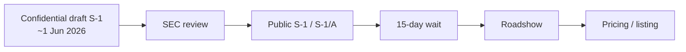
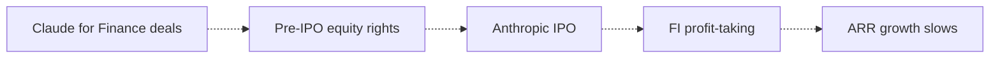

# Anthropic S-1: what can be verified on 2026-08-22

## Executive summary

- Anthropic has **not published a public S-1**. It confidentially submitted a draft Form S-1 around **1 June 2026**. [S1, S7, S15, S16]
- Official company blogs put run-rate revenue at **$14B (Feb)** → **$30B (Apr)** → **$47B (May)**. An investor update reported by CNBC put the July run-rate at **$65B** and preliminary Q2 revenue at **$11.5B**. Those later figures are not in a public filing. [S3, S4, S2, S10]
- The only quantified concentration stat is company-said via Reuters: **40% of the top 50 customers are financial institutions**, and finance is the **second** enterprise vertical after technology. That is a logo-count, not a revenue-share. [S8]
- Koterse’s five S-1 watch items are the right list. Four of five remain **undisclosed**. Related-party *spend and equity* with Amazon is official; related-party *revenue* is not. [S17, S4]
- **Stance if the decision is “buy Anthropic at IPO off this post”:** `wait`. There is no public S-1 to underwrite.

## Findings

### 1. Filing status: confidential draft, not a public S-1

Anthropic’s own Rule 135 notice says it “confidentially submitted a draft registration statement on Form S-1” for a proposed IPO of common stock. Share count and price are unset. The offering “will depend on market conditions and other factors.” [S1]

Reuters and CNBC dated that announcement to **1 June 2026**. [S7, S9]

A public S-1 would show up as Anthropic, PBC (or similar) on EDGAR. A company-name search returns SPVs and funds named “Anthropic …”, not the operating company as an S-1 registrant. [S16]

A full-text search of S-1 forms for the phrase `Anthropic, PBC` returns **seven hits**, all other issuers: SpaceX (3), Idea Acquisition (2), Figma (2). None is an Anthropic-issued registration statement. [S15]

That is the opposite of “S-1 is out.” It is also stronger than “we didn’t look.” Confidential review is designed to hide the numbers until a public filing.

We are still between A and C.

### 2. IPO machinery is moving; terms are not public

CNBC, citing people familiar, says Goldman Sachs, Morgan Stanley, and JPMorgan are involved, investor meetings have started, and a listing could come **as soon as October**. Anthropic declined to comment. [S12]

Bloomberg (20 Aug) says Citigroup is set to join those top banks, and Anthropic is considering a **public filing as soon as the end of August**. That Bloomberg page was paywalled after the first screen. [S13]

CNBC’s David Faber reporting (13 Aug): early meetings are led by CFO **Krishna Rao** and have **not** included specific financials or a valuation. Some investors model **$2T+**; CNBC says that is their analysis, not Anthropic guidance, and credits the FT for first reporting the $2T talk. [S11]

CNBC also notes a confidential prospectus does not lock a date; SpaceX went confidential 1 Apr and public 20 May. [S9]

### 3. The revenue series is official until May, then leak-based

| Date | Figure | Kind | Source |
|---|---|---|---|
| End-2025 | ~$9B run-rate; ~$10B full-year revenue | Official / CNBC recap | [S4, S10] |
| Feb 2026 (Series G) | $14B run-rate; $30B raise; $380B post-money | Official | [S3] |
| Apr 2026 (Amazon / Google posts) | >$30B run-rate; >1,000 customers at >$1M | Official | [S4, S5] |
| May 2026 (Series H) | >$47B run-rate; $65B raise; $965B post-money | Official | [S2] |
| Q2 2026 | $11.5B preliminary revenue (14× YoY) | Investor update via CNBC | [S10] |
| End-Jul 2026 | $65B annualized run-rate | Investor update via CNBC / Bloomberg | [S10] |

Anthropic uses **“run-rate revenue,”** not a defined ARR. Q2 $11.5B annualized is ~$46B, versus a $65B July run-rate, so the headline number is a **point-in-time annualization**, not TTM revenue. That is exactly the “ARR 计算方式可以大捞一笔” issue in the Koterse post. [S10, S17]

Series G also said: customers >$100k grew 7×; 8 of the Fortune 10 use Claude; Claude Code run-rate >$2.5B and more than doubled since the start of 2026; enterprise is **over half of Claude Code revenue**; Claude Code business subscriptions quadrupled. [S3]

Amodei told a May event Q1 revenue grew “80x” on an annualized basis (Reuters). That is a growth-rate claim, not a level. [S8]

### 4. The five S-1 questions

#### Customer concentration — partial

Reuters, attributing Anthropic (5 May): **40% of the top 50 customers are financial institutions**; finance is the **second-largest enterprise vertical after technology**. Named logos: Goldman Sachs, Visa, Citi, AIG. [S8]

Forbes repeated the 40% / second-vertical line the same day. [S14]

This does **not** say banks are 40% of revenue, or that any customer is ≥10% of revenue. Tech is still larger. Top-10 / top-20 revenue share is **undisclosed**.

#### Top-20 customer growth — undisclosed

Series G/H give **counts** of $100k+ and $1M+ customers, and say customers expand from one use case to others. [S3, S5]

No public same-customer growth, net revenue retention, or top-20 cohort trend.

#### Contract duration / minimums — undisclosed

No official or strong-secondary source fetched here disclosed typical term, take-or-pay, termination-for-convenience, or remaining performance obligations.

The one hard contract number in the press is **CNBC citing SpaceX’s prospectus**: Anthropic pays SpaceX **$1.25B/month through May 2029**, cancellable on **90 days’ notice**. [S9]

EDGAR confirms SpaceX’s S-1 family contains the string “Anthropic, PBC.” This run could not extract the paragraph from the HTML filing (SEC bot block / truncated table extract), so the dollar figure is **CNBC’s characterization**, not a quote we pulled from the prospectus. [S15, S9]

A 90-day walk-away on a compute offtake is the opposite of a long take-or-pay — if CNBC has the term right.

#### Usage-based revenue share — undisclosed

Claude Code has both **business subscriptions** (quadrupled) and usage/API-ish enterprise use (“over half of all Claude Code revenue”). [S3]

That is one product line, not company mix. Seat vs token vs committed-minimum split for Anthropic as a whole is **not in the public record fetched here**. Do not use the 80–85% “enterprise API” figure circulating on Yahoo/Quartz blogs; those pages were not treated as anchors.

#### Related / strategic-party revenue — spend and equity yes, revenue no

Official Amazon terms: **$5B investment now, up to $20B more**, on top of a prior **$8B**. Anthropic is committing **>$100B over ten years** to AWS technologies and up to **5GW**. 100,000+ customers run Claude on Bedrock. AWS remains the primary cloud and training partner. [S4]

Series H includes **$15B of previously committed hyperscaler money**, including that **$5B from Amazon**. [S2]

Google/Broadcom: multi-gigawatt next-gen TPU capacity expected from **2027**. Amazon still primary. [S5]

These are **compute commitments and equity**, not proof that Amazon or Google are large *product customers*. Related-party **revenue** — “we recognize revenue from our investors” — is what an S-1 related-person footnote would settle. Undisclosed.

### 5. Claude for Finance is real; the equity-for-deals thesis is not evidenced

Official launch: Financial Analysis Solution, MCP connectors (FactSet, S&P, PitchBook, Morningstar, etc.), SI partners (Accenture, Deloitte, KPMG, PwC), and quotes from Bridgewater AIA Labs, Commonwealth Bank of Australia, and AIG. [S6]

Reuters: 10 finance agents (pitchbook, audit, credit memo). [S8]

That is a serious product push. It does **not** show that finance deals are a “small number” used to buy **pre-IPO equity rights**. No fetched official or strong-secondary source supports that side-letter claim. [S17]

The “IPO → banks take profit → ARR slows” chain is a hypothesis. Nothing in the public record tests post-listing cohort usage. [S17]

Dotted arrows = unsourced.

## Caveats and disagreements

- **No public S-1** means every dollar after Series H is either a company blog or an unnamed-source investor update. CNBC says Anthropic declined to comment on the $65B / $11.5B figures. [S10]
- **Run-rate ≠ ARR ≠ GAAP revenue.** The jump from a ~$46B Q2 annualization to a $65B July run-rate is the definitional risk. [S10]
- **40% of top 50 ≠ 40% of revenue.** Koterse’s “unhealthy FI mix” overstates what Anthropic actually said. [S8, S17]
- SpaceX $1.25B/month was not independently extracted from the prospectus in this run. [S9, S15]
- Reuters June 1 page later returned HTTP 401; the saved copy is from an earlier successful fetch. [S7]
- Bloomberg Aug 20 was truncated by paywall. [S13]
- This is decision support, not financial advice. Anthropic is not a public security in this record.

## Answer

**There is no public Anthropic S-1 to read.** There is a June confidential draft, live IPO banking (GS / MS / JPM, maybe Citi), and a possible public filing in late August or a listing as soon as October — all unofficial. [S1, S12, S13]

On Koterse’s five items:

| Item | Status |
|---|---|
| Customer concentration | Partial: 40% of top 50 are FIs; tech still #1 vertical. Revenue concentration unknown. |
| Top-20 growth | Undisclosed |
| Contract duration / minimums | Undisclosed (except CNBC’s SpaceX offtake, 90-day cancel) |
| Usage-based mix | Undisclosed at company level |
| Related/strategic revenue | Amazon/Google **equity + compute spend** official; **revenue** undisclosed |

**Wait** for the public S-1. When it drops, the first pages to read are: customers ≥10% of revenue; top-customer / vertical tables; RPO and remaining performance; revenue recognition / usage vs subscription; related-person transactions (Amazon, Google, any customer-investors); and the exact definition of any “ARR” or “run-rate” non-GAAP metric.

## Sources used

- [S1] Anthropic confidential draft S-1 notice — https://www.anthropic.com/news/confidential-draft-s1-sec — primary
- [S2] Anthropic Series H — https://www.anthropic.com/news/series-h — primary
- [S3] Anthropic Series G — https://www.anthropic.com/news/anthropic-raises-30-billion-series-g-funding-380-billion-post-money-valuation — primary
- [S4] Anthropic–Amazon compute — https://www.anthropic.com/news/anthropic-amazon-compute — primary
- [S5] Anthropic–Google–Broadcom — https://www.anthropic.com/news/google-broadcom-partnership-compute — primary
- [S6] Claude for Financial Services — https://www.anthropic.com/news/claude-for-financial-services — primary
- [S7] Reuters confidential IPO — https://www.reuters.com/business/ai-giant-anthropic-confidentially-files-us-ipo-2026-06-01/ — strong-secondary
- [S8] Reuters finance push — https://www.reuters.com/business/finance/anthropic-deepens-finance-push-with-10-new-ai-agents-banks-insurers-2026-05-05/ — strong-secondary
- [S9] CNBC confidential prospectus — https://www.cnbc.com/2026/06/01/anthropic-ipo-s1-prospectus.html — strong-secondary
- [S10] CNBC $65B run-rate — https://www.cnbc.com/2026/08/17/anthropic-says-annualized-revenue-climbed-to-65-billion-in-july.html — strong-secondary
- [S11] CNBC CFO meetings — https://www.cnbc.com/2026/08/13/anthropic-cfo-early-ipo-meetings-valuation.html — strong-secondary
- [S12] CNBC banks — https://www.cnbc.com/2026/07/15/anthropic-ipo-banks-investor-meetings.html — strong-secondary
- [S13] Bloomberg Citi / end-August — https://www.bloomberg.com/news/articles/2026-08-20/anthropic-set-to-add-citigroup-to-top-ipo-banks-on-mega-listing — strong-secondary
- [S14] Forbes finance push — https://www.forbes.com/sites/the-prompt/2026/05/05/anthropic-is-now-targeting-finance-after-revolutionizing-coding/ — strong-secondary
- [S15] EDGAR S-1 full-text search — https://efts.sec.gov/LATEST/search-index?q=%22Anthropic,+PBC%22&forms=S-1 — primary
- [S16] EDGAR company search — https://www.sec.gov/cgi-bin/browse-edgar?company=Anthropic&owner=exclude&action=getcompany — primary
- [S17] Koterse screenshot — user attachment — weak
