# Mermaid rendering gallery

Synthetic fixture for Oppi markdown + Mermaid steer-testing. No real session, user, or account data.

Open this file in the document viewer, then scroll every section. Tap each diagram for fullscreen zoom. Switch **Rendered / Source** on a `.mmd` open if you extract a fence.

Expected Oppi native render today: **flowchart / graph**, **sequence**, **class**, **state**, **ER**, **gantt**, **pie**, **mindmap**, **timeline**, **xychart**, **journey**, **quadrantChart**, **gitGraph**, **sankey**, **kanban**. Everything else should fall back to a highlighted code block or “unsupported diagram type”, not crash or show raw fence markers.

| Band | Types |
| --- | --- |
| Native | flowchart, graph, sequenceDiagram, classDiagram, stateDiagram, erDiagram, gantt, pie, mindmap, timeline, xychart, journey, quadrantChart, gitGraph, sankey, kanban |
| Official fallback | requirementDiagram, C4*, zenuml, block, packet, architecture, radar, treemap |
| Experimental / demo | info, ishikawa, railroad, treeView, usecase, venn, wardley, eventModeling |
| Error | empty, unknown keyword, broken syntax |

---

## Contents

1. [Flowchart — directions](#1-flowchart--directions)
2. [Flowchart — every node shape](#2-flowchart--every-node-shape)
3. [Flowchart — every edge](#3-flowchart--every-edge)
4. [Flowchart — subgraphs, style, frontmatter](#4-flowchart--subgraphs-style-frontmatter)
5. [Sequence](#5-sequence)
6. [Class](#6-class)
7. [State](#7-state)
8. [Entity relationship](#8-entity-relationship)
9. [Gantt](#9-gantt)
10. [Pie](#10-pie)
11. [Mindmap](#11-mindmap)
12. [Timeline](#12-timeline)
13. [XY chart](#13-xy-chart)
14. [User journey](#14-user-journey)
15. [Quadrant](#15-quadrant)
16. [Requirement](#16-requirement)
17. [Git graph](#17-git-graph)
18. [C4](#18-c4)
19. [ZenUML](#19-zenuml)
20. [Sankey](#20-sankey)
21. [Block](#21-block)
22. [Packet](#22-packet)
23. [Kanban](#23-kanban)
24. [Architecture](#24-architecture)
25. [Radar](#25-radar)
26. [Treemap](#26-treemap)
27. [Info](#27-info)
28. [Experimental types](#28-experimental-types)
29. [Error and recovery](#29-error-and-recovery)
30. [Surrounding markdown chrome](#30-surrounding-markdown-chrome)

---

## 1. Flowchart — directions

`graph` is an alias of `flowchart`. Directions: `TD`/`TB`, `BT`, `LR`, `RL`.

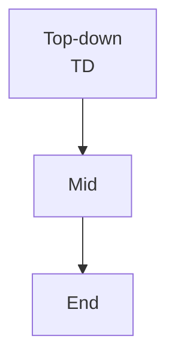

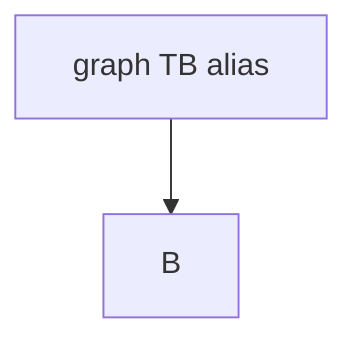

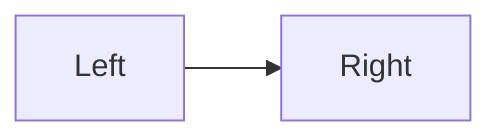

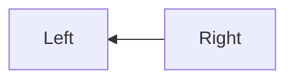

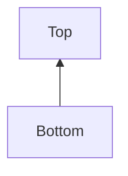

---

## 2. Flowchart — every node shape

Classic delimiters plus v11 `@{ shape: ... }` forms.

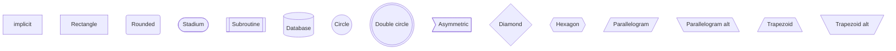

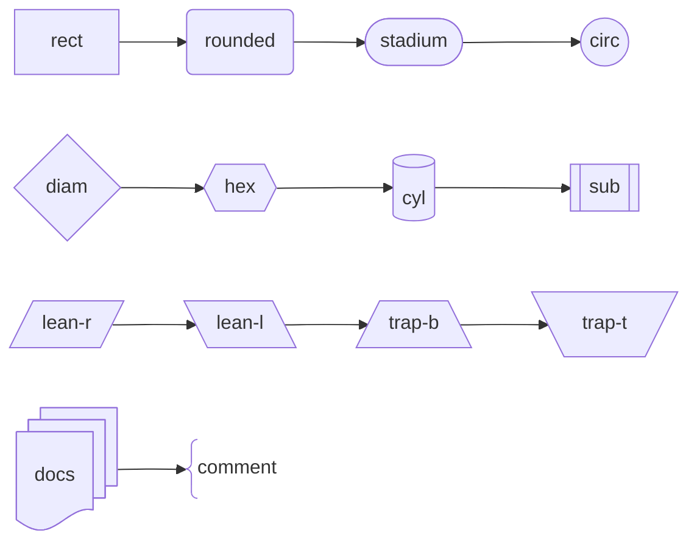

Quoted, markdown, entity, and Unicode labels:

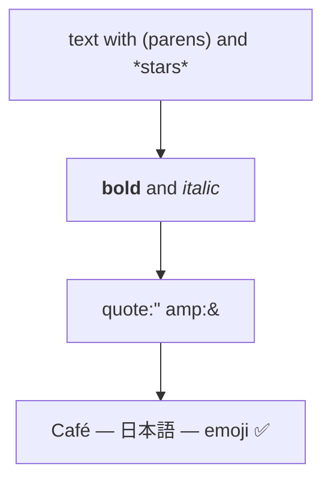

---

## 3. Flowchart — every edge

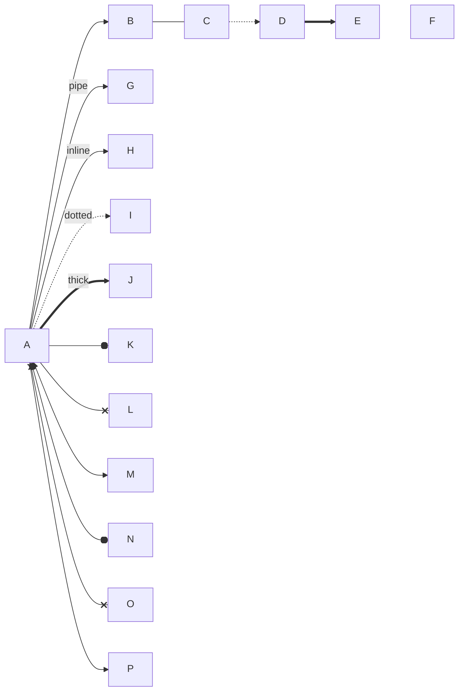

Chains, multi-target, and reuse:

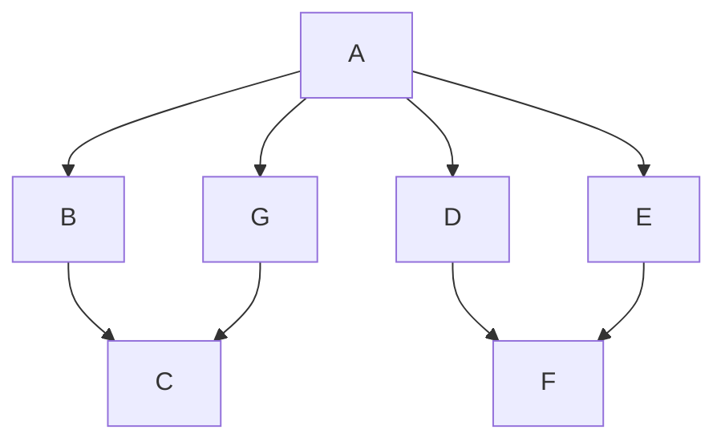

---

## 4. Flowchart — subgraphs, style, frontmatter

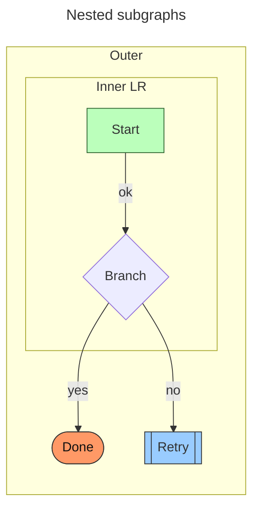

Semicolons as separators:

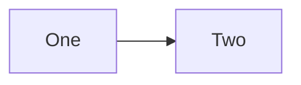

---

## 5. Sequence

Participants, actors, aliases, stereotypes, every common arrow, notes, control blocks, activation, autonumber, boxes, rect, create/destroy.

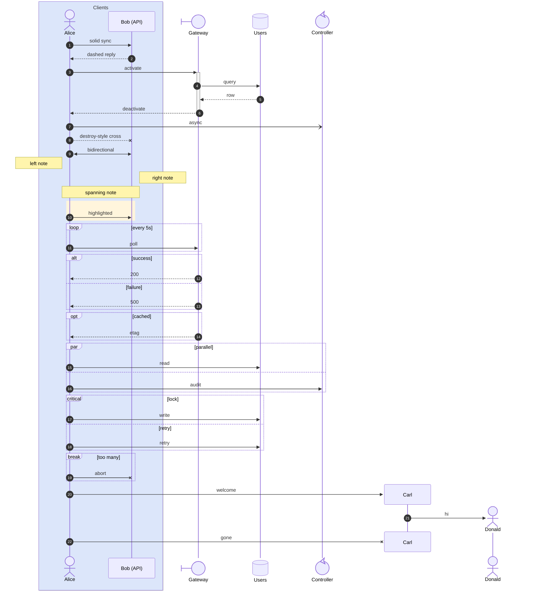

---

## 6. Class

Members, visibility, compartments, relations, stereotypes, abstract/static.

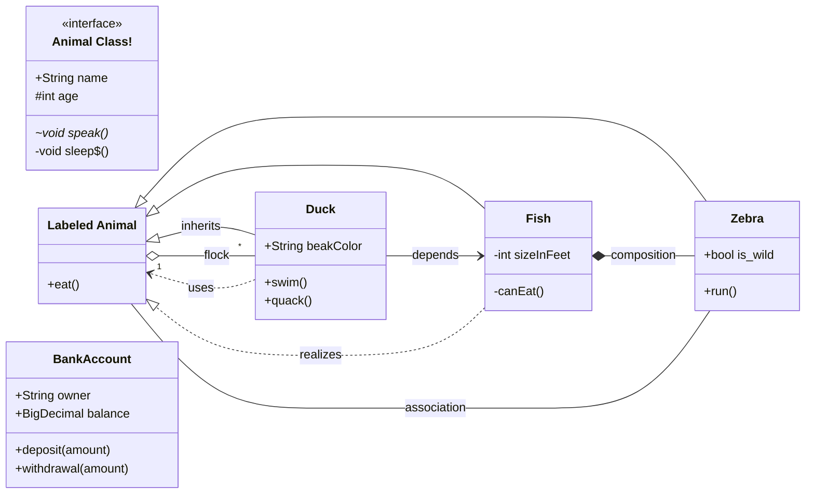

---

## 7. State

Both `stateDiagram` and `stateDiagram-v2`, plus composites, forks, notes, concurrency.

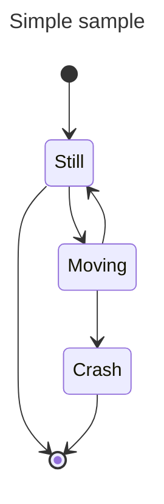

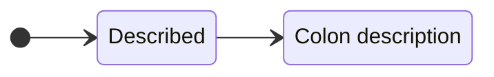

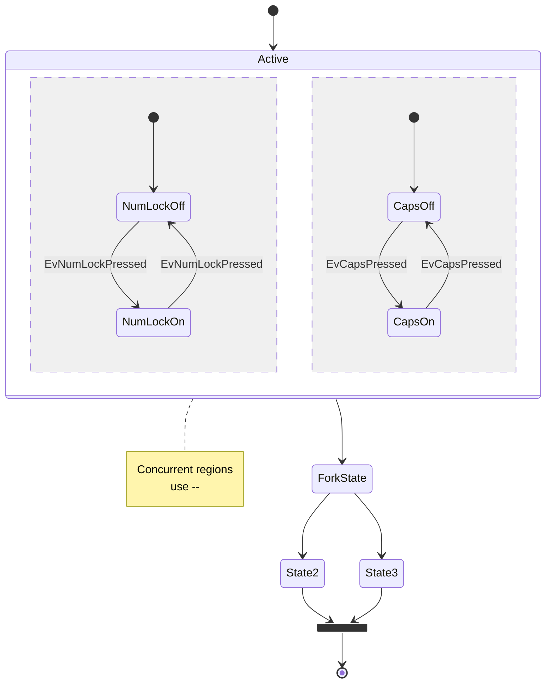

---

## 8. Entity relationship

Crow’s-foot, identifying vs non-identifying, aliases, attributes, keys.

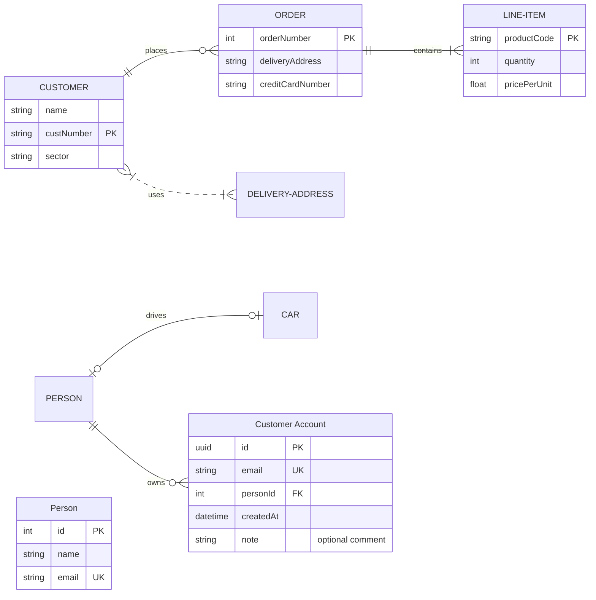

Word-alias cardinalities:

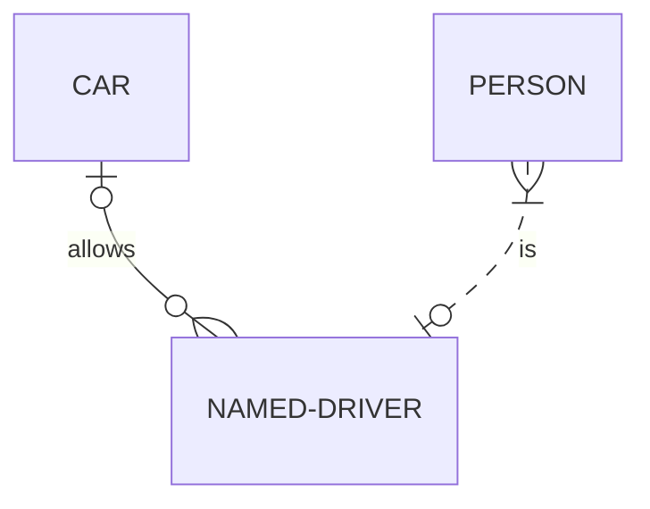

---

## 9. Gantt

Sections, statuses, dependencies, excludes, weekend, tick, today marker, milestones.

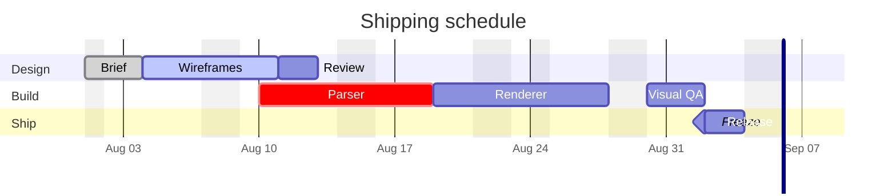

Duration units and multiple `after`:

```mermaid
gantt
  dateFormat YYYY-MM-DD
  section Units
    Milliseconds :a1, 2026-08-01, 100ms
    Hours        :a2, after a1, 12h
    Days         :a3, after a2, 2.5d
    Months       :a4, after a3, 1M
    Until freeze :a5, after a4, until a6
    Freeze       :milestone, a6, 2026-10-01, 0d
```

---

## 10. Pie

```mermaid
pie title Pets adopted by volunteers
  "Dogs" : 386
  "Cats" : 85
  "Rats" : 15
```

```mermaid
pie showData
  title "Share with values"
  "Rendered" : 10
  "Fallback" : 14
  "Broken" : 3
  "Label:with:colons" : 1
```

---

## 11. Mindmap

Shapes, icons, classes, markdown labels, tidy-tree frontmatter.

```mermaid
---
layout: tidy-tree
---
mindmap
  root((Mermaid))
    Origins
      Long history
      ::icon(fa fa-book)
      Popularisation
        British popular
        American
    Research
      On effectiveness
      On mind maps
    Tools
      Pen and paper
      Mermaid
        idSquare[Square]
        idRound(Round)
        idBang))Bang((
        idCloud)Cloud(
        idHex{{Hex}}
        :::urgent
    idMd["`**Markdown** label`"]
```

---

## 12. Timeline

Continuation events and sectioned ages.

```mermaid
timeline
  title History of Social Media Platform
  2002 : LinkedIn
  2004 : Facebook
       : Google
  2005 : YouTube
  2006 : Twitter
```

```mermaid
timeline
  title Timeline of Industrial Revolution
  section 17th-20th century
    Industry 1.0 : Machinery, Water power, Steam power
    Industry 2.0 : Electricity, Internal combustion engine, Mass production
    Industry 3.0 : Electronics, Computers, Automation
  section 21st century
    Industry 4.0 : Internet, Robotics, Internet of Things
    Industry 5.0 : Artificial intelligence, Big data, 3D printing
```

---

## 13. XY chart

Both `xychart` and `xychart-beta`. Bars, lines, named series, axis titles.

```mermaid
xychart-beta
  title "Quarterly throughput"
  x-axis [Q1, Q2, Q3, Q4]
  y-axis "jobs" 0 --> 100
  bar [20, 40, 65, 90]
  line [15, 38, 60, 88]
```

```mermaid
xychart
  title Mixed named series
  x-axis "Sprint" [A, B, C, D, E]
  y-axis Score 0 --> 10
  bar "Bugs" [8, 6, 4, 3, 2]
  line "Coverage" [4, 5, 7, 8, 9]
```

---

## 14. User journey

Expected: native.

```mermaid
journey
  title My working day
  section Go to work
    Make tea: 5: Me
    Go upstairs: 3: Me
    Do work: 1: Me, Cat
  section Go home
    Go downstairs: 5: Me
    Sit down: 5: Me
```

---

## 15. Quadrant

Expected: native.

```mermaid
quadrantChart
  title Reach and engagement of campaigns
  x-axis Low Reach --> High Reach
  y-axis Low Engagement --> High Engagement
  quadrant-1 We should expand
  quadrant-2 Need to promote
  quadrant-3 Re-evaluate
  quadrant-4 May be improved
  Campaign A: [0.3, 0.6]
  Campaign B: [0.45, 0.23]
  Campaign C: [0.57, 0.69]
  Campaign D: [0.78, 0.34]
  Campaign E: [0.40, 0.34]
  Campaign F: [0.35, 0.78]
```

---

## 16. Requirement

Expected: unsupported fallback.

```mermaid
requirementDiagram
  requirement login_req {
    id: 1
    text: the user can log in
    risk: high
    verifymethod: test
  }
  functionalRequirement session_req {
    id: 2
    text: keep an authenticated session
    risk: medium
    verifymethod: inspection
  }
  performanceRequirement latency_req {
    id: 3
    text: login under 200ms
    risk: low
    verifymethod: demonstration
  }
  element app {
    type: simulation
    docref: mock
  }
  element auth {
    type: test-harness
  }
  app - satisfies -> login_req
  login_req - contains -> session_req
  auth - traces -> latency_req
  session_req - copies -> login_req
```

---

## 17. Git graph

Expected: native.

```mermaid
gitGraph
  commit id: "init"
  commit id: "docs" tag: "v0.1"
  branch develop
  checkout develop
  commit id: "wip"
  commit id: "fix" type: HIGHLIGHT
  commit id: "chore" type: REVERSE
  checkout main
  merge develop id: "merge" tag: "v1.0"
  commit id: "release"
  cherry-pick id: "fix"
```

---

## 18. C4

Expected: unsupported fallback. Context, container, component, dynamic, deployment.

```mermaid
C4Context
  title System Context for Oppi
  Person(user, "Owner", "Runs the self-hosted server")
  System(oppi, "Oppi", "iPhone client for Pi sessions")
  System_Ext(llm, "Model provider", "Cloud or local LLM")
  Rel(user, oppi, "Uses")
  Rel(oppi, llm, "Prompts")
```

```mermaid
C4Container
  title Containers
  Person(user, "Owner")
  System_Boundary(oppi, "Oppi") {
    Container(ios, "Apple client", "Swift", "Timeline and viewers")
    Container(server, "Server", "TypeScript", "Sessions and files")
  }
  Rel(user, ios, "Taps")
  Rel(ios, server, "HTTPS / WSS")
```

```mermaid
C4Component
  title Components
  Container_Boundary(server, "Server") {
    Component(api, "HTTP API", "Hono")
    Component(runtime, "Session runtime", "Pi")
  }
  Rel(api, runtime, "Dispatches")
```

```mermaid
C4Dynamic
  title Dynamic login
  Rel(user, ios, "1", "Opens app")
  Rel(ios, server, "2", "Pair / resume")
```

```mermaid
C4Deployment
  title Deployment
  Deployment_Node(phone, "iPhone") {
    Container(ios, "Oppi.app", "Swift")
  }
  Deployment_Node(studio, "mac-studio") {
    Container(server, "oppi server", "Node")
  }
  Rel(ios, server, "LAN / Tailscale")
```

---

## 19. ZenUML

Expected: unsupported fallback.

```mermaid
zenuml
  title Order flow
  @Actor Client
  @Boundary Gateway
  @Control OrderService
  @Database DB
  Client->Gateway: POST /orders
  Gateway->OrderService: create()
  OrderService->DB: insert
  DB-->OrderService: id
  OrderService-->Gateway: 201
  Gateway-->Client: created
```

---

## 20. Sankey

Expected: native.

```mermaid
sankey-beta
  %% source,target,value
  Rendered,Flowchart,10
  Rendered,Sequence,8
  Rendered,Other native,12
  Fallback,Journey,2
  Fallback,C4,5
  Fallback,Kanban,3
  Other native,Pie,3
  Other native,Gantt,3
  Other native,Mindmap,3
  Other native,XY,3
```

```mermaid
sankey
  A,B,20
  B,C,12
  B,D,8
```

---

## 21. Block

Expected: unsupported fallback.

```mermaid
block-beta
  columns 3
  A["Start"] B["Parse"] C["Layout"]
  D["Draw"]:2 E["Export"]
  space
  F["Phone width"]:3
```

```mermaid
block
  columns 2
  A B
  C D
```

---

## 22. Packet

Expected: unsupported fallback.

```mermaid
packet-beta
  title UDP header
  0-15: "Source Port"
  16-31: "Destination Port"
  32-47: "Length"
  48-63: "Checksum"
  64-95: "Data (first word)"
```

```mermaid
packet
  0-7: "Type"
  8-15: "Flags"
  16-31: "Length"
```

---

## 23. Kanban

Expected: native.

```mermaid
---
config:
  kanban:
    ticketBaseUrl: 'https://example.invalid/browse/#TICKET#'
---
kanban
  backlog[Backlog]
    task1[Collect every diagram type]@{ ticket: MD-1, priority: 'Very High', assigned: 'Chen' }
    task2[Check native vs fallback]@{ ticket: MD-2, priority: 'High' }
  doing[In progress]
    task3[Steer-test on Duh Ifone]@{ ticket: MD-3, assigned: 'Chen' }
  review[Review]
    task4[Fullscreen pinch-zoom]
  done[Done]
    task5[Install Release build]@{ ticket: MD-0, priority: 'Low' }
```

---

## 24. Architecture

Expected: unsupported fallback.

```mermaid
architecture-beta
  group api(cloud)[Public API]
  group private(cloud)[Private API] in api
  service db(database)[Users] in private
  service cache(disk)[Cache] in private
  service server(server)[Oppi server] in api
  service phone(internet)[iPhone]
  db:R -- L:server
  cache:T -- B:server
  phone:R --> L:server
```

---

## 25. Radar

Expected: unsupported fallback.

```mermaid
radar-beta
  title Renderer coverage
  axis parse["Parse"], layout["Layout"], draw["Draw"], a11y["A11y"], export["Export"]
  curve native["Native types"]{5, 4, 4, 3, 4}
  curve fallback["Fallback types"]{1, 1, 1, 2, 2}
  max 5
  min 0
  ticks 5
  graticule polygon
  showLegend true
```

---

## 26. Treemap

Expected: unsupported fallback.

```mermaid
treemap-beta
  "Native"
    "Flowchart": 12
    "Sequence": 8
    "Class / State / ER": 9
    "Charts"
      "Pie": 2
      "Gantt": 3
      "XY": 2
      "Timeline": 2
      "Mindmap": 2
  "Fallback"
    "Journey / Quadrant / Req": 3
    "Git / C4 / ZenUML": 7
    "New beta types": 8
```

---

## 27. Info

Expected: unsupported or version card.

```mermaid
info
```

---

## 28. Experimental types

These appear in mermaid-js demos. Syntax is unstable. Useful if fallback stays calm.

```mermaid
ishikawa
  effect Poor first paint
    People
      Training gap
      Reviewer load
    Process
      Missing gallery
      No steer path
    Tools
      Parser subset
      Phone width
    Environment
      Dark theme
      Dynamic Type
```

```mermaid
railroad-beta
  Start
  "flowchart"
  Choice
    "TD"
    "LR"
  "nodes"
  End
```

```mermaid
treeView
  Workspace
    clients
      apple
        Oppi
    server
      src
    .internal
      diagrams
        gallery.md
```

```mermaid
usecase
  actor Owner
  actor Agent
  Owner --> (Open gallery)
  Owner --> (Tap diagram)
  Agent --> (Emit mermaid fence)
  (Open gallery) .> (Tap diagram) : includes
```

```mermaid
venn-beta
  title Renderer overlap
  A Native
  B Official mermaid
  C Experimental
  A B 10
  B C 6
  A 8
  C 4
```

```mermaid
wardley-beta
  title Tea vs coffee
  component Cup [0.85, 0.70] label [15, 15]
  component Kettle [0.55, 0.60]
  component Tea [0.35, 0.40]
  component Water [0.15, 0.20]
  Cup -> Kettle
  Kettle -> Water
  Cup -> Tea
```

```mermaid
eventModeling
  title Checkout
  actor Shopper
  command PlaceOrder
  event OrderPlaced
  command ChargeCard
  event CardCharged
  readmodel Orders
```

---

## 29. Error and recovery

Empty fence. Should not crash.

```mermaid

```

Unknown keyword:

```mermaid
notARealDiagram
  foo --> bar
```

Broken flowchart (unclosed subgraph / stray `end`):

```mermaid
flowchart TD
  subgraph broken
    A --> B
  A --> end
```

Directive noise that often breaks official mermaid:

```mermaid
%%{init: {"theme": "forest"}}%%
flowchart LR
  A --> B
```

---

## 30. Surrounding markdown chrome

This section exists so the same file also stresses mixed markdown, not only fences.

### Emphasis and code

**Bold**, *italic*, ***both***, `inline code`, ~~strike~~, a [plain link](https://example.invalid/mermaid).

### Lists

- Outer
  - Nested with `token`
  1. Numbered child
  2. Another child
- Sibling

1. Ordered
2. Still ordered
   - Mixed bullet

- [ ] Unchecked task
- [x] Checked task

### Table

| Viewer | What to check |
| --- | --- |
| Timeline inline | Height cap, tap-to-fullscreen, no raw fence |
| Document reader | Scroll, spacing, source toggle, line-anchor highlight |
| Fullscreen diagram | Pinch zoom, share/export, dark/light |

### Quote, rule, math

> Blockquote wrapping a long thought about whether fallback diagrams should look like code or like a dedicated unsupported card.

---

Inline math $a^2 + b^2 = c^2$ and display math:

$$
\sum_{i=1}^{n} x_i = x_1 + \cdots + x_n
$$

```latex
e^{i\pi} + 1 = 0
```

### Wiki and host links

Gallery file: [[.internal/diagrams/mermaid-rendering-gallery.md|this file]].
Architecture: [[dev/architecture-client.md#L1-L20|client architecture head]].
Existing stress corpus: [[clients/apple/OppiTests/Fixtures/mixed-markdown-stress-corpus.md|mixed markdown corpus]].

### HTML that should stay inert

This sentence has <span>inline html</span> and a hard break.<br>Next line still prose.

<div>
<p>Synthetic HTML block. Should not become a privileged web view.</p>
</div>

### Fenced non-mermaid (control)

```swift
let token = "not-mermaid"
print(token)
```

```text
plain fence after mermaid should stay a code block
```

---

End of gallery. If a native type shows source, that is a renderer bug. If a fallback type crashes or blanks the page, that is also a bug.
