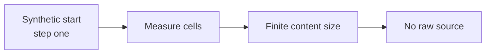
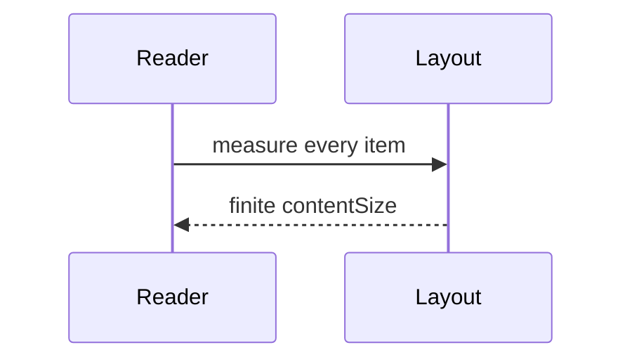

# Mixed Markdown Stress Corpus

> Synthetic fixture only. It contains no session, user, account, or real-world research content.

STRESS_CORPUS_MARK_ALPHA. This opening paragraph uses **bold**, *italic*, `inline code`, and a [plain link](https://example.invalid/docs) so the reader has to render emphasis without falling back to raw source.

## Nested lists with fenced code

- Outer wobble item
  - Nested ceramic item with `glorp-token`

    ```swift
    let token = "synthetic-list-fence"
    print(token)
    ```

  - Sibling nested item after the fence
- Second outer item
  1. Numbered nested step

     ```text
     synthetic-nested-numbered-fence
     ```

  2. Another numbered step with _emphasis_

1. Start the synthetic reader:

   ```bash
   echo synthetic-ordered-list-fence
   ```

2. Continue the corpus.

## Wide wrap table with links

| Practical takeaway | The mixed corpus must force wrap-mode tables to reflow on a phone-width reader while still exposing every link in the longer column so virtualization and self-sizing both see a tall card. |
| --- | --- |
| Links | [Alpha specimen](https://example.invalid/a) · [Beta specimen](https://example.invalid/b) · [Gamma specimen](https://example.invalid/c) |
| Dive deeper | Compare with [a longer explanation of wrap behavior that keeps going past thirty-five mono cells](https://example.invalid/wrap). |

---

## Code fence

A standalone fence after a thematic break so it stays its own collection item.

```python
print("synthetic-code-fence")
for index in range(3):
    print(index)
```

---

## Mermaid flowchart with br labels



---

## Mermaid sequence diagram



---

## LaTeX fence, display math, and inline math

```latex
e^{i\pi} + 1 = 0
```

Display math sits in its own block:

$$
x^2 + y^2 = z^2
$$

Inline math stays in prose: the identity $a^2 + b^2 = c^2$ is synthetic filler and must not appear as raw `$` delimiters around a heading.

---

## Wiki, host-file, and line-anchor links

See [[notes/synthetic-corpus.md|corpus note]] and the host file [[/tmp/oppi-markdown-stress.log]].
Line-anchor mention: [[Sources/App.swift#L12-L18|focused code]].

## Images

Relative workspace image:


Remote image that must not eagerly fetch:


## HTML inline and block

This sentence has <span>inline html</span> plus a hard break.<br>The next line is still prose.

<div>
<p>Synthetic HTML block used only as a renderer stress case.</p>
</div>

---

## Virtualization parcels

These parcels exist so the document is tall enough that a 390×844 reader cannot measure every item from the first viewport alone.

### Parcel 01 — wobble yak

STRESS_CORPUS_PARCEL_01. The wobble yak alphabetizes invisible spoons while cardboard comets orbit a fictional lighthouse made of marmalade. Repeat `glorp-1`, rotate the imaginary bucket, and record whether the socks become more philosophical. Flarn snicket ploom drabble. Flarn snicket ploom drabble. Flarn snicket ploom drabble. Flarn snicket ploom drabble. This conclusion is synthetic filler designed to wrap differently at nearby widths.

---

### Parcel 02 — ceramic moon

STRESS_CORPUS_PARCEL_02. The ceramic moon negotiates with purple wallpaper while cardboard comets orbit a fictional lighthouse made of marmalade. Repeat `glorp-2`, rotate the imaginary bucket, and record whether the socks become more philosophical. Flarn snicket ploom drabble. Flarn snicket ploom drabble. Flarn snicket ploom drabble. Flarn snicket ploom drabble. This conclusion is synthetic filler designed to wrap differently at nearby widths.

---

### Parcel 03 — accordion beetle

STRESS_CORPUS_PARCEL_03. The accordion beetle measures yesterday in teaspoons while cardboard comets orbit a fictional lighthouse made of marmalade. Repeat `glorp-3`, rotate the imaginary bucket, and record whether the socks become more philosophical. Flarn snicket ploom drabble. Flarn snicket ploom drabble. Flarn snicket ploom drabble. Flarn snicket ploom drabble. This conclusion is synthetic filler designed to wrap differently at nearby widths.

---

### Parcel 04 — velvet toaster

STRESS_CORPUS_PARCEL_04. The velvet toaster debugs a sandwich at midnight while cardboard comets orbit a fictional lighthouse made of marmalade. Repeat `glorp-4`, rotate the imaginary bucket, and record whether the socks become more philosophical. Flarn snicket ploom drabble. Flarn snicket ploom drabble. Flarn snicket ploom drabble. Flarn snicket ploom drabble. This conclusion is synthetic filler designed to wrap differently at nearby widths.

---

### Parcel 05 — quantum turnip

STRESS_CORPUS_PARCEL_05. The quantum turnip folds static into tiny hats while cardboard comets orbit a fictional lighthouse made of marmalade. Repeat `glorp-5`, rotate the imaginary bucket, and record whether the socks become more philosophical. Flarn snicket ploom drabble. Flarn snicket ploom drabble. Flarn snicket ploom drabble. Flarn snicket ploom drabble. This conclusion is synthetic filler designed to wrap differently at nearby widths.

---

### Parcel 06 — lantern moth

STRESS_CORPUS_PARCEL_06. The lantern moth catalogs unused umbrellas while cardboard comets orbit a fictional lighthouse made of marmalade. Repeat `glorp-6`, rotate the imaginary bucket, and record whether the socks become more philosophical. Flarn snicket ploom drabble. Flarn snicket ploom drabble. Flarn snicket ploom drabble. Flarn snicket ploom drabble. This conclusion is synthetic filler designed to wrap differently at nearby widths.

---

### Parcel 07 — copper kettle

STRESS_CORPUS_PARCEL_07. The copper kettle interviews a staircase while cardboard comets orbit a fictional lighthouse made of marmalade. Repeat `glorp-7`, rotate the imaginary bucket, and record whether the socks become more philosophical. Flarn snicket ploom drabble. Flarn snicket ploom drabble. Flarn snicket ploom drabble. Flarn snicket ploom drabble. This conclusion is synthetic filler designed to wrap differently at nearby widths.

---

### Parcel 08 — paper compass

STRESS_CORPUS_PARCEL_08. The paper compass argues with leftover soup while cardboard comets orbit a fictional lighthouse made of marmalade. Repeat `glorp-8`, rotate the imaginary bucket, and record whether the socks become more philosophical. Flarn snicket ploom drabble. Flarn snicket ploom drabble. Flarn snicket ploom drabble. Flarn snicket ploom drabble. This conclusion is synthetic filler designed to wrap differently at nearby widths.

---

### Parcel 09 — glass raccoon

STRESS_CORPUS_PARCEL_09. The glass raccoon inventories borrowed shadows while cardboard comets orbit a fictional lighthouse made of marmalade. Repeat `glorp-9`, rotate the imaginary bucket, and record whether the socks become more philosophical. Flarn snicket ploom drabble. Flarn snicket ploom drabble. Flarn snicket ploom drabble. Flarn snicket ploom drabble. This conclusion is synthetic filler designed to wrap differently at nearby widths.

---

### Parcel 10 — linen comet

STRESS_CORPUS_PARCEL_10. The linen comet irons a map of nowhere while cardboard comets orbit a fictional lighthouse made of marmalade. Repeat `glorp-10`, rotate the imaginary bucket, and record whether the socks become more philosophical. Flarn snicket ploom drabble. Flarn snicket ploom drabble. Flarn snicket ploom drabble. Flarn snicket ploom drabble. This conclusion is synthetic filler designed to wrap differently at nearby widths.

---

### Parcel 11 — marble herring

STRESS_CORPUS_PARCEL_11. The marble herring recites unused passwords to a coat rack. Repeat `glorp-11`, rotate the imaginary bucket, and record whether the socks become more philosophical. Flarn snicket ploom drabble. Flarn snicket ploom drabble. Flarn snicket ploom drabble. Flarn snicket ploom drabble. This conclusion is synthetic filler designed to wrap differently at nearby widths.

---

### Parcel 12 — tin orchestra

STRESS_CORPUS_PARCEL_12. The tin orchestra conducts a meeting of spoons. Repeat `glorp-12`, rotate the imaginary bucket, and record whether the socks become more philosophical. Flarn snicket ploom drabble. Flarn snicket ploom drabble. Flarn snicket ploom drabble. Flarn snicket ploom drabble. This conclusion is synthetic filler designed to wrap differently at nearby widths.

---

### Parcel 13 — felt lighthouse

STRESS_CORPUS_PARCEL_13. The felt lighthouse files a complaint against fog. Repeat `glorp-13`, rotate the imaginary bucket, and record whether the socks become more philosophical. Flarn snicket ploom drabble. Flarn snicket ploom drabble. Flarn snicket ploom drabble. Flarn snicket ploom drabble. This conclusion is synthetic filler designed to wrap differently at nearby widths.

---

### Parcel 14 — brass pebble

STRESS_CORPUS_PARCEL_14. The brass pebble translates rain into inventory codes. Repeat `glorp-14`, rotate the imaginary bucket, and record whether the socks become more philosophical. Flarn snicket ploom drabble. Flarn snicket ploom drabble. Flarn snicket ploom drabble. Flarn snicket ploom drabble. This conclusion is synthetic filler designed to wrap differently at nearby widths.

---

### Parcel 15 — wool satellite

STRESS_CORPUS_PARCEL_15. The wool satellite knits a schedule for unused Tuesdays. Repeat `glorp-15`, rotate the imaginary bucket, and record whether the socks become more philosophical. Flarn snicket ploom drabble. Flarn snicket ploom drabble. Flarn snicket ploom drabble. Flarn snicket ploom drabble. This conclusion is synthetic filler designed to wrap differently at nearby widths.

---

### Parcel 16 — chalk harbor

STRESS_CORPUS_PARCEL_16. The chalk harbor redraws the tide in block letters. Repeat `glorp-16`, rotate the imaginary bucket, and record whether the socks become more philosophical. Flarn snicket ploom drabble. Flarn snicket ploom drabble. Flarn snicket ploom drabble. Flarn snicket ploom drabble. This conclusion is synthetic filler designed to wrap differently at nearby widths.

---

### Parcel 17 — amber pulley

STRESS_CORPUS_PARCEL_17. The amber pulley lifts a rumor about leftover soup. Repeat `glorp-17`, rotate the imaginary bucket, and record whether the socks become more philosophical. Flarn snicket ploom drabble. Flarn snicket ploom drabble. Flarn snicket ploom drabble. Flarn snicket ploom drabble. This conclusion is synthetic filler designed to wrap differently at nearby widths.

---

### Parcel 18 — indigo hinge

STRESS_CORPUS_PARCEL_18. The indigo hinge opens a drawer of unused maps. Repeat `glorp-18`, rotate the imaginary bucket, and record whether the socks become more philosophical. Flarn snicket ploom drabble. Flarn snicket ploom drabble. Flarn snicket ploom drabble. Flarn snicket ploom drabble. This conclusion is synthetic filler designed to wrap differently at nearby widths.

---

### Parcel 19 — saffron ladder

STRESS_CORPUS_PARCEL_19. The saffron ladder climbs a list of imaginary chores. Repeat `glorp-19`, rotate the imaginary bucket, and record whether the socks become more philosophical. Flarn snicket ploom drabble. Flarn snicket ploom drabble. Flarn snicket ploom drabble. Flarn snicket ploom drabble. This conclusion is synthetic filler designed to wrap differently at nearby widths.

---

### Parcel 20 — cobalt umbrella

STRESS_CORPUS_PARCEL_20. The cobalt umbrella refuses to discuss the weather with any calendar. Repeat `glorp-20`, rotate the imaginary bucket, and record whether the socks become more philosophical. Flarn snicket ploom drabble. Flarn snicket ploom drabble. Flarn snicket ploom drabble. Flarn snicket ploom drabble. This conclusion is synthetic filler designed to wrap differently at nearby widths.

STRESS_CORPUS_MARK_OMEGA.
