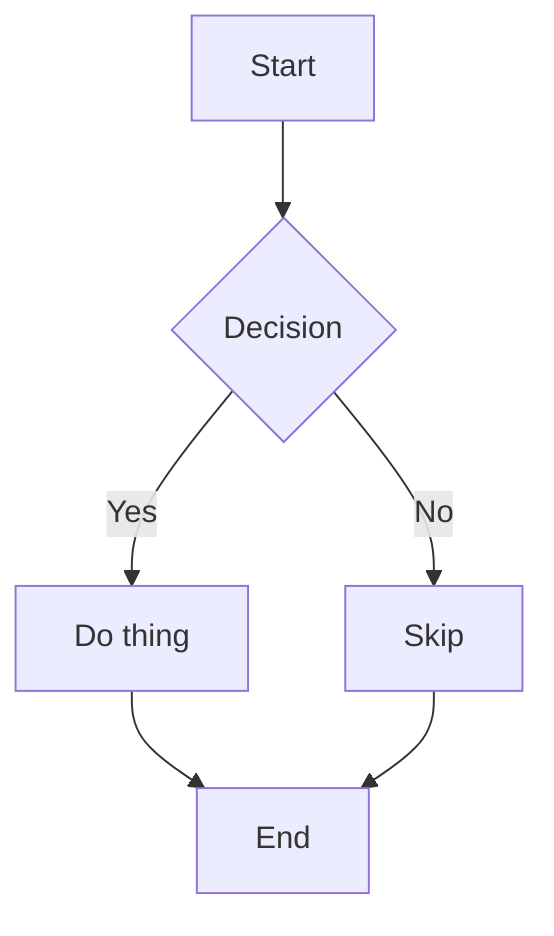
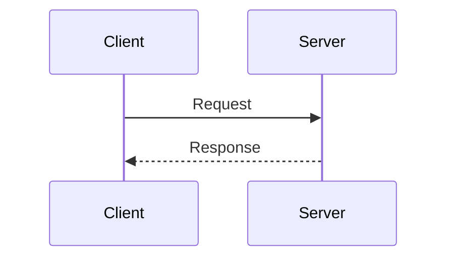
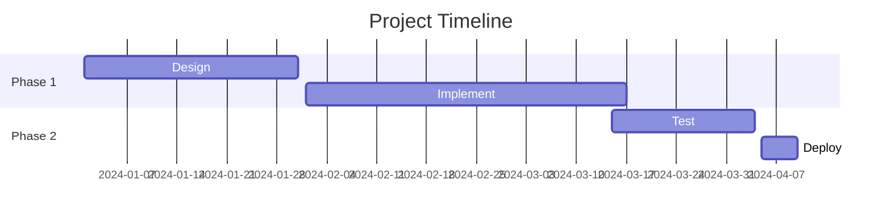
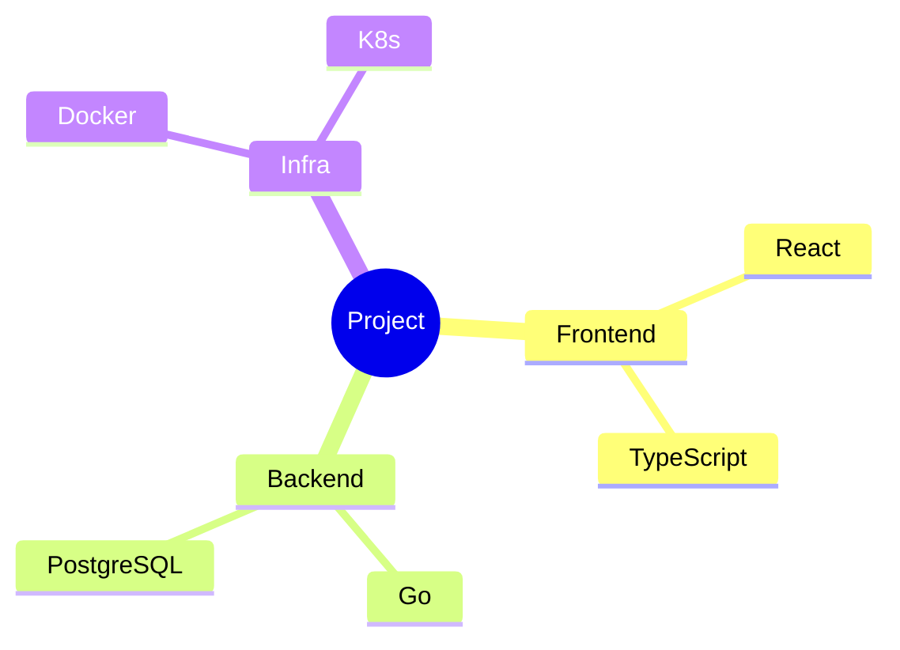

# Inline Rendering Test

Validates inline mermaid diagrams and images in the chat timeline.

## Mermaid Diagrams

### Flowchart



### Sequence Diagram



### Gantt Chart



### Mindmap



### mmd alias

```mmd
graph LR
    A --> B --> C
```

## Online Images

### GitHub avatar (https, PNG, always up)


### Wikipedia image (https, JPEG)


### Picsum photo (https, redirect)


## Edge Cases

### Mixed paragraph (should NOT render as standalone image)

Check this out:  inline with text.

### Regular code blocks (not mermaid)

```python
def hello():
    print("This is python, not mermaid")
```

### Empty mermaid block

```mermaid
```

### Unsupported diagram type

```mermaid
journey
    title My working day
    section Go to work
      Make tea: 5: Me
```
