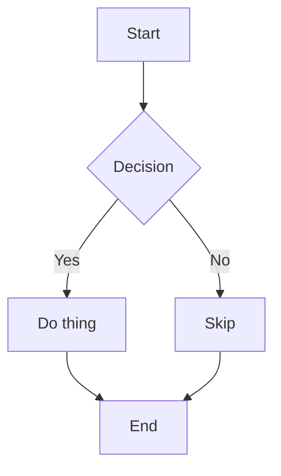
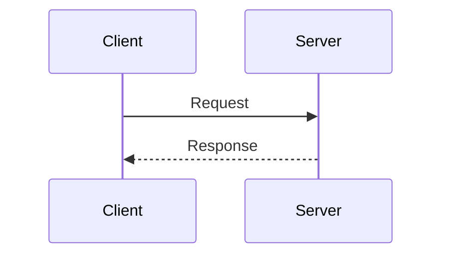
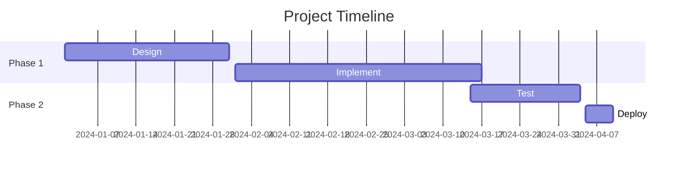
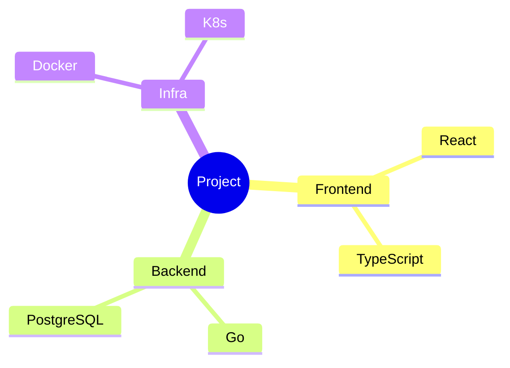

# Inline Rendering Test

This file validates inline mermaid diagrams and images in the chat timeline.

## Mermaid Diagrams

### Flowchart



### Sequence Diagram



### Gantt Chart



### Mindmap



### Using mmd alias

```mmd
graph LR
    A --> B --> C
```

## Images

### Online URL (https)


### Online URL (http)


### Relative path (workspace file)


### Mixed content (image in paragraph - should NOT render as image)

Check out this diagram:  pretty cool right?

## Regular Code Blocks (should NOT render as diagrams)

```python
def hello():
    print("This is python, not mermaid")
```

```swift
let x = 42
print("Swift code block")
```

## Edge Cases

### Empty mermaid block

```mermaid
```

### Unsupported diagram type

```mermaid
journey
    title My working day
    section Go to work
      Make tea: 5: Me
```
