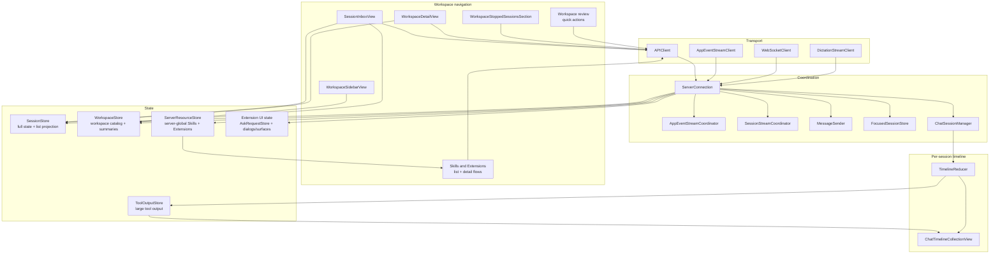
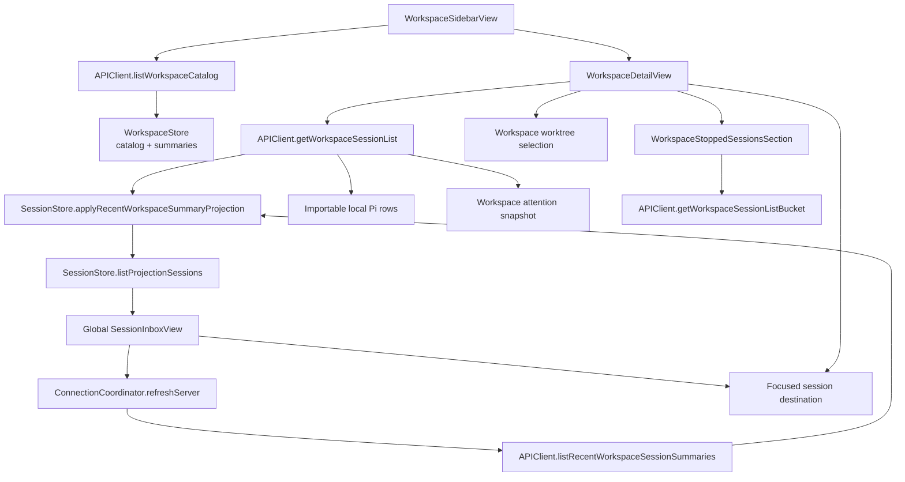
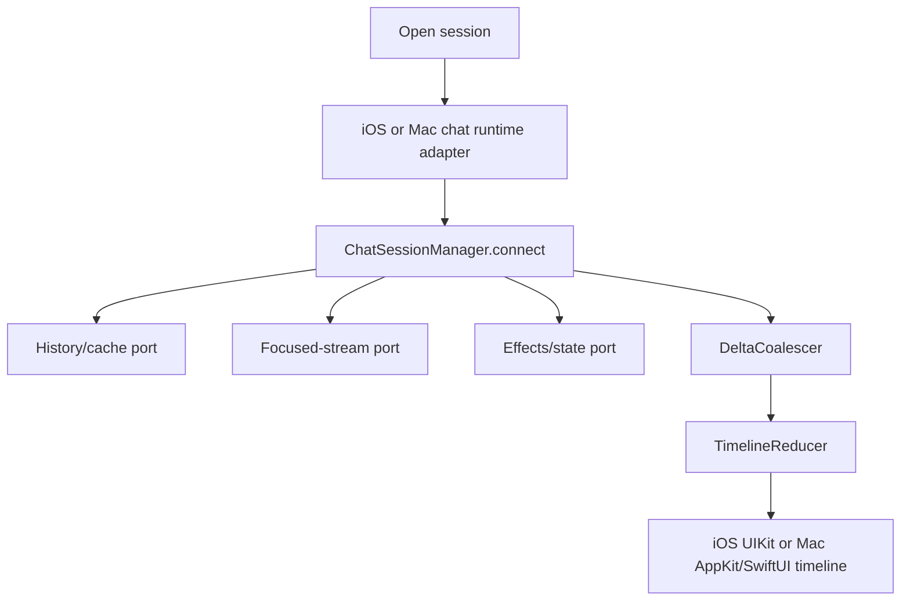

# Oppi client architecture

The Oppi Apple clients control and render server-owned and terminal-owned Pi sessions. They keep workspace navigation HTTP-first and reserve WebSockets for live streams. iOS paints the hot chat timeline with UIKit over authenticated HTTPS/WSS. Mac paints with AppKit/SwiftUI over the owner Unix socket.

## Audience and scope

Read this page before changing iOS or macOS client transport code, session and workspace stores, workspace navigation, chat timeline state, extension UI rendering, dictation, or media playback.

This page covers the Apple client structure. Server route, runtime, and storage details live in [Server architecture](architecture-server.md). For end-to-end LAN and paired HTTPS route selection, see [Networking and connection routing](networking.md).

## Client responsibilities

The Apple client owns:

- paired-server credentials and endpoint selection,
- the global sessions inbox, workspace sidebar, server-global Skills and Extensions, workspace detail navigation, and focused-session navigation,
- focused session stream setup and recovery,
- app-event stream consumption and HTTP snapshot repair,
- per-session chat timeline state and rendering,
- extension UI sheets, ask cards, status rows, widgets, and native surfaces,
- voice input, audio playback, file previews, media playback, Quick Session intake, sharing, diagnostics, and settings.

The client does not execute Pi sessions or directly mutate server read models. It sends commands and renders the server projection.

## Client topology

The diagram below is the iOS HTTPS/WSS and UIKit composition. Mac uses the same `ChatSessionManager` and reducer core with owner-socket and AppKit/SwiftUI adapters; see [Mac adapter path](#mac-adapter-path).

## Client blocks

| Block                                         | Owns                                                                                                                                                     | Does not own                                            |
| --------------------------------------------- | -------------------------------------------------------------------------------------------------------------------------------------------------------- | ------------------------------------------------------- |
| `ServerConnection`                            | HTTPS/WSS connection composition, API/WS client wiring, focused/app-event stream startup, shared store updates                                            | per-session timeline reducer state                      |
| `SessionContentAccess`                        | iOS assistant/tool-row content reads: stored attachments, session files, host files, Markdown media/sidecars; bounded readiness waits and origin routing; composes the timeline's `MarkdownResourceAccess` and `SessionToolOutputAccess` | API-client installation, auth, connection lifecycle     |
| `ChatTimelineDestinationPresenter` (`Features/Chat/`) | Builds and presents the screens a timeline destination request opens: the commit detail sheet (fresh `AppNavigation` and empty `QuickCommentTemplateStore`, connection store environment) and path-pill file viewers (session checkout worktree, upload session origin, host files); large presentation from the source view's traits | timeline row state, deciding which destination a tap means |
| `MarkdownResourceAccess`                      | One value per Markdown document: bound source identity (server, workspace, session, checkout, base URL) plus deferred resource providers; carried unchanged from row to renderer to full-screen reader | routing policy, readiness, auth, document location (`sourceFilePath`) |
| `ToolExpandedMarkdownSurface` (`Features/Chat/Timeline/Tool/`) | A tool row's expanded Markdown viewport: the live incremental view while the tool streams, the immutable reader once it completes, their width and height constraints, theme and geometry signatures, live tail-follow, and teardown; the row mounts it through `ToolExpandedSurfaceHostView` and forwards layout and scroll events | header and collapsed presentation, gestures, which expanded surface is active, the timeline's outer vertical scroll |
| `ToolExpandedHostedSurface` (`Features/Chat/Timeline/Tool/`) | A tool row's hosted media and document viewport: the container, its width and viewport-height constraints, the mounted read-media, voice-message, CSV/TSV table or GeoJSON/TopoJSON map view, whether it is the active expanded layout, and install, reuse and teardown of that view (each content view owns its own async loading and stops when the surface drops it); install methods return whether the row must re-measure. The row mounts it through `ToolExpandedSurfaceHostView` (expanded scroll viewport or the compact host) and forwards layout events | header and collapsed presentation (including the collapsed image preview and audio button), gestures, which expanded surface is active, the timeline's outer vertical scroll |
| `DocumentFamily` (`Core/Views/DocumentFamily.swift`) | The CSV/TSV table and GeoJSON/TopoJSON map document formats: classification from `FileType`, the source text and path, tool-row traits (`InlineTraits`: minimum viewport height, whether the row suppresses its own scrolling, tap/pinch/full-screen), the full-screen Source toggle content and title, reader-preference family, export content, and the iOS factory for the inline tool-row view (with reuse check) and the full-screen body. `ToolExpandedContent.document` and `FullScreenCodeContent.document` carry it; call sites forward the value and read these facts | parsing and plans (`OppiCore`), rendering (`DelimitedTableRenderView`, `GeoJSONMapView`), the rendered-fence path (assistant Markdown Mermaid/map/LaTeX segments), which expanded surface is active |
| `APIClient`                                   | authenticated HTTP requests and response decoding                                                                                                        | UI decisions or store mutation policy                   |
| `WebSocketClient`                             | focused session WebSocket transport, reconnect policy, inbound metadata                                                                                  | protocol side effects                                   |
| `AppEventStreamClient` + coordinator          | app-event WebSocket consumption                                                                                                                          | focused timeline replay                                 |
| `SessionStreamCoordinator`                    | per-session stream continuations, queue sync, and focused transport lifecycle                                                                            | timeline rendering                                      |
| `SessionStreamCatchUpTracker`                 | platform-neutral durable event sequence tracking for focused stream repair                                                                               | transport opening or telemetry                          |
| `FocusedSessionConnectionPolicy`              | whether a focused stream may open for a given `SessionStatus`                                                                                            | stream open, history fetch, or resume commands          |
| `FocusedSessionStopTurnPolicy`                | stop-requested/confirmed/failed timeline effects and the 10-second stop-reconciliation delay                                                             | reducer/coalescer mutation or HTTP reconcile            |
| `ExtensionSurfaceReducer`                     | protocol-derived extension-surface snapshot, notification reduction, placement grouping, and framework-free presentation helpers                         | toast, editor-text, and platform paint                  |
| `MessageSender`                               | command request IDs, acks, retries, command result waiters                                                                                               | session list rendering                                  |
| `ChatSessionManager`                          | transport-neutral per-session runtime for cache, paging, focused-stream recovery, catch-up apply, and reducer/coalescer ownership behind three ports     | transport composition or global app-event routing       |
| `SessionStore`                                | full session cache, cold list projection, per-server partitions, unread completion state                                                                 | workspace catalog                                       |
| `WorkspaceStore`                              | workspace catalog, workspace-effective skill choices used by workspace create/edit flows, workspace summaries, per-server freshness                      | full session lifecycle or server-global extension state |
| `ServerResourceStore`                         | independent per-server global Skill and Extension snapshots, cached-first loading, and normal toggle rollback | workspace overrides, session lifecycle, or UI grouping  |
| `AskRequestStore` and extension UI state      | pending asks, sheet dialogs, status/widget/native-surface state                                                                                          | server-side permission policy                           |
| `TimelineReducer` + `DeltaCoalescer`          | timeline model and live delta coalescing                                                                                                                 | UIKit rendering and network                             |

## Shared Apple client core

`clients/apple/OppiCore/**` is the source-group boundary for Apple client/data code that should compile into both iOS/iPadOS and macOS targets. It holds protocol DTOs, client-environment values, transport identifiers, `ChatSessionManager` and its runtime ports, reducer support state, stream sequence state, focused-session connect/stop policy, extension-surface state/reduction, session-list presentation, ask/message queue state, review-comment state, file-index state, git status state, freshness/health state, media/diff/date/session/error formatting, and other helpers that need no UI or device framework.

Files in `OppiCore` must stay platform-neutral. The CommonMark parser, its `MarkdownBlock` / `MarkdownInline` AST, and the tail-only `CommonMarkStreamingParser` cache live under `OppiCore/Formatting`; iOS and macOS paint that shared parse result in their platform UI layers. UI/device work belongs in the iOS app under `clients/apple/Oppi/**` or the Mac app under `clients/apple/OppiMac/**`.

## Mac adapter path

Share semantics; paint and adapt per platform. Do not combine Unix-socket and HTTPS transports or Mac and iOS renderers to reduce file count.

| Layer | Owner |
| --- | --- |
| Protocol DTOs, `ChatSessionManager` three ports, reducers, coalescers, focused-session policy, extension-surface state | `OppiCore` |
| Paired HTTPS/WSS, device auth, UIKit timeline, iOS navigation | `clients/apple/Oppi/**` |
| Owner Unix-socket HTTP/WebSocket, attach/LaunchAgent/spawn, TCC, AppKit/SwiftUI paint, Mac navigation | `clients/apple/OppiMac/**` |

Mac local server ownership, owner-token loading, owner Unix-socket HTTP, owner Unix-socket WebSocket upgrades, certificate trust delegates, notifications, TCC, and process lifecycle are platform-app adapters around this shared core, not part of the core itself. The Mac app sends the owner `sk_` token only on that Unix socket. Unauthenticated `GET /health` may use localhost HTTPS for attach. Local live streams use authenticated WebSocket upgrades on the owner Unix socket. Remote live WSS stays on the network listener and never carries `sk_`. Mac session home loads `GET /sessions/recent` over that socket; workspace detail still uses per-workspace session lists.

`MacServerLifecycle.startupPlan` chooses one local runtime mode:

1. **Attach** when `GET /health` already succeeds.
2. **Wait for LaunchAgent** when a LaunchAgent plist is installed and health has not succeeded yet.
3. **Spawn a child** `oppi serve` process when neither attach nor LaunchAgent applies.

`MacChatSessionRuntimeAdapter` implements the same three `ChatSessionManager` ports as the iOS adapter, using `MacSessionTraceStore` and owner-socket transport instead of `ServerConnection`.

## Transport lanes

**Automatic** constructs verified LAN HTTPS and paired HTTPS candidates. Device credentials use short-lived HTTPS/WSS tokens and P-256 proof. For each HTTPS candidate, the client constructs the final authenticated `APIClient`, probes `GET /server/info` under a total bootstrap deadline, and retains that client if it wins.

A route with current health evidence remains installed across ordinary foreground and network boundaries. Availability failures may retry another supported HTTPS/WSS candidate during the current selection pass. Unknown or revoked credentials fail closed, and TLS identity or protocol failures stop fallback. Pairing probes candidates before one non-replayed `/pair` mutation. Short-lived HTTPS/WSS clients use the device-key refresh flow.

Supported telemetry and logs cover HTTPS/WSS device-auth outcomes without exposing tokens, private keys, or raw credentials.

```mermaid
graph TD
  Client[Apple client]

  Client --> WorkspaceHTTP[Workspace HTTP lane]
  Client --> AppEventWS[Global app event stream<br/>/app/events/stream]
  Client --> SessionWS[Focused session stream<br/>workspace or /control-sessions/:sessionId/stream]
  Client --> SessionCatchup[Focused session catch-up<br/>workspace or /control-sessions/:sessionId/events]
  Client --> AudioWS[Dictation stream<br/>/dictation/stream]

  WorkspaceHTTP --> Home[Workspace catalog and summaries]
  WorkspaceHTTP --> Recent[Recent session summaries across workspaces]
  WorkspaceHTTP --> WorkspaceRecent[Workspace recent session list]
  WorkspaceHTTP --> Archive[Stopped archive buckets]
  WorkspaceHTTP --> Attention[Workspace attention snapshot]
  WorkspaceHTTP --> Files[Files, media, uploads, attachments]
  WorkspaceHTTP --> Review[Quick actions and review comments]

  AppEventWS --> Stores[Shared store updates]
  SessionWS --> Chat[Focused session timeline and commands]
  SessionCatchup --> Replay[Durable session event repair]
  AudioWS --> Dictation[Dictation and audio input]
```

The global app event stream and focused session stream stay separate. App events update lists and attention across workspaces. Focused session streams carry timeline events, commands, queue state, and session-specific UI messages. `SessionRouteScope` selects workspace-owned or declared control-session paths; both scopes feed the same `ChatSessionManager` and reducer. iOS paints that result with UIKit; Mac paints it with AppKit/SwiftUI.

## Workspace navigation flow

The Workspaces tab opens the global `SessionInboxView` for the active server. The sidebar orders its direct destinations as **Agents**, **Schedules**, **Skills**, **Extensions**, then **Workspaces**. Skills and Extensions are separate server-global utilities; there is no combined Resources destination. Server Settings owns the server-scoped Mobile Output Guide toggle. The root shows active sessions under **Your Turn** and **Working**, plus stopped sessions from the three most recent calendar days. Today's stopped group is expanded; earlier day groups are collapsed. Stopped incognito sessions are omitted because they have no resumable history. Workspace rows include workspace context; declared control-session rows use `Pi Control`. Selecting a workspace from the sidebar opens `WorkspaceDetailView` over the global inbox, where older stopped history remains available. Selecting any session opens the same focused chat without reading a Pi JSONL file.

`WorkspaceStore` owns the workspace catalog and sidebar summaries, including the optional compact Git summary requested by the Apple catalog client. A main-checkout `workspace_git_changed` invalidation repairs that compact summary through authenticated HTTP while preserving the last trustworthy value on failure. `SessionStore` owns session rows and exposes `listProjectionSessions` for the global inbox, workspace detail, and quick-session lists. The global inbox reads the server selected in its toolbar, groups that server's active rows by attention and execution state, and groups the already-fetched recent stopped projection by calendar day without another request. View-driven refreshes target the selected server so an unavailable inactive host cannot delay the inbox; app launch and foreground recovery may still refresh the broader connection pool. `WorkspaceDetailView` applies a workspace and worktree scope, refreshes the hot stopped range, exposes importable local sessions, and keeps older archive buckets in view state until loaded. The shared sidebar places saved Agents, schedules, Skills, and Extensions above a persisted Workspaces disclosure, retains the New Workspace row, and pins App Settings below it. Compact selection dismisses the drawer and pushes the management view; split selection keeps the sidebar visible, clears any workspace selection, and opens the management view in the detail column. Resource detail targets carry `serverId`, resource kind, and opaque resource ID. Skill-file targets also carry the server ID and opaque skill ID. `AppNavigation` records utility → detail → file route metadata so stack/split transitions preserve every level without issuing a request to the newly active but wrong server. The Agents list pins a client-presented Pi row before saved Agents and uses the Pi mark. Pi detail shows the live `~/.pi/agent/SYSTEM.md` or Pi's built-in default prompt, plus a built-in Tools picker that writes only `defaultTools`; it has no saved `agentId`. Existing Agent, schedule, and workspace create/edit sheets expose a capability-gated `Use Oppi Session` row. It launches a declared server-scoped session and then opens the ordinary chat destination. Schedule prompts and saved Agent definitions can also open in the full-screen Markdown reader. Server Skill files whose catalog summary carries `editable: true` reuse the same full-screen selected-text review flow and pass the selected existing absolute host path to a Control prompt that uses stock `read` and `edit`; package and other server-authored read-only Skills keep the ordinary file reader. Selected-text comments remain in a server-and-target-scoped local draft until the user chooses **Edit in Oppi Session**. In the guided revision composer, opening and typing create nothing; **Send** posts one idempotent control-session creation request whose initial prompt contains the starter instructions, typed request, and staged comments. The client freezes the complete request and comment snapshots for that idempotency key; retries resend those exact fields, and success clears only comments that remain byte-for-byte unchanged from the sent snapshots. Revised draft text and edited or newly staged comments remain local; the composer stays open with a fresh idempotency key so the user can send that remaining work separately. A prompt-preflight failure keeps the text and comments in place and does not navigate. Skill drafts are keyed by opaque Skill ID so comments from several files can stack into one revision session while retaining each absolute source path. Reading alone never creates a session. On iPad that chat is pushed on the selected management utility's detail stack, so the utility remains selected. Stack navigation pushes workspace detail and chat over the inbox; split navigation keeps the workspace sidebar beside the selected detail and preserves the equivalent route when the layout changes. `WorkspaceAdaptiveRootView` consumes guided first-workspace requests and `oppi://workspace` payloads so both presentations open the same workspace creation sheet. List views must not read the full `SessionStore.sessions` array because hot timeline updates can change full session state without changing row-level summary data.

## Focused session flow

`ChatView` creates or receives a `ChatSessionManager` for a session. The manager owns the per-session reducer, coalescer, and tool-call correlator.

The manager loads cached trace first for immediate display, then fetches the latest trace page in the background. On first WebSocket connect it seeds sequence tracking from the server. On reconnect it uses focused-session catch-up; if the server ring cannot serve the gap, it repairs from paged trace history instead of loading the entire trace at once.

Stopped sessions load history without opening the focused WebSocket. Opening the WebSocket can resume server-owned execution, so explicit resume stays a user action. `FocusedSessionConnectionPolicy` encodes that rule: a locally stopped session must refresh history first, and a still-stopped refresh must stay history-only.

Shared policy types live under `clients/apple/OppiCore/Runtime/`:

- `FocusedSessionConnectionPolicy` — stream vs history-only for a `SessionStatus`
- `FocusedSessionStopTurnPolicy` — `stopRequested` / `stopConfirmed` / `stopFailed` timeline effects and the 10-second reconcile delay

`ChatSessionManager` lives under `clients/apple/OppiCore/Runtime/` and owns the connection loop, cache-first restore order, paging, catch-up apply, and reducer/coalescer mutations. It sequences cache → paged trace → catch-up directly. It depends on three cohesive ports: history/cache, focused stream, and effects/state. The iOS adapter implements those ports with `ServerConnection`, `APIClient`, `SessionStore`, `TimelineCache`, UI effects, audio, preferences, and telemetry. The manager does not import those app services or a UI framework. iOS trace-page 404/405/409 fallback to a full session trace is classified by `IOSChatSessionRuntimeAdapter`, not by the manager.

iOS and Mac are both live runtime consumers. iOS implements the three ports with `ServerConnection`, `APIClient`, `SessionStore`, `TimelineCache`, UI effects, audio, preferences, and telemetry. Mac implements them with `MacChatSessionRuntimeAdapter` and `MacSessionTraceStore` over the owner Unix socket. Live-stream authentication, app-event handling, and dictation remain outside this runtime boundary. The manager still consults `FocusedSessionConnectionPolicy` and `FocusedSessionStopTurnPolicy`.

## Shared store updates

Live messages can arrive through focused session streams, app-event streams, and HTTP refreshes. The client keeps mutation policy centralized:

- `ServerConnection+StoreUpdates.swift` applies shared session store, workspace summary, screen-awake, unread-completion, and Live Activity state changes.
- `ServerConnection+MessageRouter.swift` applies active-session UI effects, inactive-session UI effects, queue effects, extension UI notifications, and command result side effects.
- `ChatSessionManager` routes timeline events to its own coalescer and reducer after shared store updates.

A live session event should mutate shared stores once. If a non-focused session has its own live consumer, cross-session handling defers shared updates for message types that the live consumer owns.

## Extension UI on Apple

Extension UI is extension-agnostic. Generic client code renders semantic protocol metadata instead of branching on tool names, extension names, status keys, widget keys, or display names.

Main client owners:

- `clients/apple/OppiCore/Stores/AskRequestStore.swift` stores question/confirmation/input requests that render as ask cards.
- `pendingExtensionDialogQueues` stores sheet-backed generic extension dialogs per session.
- `clients/apple/OppiCore/Runtime/ExtensionSurfaceState.swift` owns the protocol-derived snapshot, reducer, placement grouping, and framework-free presentation helpers used by both iOS and Mac.
- iOS `extensionSurfaceBySession` and Mac `MacSessionTraceStore.extensionSurface` store that shared snapshot per session. iOS also retains working-message, hidden-thinking-label, and tools-expanded fields, plus toast and editor-text effects.
- `ServerConnection+Ask.swift` sends responses over the focused stream or the HTTP session command route for non-focused sessions.
- `ExtensionSurfacePanel.swift` and `MacExtensionSurfacePanel.swift` paint extension-provided content.

Cross-session extension UI responses use HTTP when the focused WebSocket is not bound to the target session.

## Media, files, and sharing

File previews and media playback use authenticated HTTP routes. The focused session WebSocket does not carry raw media bytes.

- `APIClient` builds every current-file read (workspace, session, and exact-path host files) through one origin-aware URL builder. When this client's own `/server/info` reports `capabilities.currentFiles`, reads use authenticated `GET/HEAD /files/current?origin=…`; otherwise they use the legacy route for that origin (workspace `raw`, session-raw, or host `/files/raw`) and never send a sandbox path to `/files/raw`. OppiMac always uses `/files/current?origin=…` on owner Unix-socket paths (`MacCurrentFileRequest`); it has no other Mac clients, so it does not keep the iOS legacy-route fallback. Session attachments and tool output keep their ID routes. Host-file responses carry percent-encoded `X-Oppi-Resolved-Path`; `HostRawFileHeaders` decodes it so tap disclosure and the viewer title can show the canonical realpath.
- `SessionContentAccess` (`Core/Networking/`, composed by `ServerConnection.sessionContent`) owns the iOS assistant/tool-row content operations and their origin routing (`MarkdownVideoMediaSourceRoute`, `MarkdownVideoWorkspaceContext`). `ServerConnection` stays authoritative for API-client installation, authentication, and lifecycle; the adapter reads the current client, server id, and session/workspace metadata through narrow capabilities each time an operation starts or resumes, so cached rows can request content before the client or workspace catalog is ready. Waits are bounded (50 polls × 100 ms) and cancellable; the current catalog runtime wins over a row-captured one, and workspace, session, host, and attachment origins stay distinct. It keeps no cache or copied connection state. File-browser routing does not go through it. `toolOutputAccess(sessionId:routeScope:)` is the one place tool-output transport is built: it returns a `SessionToolOutputAccess` (`Core/Networking/`) bound to the current client, route scope, and session, or nil if either the client or scope is missing at that moment (no readiness wait). That value builds the expansion fetch, the full-sidecar window source, and the shell-tool copy fetch; the timeline only decides when to use them. `ExpandedToolOutputLoader` remains the sole loader (retry, cancellation, stale-row rejection) and `ToolOutputStore` the sole store; tool-output access is separate from `MarkdownResourceAccess`.
- The chat timeline is constructed from explicit values and actions, not a `ServerConnection`. `ChatView` supplies `SessionContentAccess`, the icon asset cache, `openDestination` (a `ChatTimelineOpenDestination` that runs `ChatTimelineDestinationPresenter`), and `loadOlderPage` (this chat's `ChatSessionManager.loadOlderTracePage`, rebound to the connection `ChatView` already uses). The timeline decides which destination a pill means and whether to reveal local rows or request an older page, and it keeps the render-window step. Under `Features/Chat/Timeline/**` there is no `ServerConnection`, no transport (`apiClient`, `wsClient`), and no store or environment assembly; it still receives `ChatSessionManager` (paging decisions and scroll) and `AudioPlayerService` (row playback). `SessionContentAccess.sessionFileReader(workspaceId:sessionId:)` builds the user-row image reader without a readiness wait (nil when there is no client or workspace when the row is built). No forwarding object re-exposes connection services to the timeline.
- `MarkdownResourceAccess` (`Core/Views/`) is the one iOS value that carries a Markdown document's source identity and resource providers. `SessionContentAccess.markdownResourceAccess(...)` builds it for assistant rows (files plus inline media) and tool rows (file reads only); the file browser and touched-file readers build their own from their own routes, so their `controlSessionId`, host-mount, and session-file rules stay separate. Assistant prose, expanded tool Markdown, and the full-screen reader (including the streaming-to-complete swap) receive the same value and read it; pass-through owners do not unpack it, and leaf views (image, video, audio, USDZ, the preparation runway) take only the provider they need. The document's location stays a separate `sourceFilePath`, so relative links keep their original base. Identity is plain `Equatable`/`Sendable` data compared to decide re-rendering; providers are never compared. When identity matches, `AssistantMarkdownContentView.apply` returns before replacing its config and `NativeMutableFullScreenMarkdownBody.update` skips the Markdown apply, so already-mounted image and video views keep their previous closures until content, streaming state, or identity changes. Identity fields and providers are independently optional: a control-session or cached row with no workspace or client still carries its server, session, and host/media providers, and workspace-relative reads appear once the owner builds a value with a client. Provider closures capture only their owner's adapter or client, so whatever retains the value (a row configuration, a reader payload) retains them.
- `AuthenticatedMediaSource` and media playback views translate local media asset requests into bearer-authenticated HTTP range requests. Markdown `![[video-file]]` and `![[audio-file]]` reuse this path for native inline playback; `[[video-file]]` and `[[audio-file]]` keep the normal file-navigation path.
- `ToolOutputStore` holds large tool output outside hot timeline row state.
- File browser views list directories through workspace `contents`, search a client-side cache of the `/paths` index, and read bytes through the `APIClient` current-file builder. Host wiki-link taps skip those workspace listings and open the host-origin current-file route on the source server. Video and audio sidecars share `TimedText.access(for:)`: workspaces list the parent directory, host files use bounded `/files/current/sidecars` discovery, and sessions probe exact `stem.ext` names. Relative links inside host Markdown resolve against the source directory before classification. Pushed host text files keep the SwiftUI navigation bar as the only chrome owner. Host HTML/SVG stay on fetch → `loadHTMLString` + CSP; WKWebView must not URL-load `/files/raw` or `/files/current*`.
- Workspace file editing (iOS only) is gated by this client's own `capabilities.workspaceFileEditing` plus `currentFiles`. Missing capability, host origin, session origin, an untagged read, a file over `maxBytes`, or bytes that are not exact UTF-8 keep the reader read-only. `APIClient.readWorkspaceFileForEditing` returns the bytes and strong `ETag` from one `GET /files/current?origin=workspace`; `writeWorkspaceFile` is the only file-write URL the client builds: `PUT /files/current?origin=workspace` with raw bytes and one concrete `If-Match`. Legacy `/workspaces/:id/raw`, `/files/raw`, and session-raw stay read-only, with no write fallback. Identity is server + workspace + worktree + workspace-relative path (`WorkspaceFileEditIdentity`); a worktree never falls back to main.
  - `WorkspaceFileEditSession` (`Features/FileBrowser/Editing/`) is the headless core. Keystrokes bump a generation and move a 1-second idle deadline; bytes are pulled from the text view only at checkpoint and save. One write is in flight; each write is scoped by generation, epoch, and request token, so a late response never marks newer edits saved. `412` → conflict and `404` → deleted stop autosave but keep typing and the draft; a deleted file is never recreated. A transport failure before the request left (`notSent`) retries with the same tag; any other failure (`unknown`) re-reads disk before a retry: bytes equal → acknowledged, base tag unchanged → resend, otherwise conflict. Review fetches the disk version; Replace sends `If-Match` with exactly that reviewed tag; Use Disk Version replaces the buffer and drops the draft. Text codec is exact UTF-8 with no BOM, line-ending, Unicode, JSON, or trailing-newline normalization.
  - `WorkspaceFileDraftStore` writes one protected file per identity under Application Support (`completeUnlessOpen`, hashed name), never UserDefaults. Drafts are checkpointed at idle, on Done, Back, covering navigation, and app background, before any network wait. A failed draft write is surfaced (`draftPersistenceError`), and the banner stops claiming the edits are kept until a write succeeds. On open, a draft whose base tag equals the fresh read resumes autosave in the editor; a draft whose base differs opens in conflict. A draft that cannot be applied (unreadable file or invalid UTF-8) is moved aside as `<key>.<ms>.unreadable` and never deleted; a draft with NUL bytes the server refused still recovers. If the read is 404, a live session with unsaved edits (whatever its state, including offline or too large) or a kept draft reopens in the non-writing deleted state with Review and Use Disk Version; pending idle saves, retries, and late write results are dropped and the draft is kept. `WorkspaceFileEditSessionRegistry` reuses a live session for the same identity so a reopened file never gets a second writer, and holds a background task only for in-flight writes.
  - `WorkspaceFileEditorViewController` hosts one continuous `UITextView` (TextKit 2) through `WorkspaceFileEditorView`; the SwiftUI `FileBrowserContentView` shell owns the toolbar (status, Preview, Done), conflict banner, and review sheet. Theme changes recolor the same text view in place; Preview hides it behind a reader built from the current draft and shows the same instance again, so selection and undo survive. The reader stays the opening view; Edit is explicit: a reader navigation action when the embedded UIKit bar shows (`.pushed`), a SwiftUI toolbar item when it is hidden (`.treePane`: iPad tree, file review). Markdown files get list continuation on Return (`MarkdownListContinuation`, a pure UTF-16 function applied as one undoable `UITextView.replace`; skipped during marked text). There is no syntax highlighting or gutter in edit mode.
  - Chat-owned readers carry the session's `worktreeId` and server: timeline file pills (upload pills use the session origin; the timeline raises a typed `ChatTimelineDestinationRequest` and `ChatTimelineDestinationPresenter` builds the reader), `ChatFileBrowserPanel` (All pushes the full `.pushed` reader; Changed → `WorkspaceReviewFileDetailView`), and the git context bar. The review File tab and new files render `FileBrowserContentView` (workspace origin) instead of the diff's `currentText`; deleted files stay diff-only. While editing, the review hides its tab picker, previous/next, back swipe, and actions, then reloads the diff after the in-flight save.
- Sharing and export code uses redaction and file-rendering services outside the transport layer.

Saved-Agent launchers consume server-authored launch constraints from Agent summaries. They show only allowed workspaces whose host or sandbox runtime matches, while the server remains authoritative. A rejected Agent configuration launch stays on the launch surface, shows the server's actionable explanation, and offers workspace or Agent-edit recovery instead of navigating into an unusable session. Terminal configuration stream closures are non-retryable and do not become repeated timeline rows.

Quick Session intake has two paths:

- `StartQuickSessionIntent` runs in the main app and can preload optional text plus one image from Shortcuts. The image must have an image representation and fit the composer's upload limit.
- The iOS share extension collects text, URLs, images, and files into an app-group staging directory, presents `ShareQuickSessionComposerViewController`, loads paired-server workspaces through `ShareQuickSessionSender`, and starts the selected session directly from the extension. Uploads are file-backed, and staged files are deleted on success or cancellation.

`QuickSessionTrigger` owns the latest accepted main-app payload from Shortcuts and the Control widget presentation signal. A request received while the sheet is already open is ignored. Share-extension drafts do not enter the main app or merge with these requests.

## Client boundary rules current code

These rules are enforced by `server/scripts/check-architecture-boundaries.ts` during server checks (`--scope all`), the iOS build phase (`--scope ios`), and the Mac pre-push gate (`--scope mac`):

- `clients/apple/OppiCore/Runtime/TimelineReducer.swift` and `DeltaCoalescer.swift` must stay platform-neutral under the shared-core import rule.
- `clients/apple/OppiCore/**` files must not import UIKit, AppKit, SwiftUI, ActivityKit, UserNotifications, Speech, AVFoundation, WebKit, or MetricKit. Put platform-specific code in the iOS or macOS app target.
- `clients/apple/OppiMac/**` files must not import UIKit. Mac paint stays on AppKit/SwiftUI.
- `project.yml` is the Mac target membership authority. OppiMac may compile `OppiMac/**`, `OppiCore/**`, `Shared/**`, and only the established `Oppi/**` adapter files listed there; do not add arbitrary iOS production files to the Mac target.
- `clients/apple/Oppi/Core/Views/**` and `clients/apple/Oppi/Features/Chat/Timeline/**` must not reference `APIClient` or `WebSocketClient` directly.
- `clients/apple/Oppi/Core/Views/**` and `clients/apple/Oppi/Features/Chat/Timeline/**` must not reference `ServerConnection`, `ConnectionCoordinator`, `apiClient` (member, environment key path, or binding), `wsClient`, or `SessionStore`/`WorkspaceStore` (`view-layer-connection-boundary`). They receive explicit values (`SessionContentAccess`, icon cache) and typed actions from chat composition.
- Workspace and quick-session list views must read `SessionStore.listProjectionSessions` or `listProjectionSessions(workspaceId:)`, not full `SessionStore.sessions`.
- `SessionStore`, `WorkspaceStore`, `ServerResourceStore`, and shared stores under `clients/apple/OppiCore/Stores/**` must not depend on each other. Cross-store workflows belong in `ServerConnection` or a small service.
- Generic extension UI rendering and routing must not branch on concrete tool names, extension names, status keys, widget keys, or display names. Add semantic protocol metadata at the producer boundary instead. This includes `ExtensionSurfacePanel.swift` and `MacExtensionSurfacePanel.swift`.
- SwiftUI foreground, fill, and stroke styling must use the environment-resolved `.theme*` `ShapeStyle` shorthand. `Color.theme*` is a runtime snapshot for APIs that require a concrete `Color` or a UIKit/AppKit bridge. Persistent list and panel modifiers must read `theme` or `themeID` from the environment so mounted content repaints after a theme switch. `scripts/theme-surface-guard.ts` enforces the shorthand boundary during the iOS architecture check.

## Client cleanup targets

Keep these high-churn client modules small and explicit:

- `APIClient.swift` — split by route domain while keeping the same actor and request helpers.
- `ServerConnection.swift` and extensions — keep as composition root; move capability/reconnect policy and extension UI state transitions into smaller coordinators when behavior grows.
- `SessionInboxView.swift` — keep global grouping, sidebar selection, and session actions explicit; move them into a `@MainActor @Observable` controller if the view's state continues to grow.
- `WorkspaceDetailView.swift` — extract refresh, worktree, archive bucket, and local-import state into a `@MainActor @Observable` controller as the view grows.
- `ChatView.swift` — keep rendering and composition in the view; push lifecycle and timeline policy into `ChatSessionManager` and timeline helpers.
- `FullScreenCodeBodies.swift` and timeline tool rows — continue moving heavy rendering and measurement code behind focused view models/builders. The tool row's Markdown viewport lives in `ToolExpandedMarkdownSurface` and its hosted media and document viewports (read-media, audio message, tables, maps) in `ToolExpandedHostedSurface`; the row keeps orchestration and calls each concrete surface directly (they share no polymorphic lifecycle call, so there is no surface protocol). CSV/TSV and GeoJSON/TopoJSON dispatch lives in `DocumentFamily`; the row's install-action, viewport, interaction and full-screen switches forward its `.document` case.

## Renderer-addition change map

A native document renderer is a file format the app draws itself instead of as text, code or Markdown, in the expanded tool row, the full-screen reader and export. CSV/TSV and GeoJSON/TopoJSON are the two implemented families. This map uses a hypothetical `.gpx` track viewer as the representative addition. It lists where decisions live, not a file count: each step is needed only if the format has that concern.

1. **Semantic classification (only if the format is new to `FileType`).** Add the `FileType` case and its detection in `OppiCore/Formatting/FileType.swift` (extension, and content sniffing like `GeographicJSONSniffer` when the extension is ambiguous). Put parsing and a viewer plan (`…ViewerPlan.resolved(path:text:)`) in `OppiCore/Formatting`, UI-free, with bounds for large input and a described failure for malformed input. `FileType`, `ToolContentDescriptor` and plans stay exhaustive; the compiler flags the `FileType` switches in `DocumentFamily.init(fileType:)`, `ToolPresentationBuilder.expandedFileContent` (its exhaustiveness list) and the Mac renderer. A format that `FileType` already classifies skips this step.
2. **One implementation.** A `UIView` that takes the plan, conforms to `FullScreenReaderConfigurable`, loads and measures itself, shows its own fallback for malformed or over-limit input, and exposes `displays(_ plan:)` so a mounted view can be kept. Interaction (selection, scrolling, gestures) lives here.
3. **One static composition point.** Add the case to `DocumentFamily` in `Core/Views/DocumentFamily.swift`. Its exhaustive `switch`es then ask for everything the app needs: classification, `text` and `filePath`, `kindName`, `inline` traits (minimum viewport height, `suppressesRowScrolling`, gestures, full-screen support), `sourceContent` and `sourceToggleTitle`, `readerFamily`, `shareableContent`, `makeInlineView(itemID:reusing:)` and `makeFullScreenBody(palette:readerPreferences:)`. Nothing else names the kind: the tool row (`ToolPresentationBuilder` → interaction/viewport policies → `ToolRowPlanBuilder` → `ToolExpandedHostedSurface.installDocument`), the full-screen reader (`FullScreenCodeContent.document`), and `FileShareService.ShareableContent.fromText` forward the `.document` value and read those facts. There is no registry: the compiler is the list. A new family inherits the current defaults without extra code: no expanded-label or review-comment selection in the tool row, a hosted surface pinned to the capped viewport (`installDocument`), full-screen through the live-source snapshot while the tool runs, and the theme in the row's render signature. A format that needs a different default adds a field to `InlineTraits` (or another `DocumentFamily` member) rather than a per-kind branch at the call site. One classification step still sits outside `DocumentFamily`: `ToolPresentationBuilder.expandedFileContent` sniffs `.json` file content with `GeographicJSONSniffer` (it covers dotfile JSON that `FileType.detect` does not sniff) and hands the sniffed `FileType` to `DocumentFamily(fileType:)`.
4. **Tests and export.** Parser/plan tests beside `DelimitedTableTests` and `GeoJSONDocumentTests`; a `DocumentFamilyTests` case for classification, Source toggle, reader export and inline view reuse; a `ToolPresentationBuilderTests` case that a tool call for the file yields `.document`; a hosted-surface reuse case if the view holds state; `FileShareServiceTests` if export needs a rendered image or PDF beyond source text; a `ToolMarkdownRowPerfProbe` hosted case if the view is expensive to build.

What a document addition does not touch: session runtime, connection or transport code, the timeline reducer, the tool-row surface owners (`ToolExpandedMarkdownSurface`, `ToolExpandedHostedSurface` besides the generic `installDocument`), and the assistant rendered-fence path. A format that is really Markdown (Org) converts to Markdown and reuses that surface. A format that appears as a fenced block in assistant prose (Mermaid, maps, LaTeX) adds a segment to the Markdown segment pipeline instead: those segments have per-fence loading, measurement and reuse lifecycles, and `FlatSegment`, `MarkdownReaderSegmentID.Kind` and the applier's per-kind view dictionaries are not `DocumentFamily` concerns. The Mac renderer is separate (`MacMarkdownPaintKind`); an `OppiCore` `FileType` addition compiles there only after Mac handles it.

## Where to look in code

| Concern                       | Files                                                                                                                                                                                                                                   |
| ----------------------------- | --------------------------------------------------------------------------------------------------------------------------------------------------------------------------------------------------------------------------------------- |
| Connection composition        | `clients/apple/Oppi/Core/Networking/ServerConnection.swift`, `ServerConnection+*.swift`, and `ConnectionCoordinator.swift`                                                        |
| HTTP API                      | `clients/apple/Oppi/Core/Networking/APIClient.swift`                                                                                                                                                                                    |
| Focused WebSocket transport   | `clients/apple/Oppi/Core/Networking/WebSocketClient.swift`, `SessionStreamCoordinator.swift`, `MessageSender.swift`; shared state in `clients/apple/OppiCore/Runtime/FocusedSessionStore.swift` and `SessionStreamCatchUpTracker.swift` |
| App event stream              | `clients/apple/Oppi/Core/Networking/AppEventStreamClient.swift`, `AppEventStreamCoordinator.swift`, `ServerConnection+AppEvents.swift`                                                                                                  |
| Workspace catalog and sidebar | `clients/apple/Oppi/Core/Services/WorkspaceStore.swift`, shared file index and freshness/health state in `clients/apple/OppiCore/Stores/**`, `SessionInboxView.swift`                                                                   |
| Server Skills and Extensions  | `clients/apple/Oppi/Core/Services/ServerResourceStore.swift`, `APIClient+ServerResources.swift`, `clients/apple/Oppi/Features/Skills/**`, `clients/apple/Oppi/Features/Extensions/**`                                                   |
| Global sessions inbox         | `clients/apple/Oppi/Features/Workspaces/SessionInboxView.swift`, `SessionRow.swift`, `SessionRowPresentation.swift`                                                                                                                     |
| Workspace detail list         | `clients/apple/Oppi/Features/Workspaces/WorkspaceDetailView.swift`, `WorkspaceStoppedSessionsSection.swift`                                                                                                                             |
| Session store                 | `clients/apple/Oppi/Core/Services/SessionStore.swift`; shared ask/queue/review state in `clients/apple/OppiCore/Stores/**`                                                                                                              |
| Chat session lifecycle        | Shared runtime and ports under `clients/apple/OppiCore/Runtime/ChatSessionManager.swift` and `ChatSessionRuntimePorts.swift`; iOS adapter under `clients/apple/Oppi/Core/Networking/`; Mac adapter `MacChatSessionRuntimeAdapter.swift`; `ChatActionHandler.swift` and the focused-session policy types |
| Mac local runtime             | `clients/apple/OppiMac/Server/MacServerLifecycle.swift`, `ServerProcessManager.swift` |
| Mac owner-socket transport    | `MacUnixSocketHTTPClient.swift`, `MacUnixWebSocketTransport.swift`, `MacAPIClient.swift` |
| Timeline model                | `clients/apple/OppiCore/Runtime/TimelineReducer.swift`, `DeltaCoalescer.swift`, and shared support under `OppiCore/Runtime/**`                                                                                                          |
| Timeline rendering            | iOS: `clients/apple/Oppi/Features/Chat/Timeline/**`, `ChatTimelineCollectionView.swift`; Mac: `clients/apple/OppiMac/Views/**`                                                                                                                                                      |
| Document renderers            | `clients/apple/Oppi/Core/Views/DocumentFamily.swift` (family, traits, factory, export); views `DelimitedTableRenderView.swift`, `GeoJSONMapView.swift`; plans in `clients/apple/OppiCore/Formatting/DelimitedTable.swift`, `GeoJSONDocument.swift` |
| Extension UI                  | `clients/apple/OppiCore/Runtime/ExtensionSurfaceState.swift`, `ServerConnection+Ask.swift`, `ServerConnection+MessageRouter.swift`, `clients/apple/OppiCore/Stores/AskRequestStore.swift`, `ExtensionSurfacePanel.swift`, `MacExtensionSurfacePanel.swift` |
| File browser and media        | `APIClient.swift`, `SessionContentAccess.swift`, `MarkdownResourceAccess.swift`, `AuthenticatedMediaSource.swift`, `AuthenticatedMediaPlayback.swift`, `InlineMediaPlayback.swift`, `FileBrowserView.swift`                                                                                           |
| Workspace file editor         | `APIClient.swift` (`readWorkspaceFileForEditing`, `writeWorkspaceFile`), `Oppi/Core/Models/WorkspaceFileEditing.swift`, `Oppi/Features/FileBrowser/Editing/**`, `FileBrowserContentView.swift`                                          |
| Quick Session intake          | Main app: `QuickSessionTrigger.swift`, `StartQuickSessionIntent.swift`, `QuickSessionSheet.swift`; share extension: `ShareViewController.swift`, `ShareQuickSessionComposerViewController.swift`, `ShareQuickSessionSender.swift`       |
| Protocol mirrors              | `clients/apple/OppiCore/Models/ClientMessage.swift`, `ServerMessage.swift`, `AppEventMessage.swift`                                                                                                                                     |
