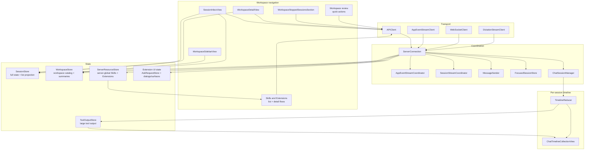

# Oppi client architecture

The Oppi Apple clients control and render server-owned and terminal-owned Pi sessions. They keep workspace navigation HTTP-first and reserve WebSockets for live streams. iOS paints the hot chat timeline with UIKit over authenticated HTTPS/WSS. Mac paints with AppKit/SwiftUI over the owner Unix socket.

## Audience and scope

Read this page before changing iOS or macOS client transport code, session and workspace stores, workspace navigation, chat timeline state, extension UI rendering, dictation, or media playback.

This page covers the Apple client structure. Server route, runtime, and storage details live in [Server architecture](architecture-server.md). For end-to-end LAN and paired HTTPS route selection, see [Networking and connection routing](networking.md).

## Detail map

This page keeps the rules that always apply. Read only the detail page for the area you are changing.

| Page | Covers |
| --- | --- |
| [Client blocks and shared core](architecture-client/blocks.md) | Client blocks; Shared Apple client core; Mac adapter path |
| [Transport and UI flows](architecture-client/flows.md) | Transport lanes; Workspace navigation flow; Focused session flow; Shared store updates; Extension UI on Apple |
| [Media, files, and sharing](architecture-client/media-files.md) | Media, files, and sharing |
| [Renderer change map and cleanup targets](architecture-client/change-map.md) | Renderer-addition change map; Client cleanup targets |
| [Where to look in code](architecture-client/code-map.md) | Where to look in code |

## Client responsibilities

The Apple client owns:

- paired-server credentials and endpoint selection,
- the global sessions inbox, workspace sidebar, server-global Skills and Extensions, workspace detail navigation, and focused-session navigation,
- focused session stream setup and recovery,
- app-event stream consumption and HTTP snapshot repair,
- per-session chat timeline state and rendering,
- extension UI sheets, ask cards, status rows, widgets, and native surfaces,
- voice input, audio playback, file previews, media playback, Quick Session intake, sharing, diagnostics, and settings.

The client does not execute Pi sessions or directly mutate server read models. It sends commands and renders the server projection.

## Client topology

The diagram below is the iOS HTTPS/WSS and UIKit composition. Mac uses the same `ChatSessionManager` and reducer core with owner-socket and AppKit/SwiftUI adapters; see [Mac adapter path](architecture-client/blocks.md#mac-adapter-path).

## Live terminal output ownership

`TimelineReducer.terminalOutputStreams` owns one `TerminalOutputStream` per tool call with `outputStream` metadata. `DeltaCoalescer` forwards each offset-bearing chunk intact, including an empty attach marker. These chunks do not enter the cumulative `ToolOutputStore`. Messages without `outputStream` retain the existing cumulative/history path. Terminal row specialization continues to use producer presentation facts, not tool names.

Each owner serializes byte acceptance, sidecar recovery, and libghostty-vt access on MainActor. It validates producer epochs and raw-byte offsets, drops duplicates and older epochs, and requests the exact missing Range from the existing `?full=true` sidecar. Partial overlaps reset the engine and refetch from byte zero. Recovery queues at most 256 KiB or 512 chunks; overflow keeps a recovery high-water mark. Gaps above 4 MiB reset to a newline-aligned tail where possible and retain an omission notice. Failed recovery remains visible. HTTP 416 recovery requests retry twice after 100 ms and 200 ms while the resync notice stays visible; a third failure shows `resyncFailed`. Reconnect marks running owners as resyncing until an attach marker or output resolves the cursor. Full trace rebuilds discard owners.

The live engine bounds scrollback to about 2000 physical rows and exposes at most 2000 formatted lines. It caches committed logical rows, keeps soft-wrapped prefixes with the active area, and uses tracked grid references to detect pruning or scrollback clearing. Paints are scheduled at most once per 50 ms while live. Completion formats the final ring and releases the grid. Terminal effects remain disabled.

The expanded row paints the owner's resolved ring without interpreting it again. The collection tracks each owner's presentation revision independently of `ChatItem` equality, because ring-tail paints and recovery state can change without changing the 500-character canonical preview. Collapsed and expanded rows show recovery and omission notices. The live full-screen reader captures the call identity and owner store independently of the reusable row, follows the owner's formatted snapshots, and uses its bound sidecar after completion. A full trace rebuild shows a reload notice while the call has no owner. The reader binds to a replacement owner for that same call when one appears; another call cannot redirect it. Copy uses the complete sidecar when available and otherwise the owner's resolved ring. The completed reader retains the existing sidecar/virtualized full-history path. The VT engine remains iOS-linked; shared core types compile without it on Mac.

## Client boundary rules current code

These rules are enforced by `server/scripts/check-architecture-boundaries.ts` during server checks (`--scope all`), the iOS build phase (`--scope ios`), and the Mac pre-push gate (`--scope mac`):

- `clients/apple/OppiCore/Runtime/TimelineReducer.swift` and `DeltaCoalescer.swift` must stay platform-neutral under the shared-core import rule.
- `clients/apple/OppiCore/**` files must not import UIKit, AppKit, SwiftUI, ActivityKit, UserNotifications, Speech, AVFoundation, WebKit, or MetricKit. Put platform-specific code in the iOS or macOS app target.
- `clients/apple/OppiMac/**` files must not import UIKit. Mac paint stays on AppKit/SwiftUI.
- `project.yml` is the Mac target membership authority. OppiMac may compile `OppiMac/**`, `OppiCore/**`, `Shared/**`, and only the established `Oppi/**` adapter files listed there; do not add arbitrary iOS production files to the Mac target.
- `clients/apple/Oppi/Core/Views/**` and `clients/apple/Oppi/Features/Chat/Timeline/**` must not reference `APIClient` or `WebSocketClient` directly.
- `clients/apple/Oppi/Core/Views/**` and `clients/apple/Oppi/Features/Chat/Timeline/**` must not reference `ServerConnection`, `ConnectionCoordinator`, `apiClient` (member, environment key path, or binding), `wsClient`, or `SessionStore`/`WorkspaceStore` (`view-layer-connection-boundary`). They receive explicit values (`SessionContentAccess`, icon cache) and typed actions from chat composition.
- Workspace and quick-session list views must read `SessionStore.listProjectionSessions` or `listProjectionSessions(workspaceId:)`, not full `SessionStore.sessions`.
- `SessionStore`, `WorkspaceStore`, `ServerResourceStore`, and shared stores under `clients/apple/OppiCore/Stores/**` must not depend on each other. Cross-store workflows belong in `ServerConnection` or a small service.
- Generic extension UI rendering and routing must not branch on concrete tool names, extension names, status keys, widget keys, or display names. Add semantic protocol metadata at the producer boundary instead. This includes `ExtensionSurfacePanel.swift` and `MacExtensionSurfacePanel.swift`.
- SwiftUI foreground, fill, and stroke styling must use the environment-resolved `.theme*` `ShapeStyle` shorthand. `Color.theme*` is a runtime snapshot for APIs that require a concrete `Color` or a UIKit/AppKit bridge. Persistent list and panel modifiers must read `theme` or `themeID` from the environment so mounted content repaints after a theme switch. `scripts/theme-surface-guard.ts` enforces the shorthand boundary during the iOS architecture check.
