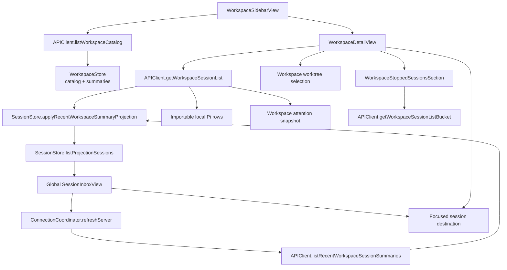
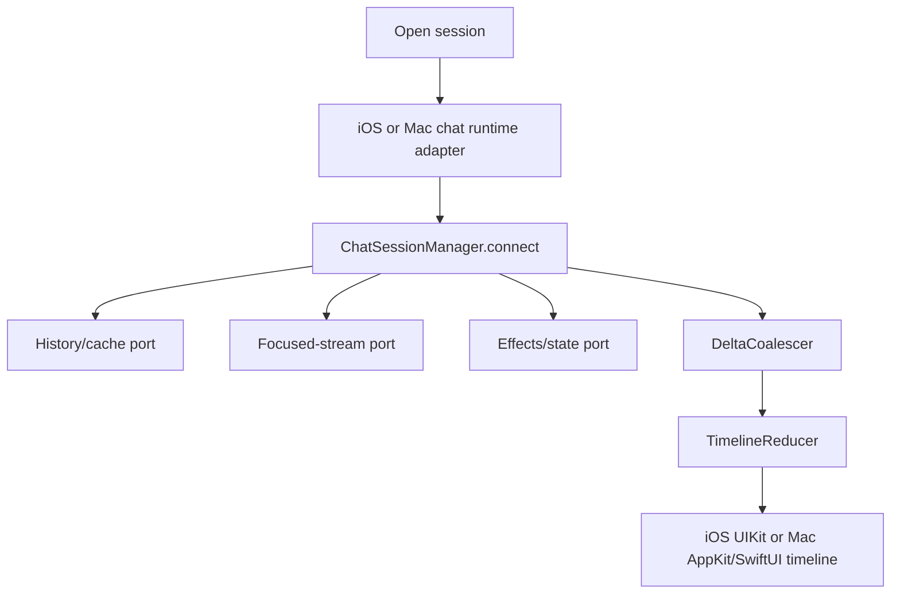

# Oppi client architecture: Transport and UI flows

Part of [Oppi client architecture](../architecture-client.md). Transport lanes, navigation and session flows, store updates, and extension UI.

## Transport lanes

**Automatic** constructs verified LAN HTTPS and paired HTTPS candidates. Device credentials use short-lived HTTPS/WSS tokens and P-256 proof. For each HTTPS candidate, the client constructs the final authenticated `APIClient`, probes `GET /server/info` under a total bootstrap deadline, and retains that client if it wins.

A route with current health evidence remains installed across ordinary foreground and network boundaries. Availability failures may retry another supported HTTPS/WSS candidate during the current selection pass. Unknown or revoked credentials fail closed, and TLS identity or protocol failures stop fallback. Pairing probes candidates before one non-replayed `/pair` mutation. Short-lived HTTPS/WSS clients use the device-key refresh flow.

Supported telemetry and logs cover HTTPS/WSS device-auth outcomes without exposing tokens, private keys, or raw credentials.

```mermaid
graph TD
  Client[Apple client]

  Client --> WorkspaceHTTP[Workspace HTTP lane]
  Client --> AppEventWS[Global app event stream<br/>/app/events/stream]
  Client --> SessionWS[Focused session stream<br/>workspace or /control-sessions/:sessionId/stream]
  Client --> SessionCatchup[Focused session catch-up<br/>workspace or /control-sessions/:sessionId/events]
  Client --> AudioWS[Dictation stream<br/>/dictation/stream]

  WorkspaceHTTP --> Home[Workspace catalog and summaries]
  WorkspaceHTTP --> Recent[Recent session summaries across workspaces]
  WorkspaceHTTP --> WorkspaceRecent[Workspace recent session list]
  WorkspaceHTTP --> Archive[Stopped archive buckets]
  WorkspaceHTTP --> Attention[Workspace attention snapshot]
  WorkspaceHTTP --> Files[Files, media, uploads, attachments]
  WorkspaceHTTP --> Review[Quick actions and review comments]

  AppEventWS --> Stores[Shared store updates]
  SessionWS --> Chat[Focused session timeline and commands]
  SessionCatchup --> Replay[Durable session event repair]
  AudioWS --> Dictation[Dictation and audio input]
```

The global app event stream and focused session stream stay separate. App events update lists and attention across workspaces. Focused session streams carry timeline events, commands, queue state, and session-specific UI messages. `SessionRouteScope` selects workspace-owned or declared control-session paths; both scopes feed the same `ChatSessionManager` and reducer. iOS paints that result with UIKit; Mac paints it with AppKit/SwiftUI.

## Workspace navigation flow

The Workspaces tab opens the global `SessionInboxView` for the active server. The sidebar orders its direct destinations as **Agents**, **Schedules**, **Skills**, **Extensions**, then **Workspaces**. Skills and Extensions are separate server-global utilities; there is no combined Resources destination. Server Settings owns the server-scoped Mobile Output Guide toggle. The root shows active sessions under **Your Turn** and **Working**, plus stopped sessions from the three most recent calendar days. Today's stopped group is expanded; earlier day groups are collapsed. Stopped incognito sessions are omitted because they have no resumable history. Workspace rows include workspace context; declared control-session rows use `Pi Control`. Selecting a workspace from the sidebar opens `WorkspaceDetailView` over the global inbox, where older stopped history remains available. Selecting any session opens the same focused chat without reading a Pi JSONL file.

`WorkspaceStore` owns the workspace catalog and sidebar summaries, including the optional compact Git summary requested by the Apple catalog client. A main-checkout `workspace_git_changed` invalidation repairs that compact summary through authenticated HTTP while preserving the last trustworthy value on failure. `SessionStore` owns session rows and exposes `listProjectionSessions` for the global inbox, workspace detail, and quick-session lists. The global inbox reads the server selected in its toolbar, groups that server's active rows by attention and execution state, and groups the already-fetched recent stopped projection by calendar day without another request. View-driven refreshes target the selected server so an unavailable inactive host cannot delay the inbox; app launch and foreground recovery may still refresh the broader connection pool. `WorkspaceDetailView` applies a workspace and worktree scope, refreshes the hot stopped range, exposes importable local sessions, and keeps older archive buckets in view state until loaded. Both lists build rows with `SessionListEntries` (OppiCore) as threads only when the Session Threads experiment is on (`AppNavigation.sessionThreadsEnabled`, default off, else flat), section them with `SessionInboxGrouping`, and draw every session row with `SessionListEntryRow`: one row, Thread strip or `In thread` link, and one set of swipe actions. With the experiment on, Threads builds launch trees over every loaded session, lists each tree at its root, and links a listed member whose root is outside the list (another workspace or worktree); only stopped history grouping differs between the two lists. The inbox always shows every workspace; selecting a workspace in either presentation opens `WorkspaceDetailView`. The shared sidebar places saved Agents, schedules, Skills, and Extensions above a persisted Workspaces disclosure, retains the New Workspace row, and pins App Settings below it. Compact selection dismisses the drawer and pushes the management view; split selection keeps the sidebar visible, clears any workspace selection, and opens the management view in the detail column. Resource detail targets carry `serverId`, resource kind, and opaque resource ID. Skill-file targets also carry the server ID and opaque skill ID. `AppNavigation` records utility → detail → file route metadata so stack/split transitions preserve every level without issuing a request to the newly active but wrong server. The Agents list pins a client-presented Pi row before saved Agents and uses the Pi mark. Pi detail shows the live `~/.pi/agent/SYSTEM.md` or Pi's built-in default prompt, plus a built-in Tools picker that writes only `defaultTools`; it has no saved `agentId`. Existing Agent, schedule, and workspace create/edit sheets expose a capability-gated `Use Oppi Session` row. It launches a declared server-scoped session and then opens the ordinary chat destination. Schedule prompts and saved Agent definitions can also open in the full-screen Markdown reader. Server Skill files whose catalog summary carries `editable: true` reuse the same full-screen selected-text review flow and pass the selected existing absolute host path to a Control prompt that uses stock `read` and `edit`; package and other server-authored read-only Skills keep the ordinary file reader. Selected-text comments remain in a server-and-target-scoped local draft until the user chooses **Edit in Oppi Session**. In the guided revision composer, opening and typing create nothing; **Send** posts one idempotent control-session creation request whose initial prompt contains the starter instructions, typed request, and staged comments. The client freezes the complete request and comment snapshots for that idempotency key; retries resend those exact fields, and success clears only comments that remain byte-for-byte unchanged from the sent snapshots. Revised draft text and edited or newly staged comments remain local; the composer stays open with a fresh idempotency key so the user can send that remaining work separately. A prompt-preflight failure keeps the text and comments in place and does not navigate. Skill drafts are keyed by opaque Skill ID so comments from several files can stack into one revision session while retaining each absolute source path. Reading alone never creates a session. On iPad that chat is pushed on the selected management utility's detail stack, so the utility remains selected. Stack navigation pushes workspace detail and chat over the inbox; split navigation keeps the workspace sidebar beside the selected detail and preserves the equivalent route when the layout changes. `WorkspaceAdaptiveRootView` consumes guided first-workspace requests and `oppi://workspace` payloads so both presentations open the same workspace creation sheet. List views must not read the full `SessionStore.sessions` array because hot timeline updates can change full session state without changing row-level summary data.

## Focused session flow

`ChatView` creates or receives a `ChatSessionManager` for a session. The manager owns the per-session reducer, coalescer, and tool-call correlator.

The manager loads cached trace first for immediate display, then fetches the latest trace page in the background. On first WebSocket connect it seeds sequence tracking from the server. On reconnect it uses focused-session catch-up; if the server ring cannot serve the gap, it repairs from paged trace history instead of loading the entire trace at once.

Stopped sessions load history without opening the focused WebSocket. Opening the WebSocket can resume server-owned execution, so explicit resume stays a user action. `FocusedSessionConnectionPolicy` encodes that rule: a locally stopped session must refresh history first, and a still-stopped refresh must stay history-only.

Shared policy types live under `clients/apple/OppiCore/Runtime/`:

- `FocusedSessionConnectionPolicy` — stream vs history-only for a `SessionStatus`
- `FocusedSessionStopTurnPolicy` — `stopRequested` / `stopConfirmed` / `stopFailed` timeline effects and the 10-second reconcile delay

`ChatSessionManager` lives under `clients/apple/OppiCore/Runtime/` and owns the connection loop, cache-first restore order, paging, catch-up apply, and reducer/coalescer mutations. It sequences cache → paged trace → catch-up directly. It depends on three cohesive ports: history/cache, focused stream, and effects/state. The iOS adapter implements those ports with `ServerConnection`, `APIClient`, `SessionStore`, `TimelineCache`, UI effects, audio, preferences, and telemetry. The manager does not import those app services or a UI framework. iOS trace-page 404/405/409 fallback to a full session trace is classified by `IOSChatSessionRuntimeAdapter`, not by the manager.

iOS and Mac are both live runtime consumers. iOS implements the three ports with `ServerConnection`, `APIClient`, `SessionStore`, `TimelineCache`, UI effects, audio, preferences, and telemetry. Mac implements them with `MacChatSessionRuntimeAdapter` and `MacSessionTraceStore` over the owner Unix socket. Live-stream authentication, app-event handling, and dictation remain outside this runtime boundary. The manager still consults `FocusedSessionConnectionPolicy` and `FocusedSessionStopTurnPolicy`.

## Shared store updates

Live messages can arrive through focused session streams, app-event streams, and HTTP refreshes. The client keeps mutation policy centralized:

- `ServerConnection+StoreUpdates.swift` applies shared session store, workspace summary, screen-awake, unread-completion, and Live Activity state changes.
- `ServerConnection+MessageRouter.swift` applies active-session UI effects, inactive-session UI effects, queue effects, extension UI notifications, and command result side effects.
- `ChatSessionManager` routes timeline events to its own coalescer and reducer after shared store updates.

A live session event should mutate shared stores once. If a non-focused session has its own live consumer, cross-session handling defers shared updates for message types that the live consumer owns.

## Extension UI on Apple

Extension UI is extension-agnostic. Generic client code renders semantic protocol metadata instead of branching on tool names, extension names, status keys, widget keys, or display names.

Main client owners:

- `clients/apple/OppiCore/Stores/AskRequestStore.swift` stores question/confirmation/input requests that render as ask cards.
- `pendingExtensionDialogQueues` stores sheet-backed generic extension dialogs per session.
- `clients/apple/OppiCore/Runtime/ExtensionSurfaceState.swift` owns the protocol-derived snapshot, reducer, placement grouping, and framework-free presentation helpers used by both iOS and Mac.
- iOS `extensionSurfaceBySession` and Mac `MacSessionTraceStore.extensionSurface` store that shared snapshot per session. iOS also retains working-message, hidden-thinking-label, and tools-expanded fields, plus toast and editor-text effects.
- `ServerConnection+Ask.swift` sends responses over the focused stream or the HTTP session command route for non-focused sessions.
- `ExtensionSurfacePanel.swift` and `MacExtensionSurfacePanel.swift` paint extension-provided content. On iOS the panel keeps its SwiftUI chrome (strip pills, drawer header, detail header) and paints every block body through UIKit: `ExtensionNativeBlockViews.swift` reuses the chat timeline's Markdown and highlighted-code views, draws terminal and widget lines as unwrapped monospaced text, and keeps block and activity-row views by id so a replacement snapshot preserves their view state. `OppiCore/Runtime/ExtensionNativeBlockPresentation.swift` holds the framework-free state wording, progress clamping, link, and widget-line rules.

Cross-session extension UI responses use HTTP when the focused WebSocket is not bound to the target session.
