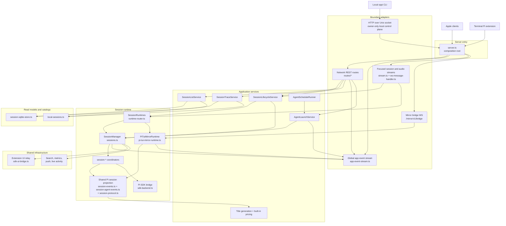

# Oppi server architecture

The Oppi server owns sessions, workspace access, runtime configuration, and the mobile-facing projection of Pi session state. It exposes authenticated HTTP plus the bearer-free Oppi Mirror bridge over an owner-only Unix socket. iPhone and iPad clients, dictation, and app events use authenticated HTTPS/WSS listeners. The co-located Mac app uses that same owner Unix socket for authenticated local HTTP and live WebSocket upgrades whether it attaches to a healthy runtime, waits for LaunchAgent, or spawns a child process, and must not send `sk_` over HTTPS or WSS.

## Audience and scope

Read this page when changing server routes, WebSocket transports, session lifecycle code, runtime ownership, the Pi SDK adapter, terminal mirror behavior, storage projections, or protocol contracts.

This page covers production server structure. For Apple UI composition, see [Client architecture](architecture-client.md). For supported HTTPS/WSS routing, see [Networking and connection routing](networking.md).

## Detail map

This page keeps the rules that always apply. Read only the detail page for the area you are changing.

| Page | Covers |
| --- | --- |
| [Server blocks and HTTP/WebSocket boundaries](architecture-server/blocks-and-boundaries.md) | Main server blocks; HTTP and WebSocket boundaries |
| [Session runtime](architecture-server/runtime.md) | Session runtime ownership; Managed SDK runtime; Saved Agents and schedules; Terminal mirror runtime |
| [Read models and event stream](architecture-server/read-models.md) | Session list and history read models; App event stream |
| [Tool inspection](architecture-server/tool-inspection.md) | Producer facts; mobile-renderer registry; full tool-output ownership |
| [Cleanup targets and code map](architecture-server/code-map.md) | Server cleanup targets; Where to look in code |

## Server responsibilities

The server owns:

- authenticated HTTP and WebSocket boundaries,
- workspace CRUD, workspace file access, review comments, quick actions, and provider auth,
- managed Pi SDK session lifecycle,
- saved Agent definitions and schedule-runner state,
- terminal Pi TUI mirror registration and command proxying,
- session event projection into durable sequence numbers, summaries, media, search, and SQLite read models,
- extension UI relay and attention state,
- telemetry, push, Live Activity updates, package version via getPackageInfo(), and diagnostics.

The server does not render the chat timeline. It sends protocol messages and HTTP snapshots for the Apple client to render.

## Server topology

## Protocol boundary

Server protocol types live in `server/src/types/protocol.ts` and are re-exported from `server/src/types.ts`. `types.ts` is a stable barrel for the historical `./types.js` import path; it should only re-export type modules.

When changing protocol messages:

1. Update server protocol types.
2. Update Apple models: `ClientMessage.swift`, `ServerMessage.swift`, `AppEventMessage.swift`, and stream wrappers.
3. Update protocol snapshots in `protocol/*.json` when the wire shape changes. Ordinary protocol tests compare deterministic canonical bytes with the committed fixtures without writing tracked files. Deliberate fixture changes use `cd server && npm run protocol:fixtures:update`.
4. Run server protocol tests, followed by Apple Codable tests.

Tool presentation facts and full-output lifetime are documented in [Tool inspection](architecture-server/tool-inspection.md).

## Server boundary rules current code

These rules are enforced by `server/scripts/check-architecture-boundaries.ts` and ESLint local rules:

- Server tests live under `server/tests/**`, not `server/src/**`.
- `server/src/server.ts` is the single composition root. Lower layers must not import it.
- Core modules must not import `server/src/routes/**`; shared logic belongs in non-route modules.
- Concrete route modules must not import each other. Compose route dispatch in `server/src/routes/index.ts`, and keep shared route helpers limited to the approved route helper modules.
- `server/src/types.ts` may only re-export modules under `server/src/types/`.
- `session-*` modules must not import the `sessions.ts` facade.
- `server/src/storage/**` modules are infrastructure leaves. They must not import routes, stream code, or session runtime modules.
- `@earendil-works/pi-ai/compat` imports are forbidden. Configured model/auth requests use `ModelRuntime`; static built-in pricing reads use `@earendil-works/pi-ai/providers/all`.
- Direct `mirror-session-resume.ts` imports live only in `server/src/session-lifecycle-service.ts`; routes and streams call lifecycle service methods for mirror open/resume behavior.
- `runtime == "pi-tui"` ownership checks live only in runtime, lifecycle, mirror-resume, and current input-command boundary modules. Other modules consume typed service results or semantic capabilities instead of branching on runtime ownership.
- Generic extension UI relay/rendering code must not branch on concrete tool names, extension names, status keys, widget keys, or display names. Add semantic protocol metadata at the producer boundary instead.
