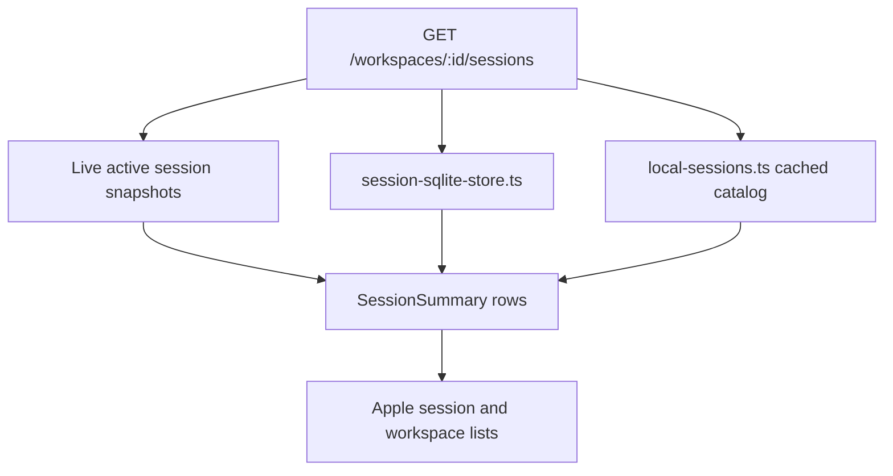

# Oppi server architecture: Read models and event stream

Part of [Oppi server architecture](../architecture-server.md). Session list and history read models, and the app event stream.

## Session list and history read models

Workspace navigation uses `SessionListService` over SQLite-backed snapshots and the local-session catalog instead of reading full JSONL traces on the hot path. The workspace catalog can opt into compact Git summaries (`changedCount`, `ahead`, and `behind`); this uses a lightweight status probe rather than the full review-oriented Git status payload.

The recent lane is time-bounded with `sinceMs` and `untilMs`. Older stopped sessions and importable local sessions are summarized into archive buckets and loaded lazily.

`SessionTraceService` owns trace paging, outline snapshots, recovery, tool output lookup, overall diffs, changed-file summaries, and raw changed-file previews.

Session detail uses bounded trace pages and lightweight outline data where possible. Full trace reads remain behind recovery and compatibility paths:

- `readSessionTrace(...)` for server-owned persisted traces,
- `readSessionTraceFromFile(...)` and `readSessionTraceFromFiles(...)` for Pi JSONL files,
- `readSessionTraceByUuid(...)` for UUID lookup fallback.

## App event stream

`AppEventStreamMux` converts session broadcast events into app-level messages. It sends only allowed `AppEventMessage` types:

- session created/imported/discovered/deleted/ended,
- session summaries,
- stop requested/confirmed/failed,
- session errors,
- extension UI request/settled/notification,
- workspace git changed,
- app-event stream connected.

It does not send focused timeline deltas, full session state, queue state, command results, dictation frames, or raw `GitStatus` payloads. On connect it sends `app_events_connected` with `snapshotRequired: true`; clients repair state through HTTP snapshots.
