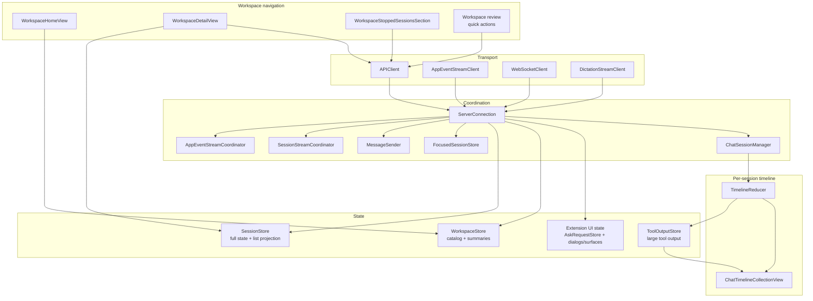
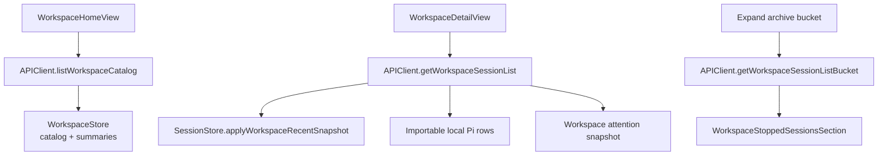
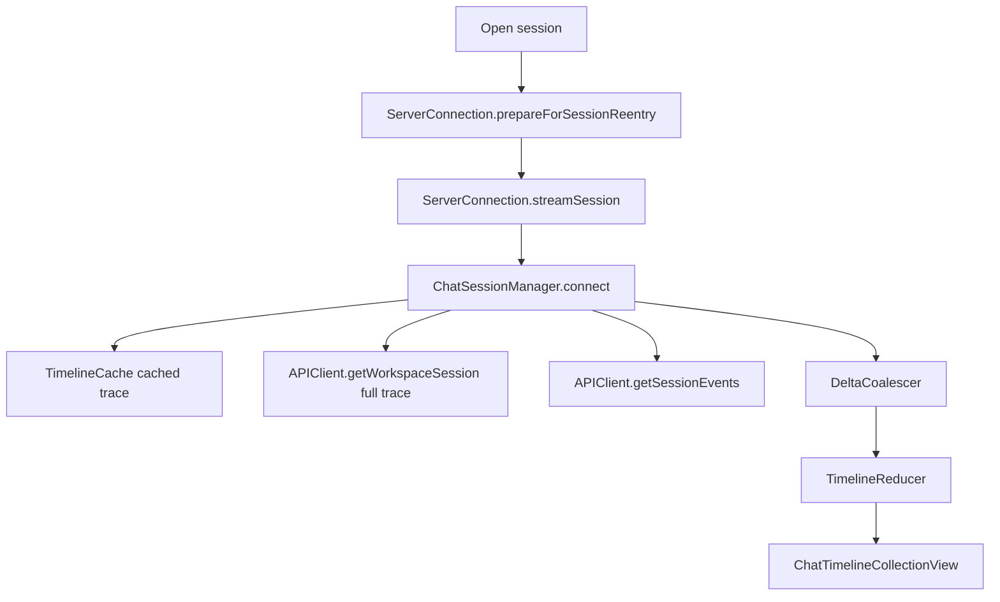

# Oppi client architecture

The Oppi Apple client is a remote control and renderer for server-owned and terminal-owned Pi sessions. It keeps workspace navigation HTTP-first, uses WebSockets only for live streams, and renders the hot chat timeline through a UIKit-backed pipeline.

## Audience and scope

Read this page when changing iOS or macOS client transport code, session/workspace stores, workspace navigation, chat timeline state, extension UI rendering, dictation, or media playback.

This page covers the Apple client structure. Server route, runtime, and storage details live in [Server architecture](architecture-server.md).

## Client responsibilities

The Apple client owns:

- paired-server credentials and endpoint selection,
- workspace home and workspace detail navigation,
- focused session stream setup and recovery,
- app-event stream consumption and HTTP snapshot repair,
- per-session chat timeline state and rendering,
- extension UI sheets, ask cards, status rows, widgets, and native surfaces,
- voice input, audio playback, file previews, media playback, sharing, and settings.

The client does not execute Pi sessions or mutate server read models directly. It sends commands and renders the server projection.

## Client topology

## Client blocks

| Block                                    | Owns                                                                                                                        | Does not own                          |
| ---------------------------------------- | --------------------------------------------------------------------------------------------------------------------------- | ------------------------------------- |
| `ServerConnection`                       | connection composition, API/WS client wiring, focused/app-event stream startup, shared store updates, command sender wiring | per-session timeline reducer state    |
| `APIClient`                              | authenticated HTTP requests and response decoding                                                                           | UI decisions or store mutation policy |
| `WebSocketClient`                        | focused session WebSocket transport, reconnect policy, inbound metadata                                                     | protocol side effects                 |
| `AppEventStreamClient` + coordinator     | app-event WebSocket consumption                                                                                             | focused timeline replay               |
| `SessionStreamCoordinator`               | per-session stream continuations and sequence tracking                                                                      | timeline rendering                    |
| `MessageSender`                          | command request IDs, acks, retries, command result waiters                                                                  | session list rendering                |
| `ChatSessionManager`                     | per-session connection loop, cached/fresh trace loading, catch-up, reducer/coalescer ownership                              | global app-event routing              |
| `SessionStore`                           | full session cache, cold list projection, per-server partitions, unread completion state                                    | workspace catalog                     |
| `WorkspaceStore`                         | workspace catalog, skill catalog, workspace summaries, per-server freshness                                                 | full session lifecycle                |
| `AskRequestStore` and extension UI state | pending asks, sheet dialogs, status/widget/native-surface state                                                             | server-side permission policy         |
| `TimelineReducer` + `DeltaCoalescer`     | timeline model and live delta coalescing                                                                                    | UIKit rendering and network           |

## Transport lanes

```mermaid
graph TD
  Client[Apple client]

  Client --> WorkspaceHTTP[Workspace HTTP lane]
  Client --> AppEventWS[Global app event stream<br/>/app/events/stream]
  Client --> SessionWS[Focused session stream<br/>/workspaces/:workspaceId/sessions/:sessionId/stream]
  Client --> SessionCatchup[Focused session catch-up<br/>/workspaces/:workspaceId/sessions/:sessionId/events]
  Client --> AudioWS[Dictation stream<br/>/dictation/stream]

  WorkspaceHTTP --> Home[Workspace catalog and summaries]
  WorkspaceHTTP --> Recent[Workspace recent session list]
  WorkspaceHTTP --> Archive[Stopped archive buckets]
  WorkspaceHTTP --> Attention[Workspace attention snapshot]
  WorkspaceHTTP --> Files[Files, media, uploads, attachments]
  WorkspaceHTTP --> Review[Quick actions and review comments]

  AppEventWS --> Stores[Shared store updates]
  SessionWS --> Chat[Focused session timeline and commands]
  SessionCatchup --> Replay[Durable session event repair]
  AudioWS --> Dictation[Dictation and audio input]
```

The global app event stream and focused session stream are intentionally separate. App events update lists and attention across workspaces. Focused session streams carry timeline events, commands, queue state, and session-specific UI messages.

## Workspace navigation flow

Workspace navigation avoids rereading full traces.

`WorkspaceStore` owns workspace cards and summaries. `SessionStore` owns session rows and exposes `listProjectionSessions` for workspace and quick-session lists. List views must not read the full `SessionStore.sessions` array because hot timeline updates can change full session state without changing row-level summary data.

`WorkspaceDetailView` owns view-scoped refresh and polling for one workspace. It fetches the hot stopped range and archive buckets through HTTP, applies the recent snapshot to `SessionStore`, and keeps older archive buckets in view state until loaded.

## Focused session flow

`ChatView` creates or receives a `ChatSessionManager` for a session. The manager owns the per-session reducer, coalescer, and tool-call correlator.

The manager loads cached trace first for immediate display, then fetches fresh trace in the background. On first WebSocket connect it seeds sequence tracking from the server. On reconnect it uses focused-session catch-up; if the server ring cannot serve the gap, it schedules a full trace reload.

Stopped sessions load history without opening the focused WebSocket. Opening the WebSocket can resume server-owned execution, so explicit resume stays a user action.

## Shared store updates

Live messages can arrive through focused session streams, app-event streams, and HTTP refreshes. The client keeps mutation policy centralized:

- `ServerConnection+StoreUpdates.swift` applies shared session store, workspace summary, screen-awake, unread-completion, and Live Activity state changes.
- `ServerConnection+MessageRouter.swift` applies active-session UI effects, inactive-session UI effects, queue effects, extension UI notifications, and command result side effects.
- `ChatSessionManager` routes timeline events to its own coalescer and reducer after shared store updates.

A live session event should mutate shared stores once. If a non-focused session has its own live consumer, cross-session handling defers shared updates for message types that the live consumer owns.

## Extension UI on Apple

Extension UI is extension-agnostic. Generic client code renders semantic protocol metadata instead of branching on tool names, extension names, status keys, widget keys, or display names.

Main client owners:

- `AskRequestStore` stores question/confirmation/input requests that render as ask cards.
- `pendingExtensionDialogQueues` stores sheet-backed generic extension dialogs per session.
- `extensionSurfaceBySession` stores status rows, widgets, working messages, hidden-thinking labels, and native surfaces.
- `ServerConnection+Ask.swift` sends responses over the focused stream or the HTTP session command route for non-focused sessions.
- `ExtensionSurfacePanel.swift` and native-surface views render extension-provided content.

Cross-session extension UI responses use HTTP when the focused WebSocket is not bound to the target session.

## Media, files, and sharing

File previews and media playback use authenticated HTTP routes. The focused session WebSocket does not carry raw media bytes.

- `APIClient` fetches workspace files, session files, session attachments, and tool output.
- `AuthenticatedMediaSource` and media playback views translate local media asset requests into bearer-authenticated HTTP range requests.
- `ToolOutputStore` holds large tool output outside hot timeline row state.
- File browser views use workspace path/list/raw endpoints and client-side cached file indexes for search.
- Sharing and export code uses redaction and file-rendering services outside the transport layer.

## Client boundary rules current code

These rules are enforced by `server/scripts/check-architecture-boundaries.ts` during server checks and the Apple build phase:

- `TimelineReducer.swift` and `DeltaCoalescer.swift` must remain UIKit-free.
- `clients/apple/Oppi/Core/Views/**` and `clients/apple/Oppi/Features/Chat/Timeline/**` must not reference `APIClient` or `WebSocketClient` directly.
- Workspace and quick-session list views must read `SessionStore.listProjectionSessions` or `listProjectionSessions(workspaceId:)`, not full `SessionStore.sessions`.
- `SessionStore`, `WorkspaceStore`, and `MessageQueueStore` must not depend on each other. Cross-store workflows belong in `ServerConnection` or a small service.
- Generic extension UI rendering and routing must not branch on concrete tool names, extension names, status keys, widget keys, or display names. Add semantic protocol metadata at the producer boundary instead.

## Client cleanup targets

Keep these high-churn client modules small and explicit:

- `APIClient.swift` — split by route domain while keeping the same actor and request helpers.
- `ServerConnection.swift` and extensions — keep as composition root; move capability/reconnect policy and extension UI state transitions into smaller coordinators when behavior grows.
- `WorkspaceDetailView.swift` — extract refresh, archive bucket, and local-import state into a `@MainActor @Observable` controller.
- `ChatView.swift` — keep rendering and composition in the view; push lifecycle and timeline policy into `ChatSessionManager` and timeline helpers.
- `FullScreenCodeBodies.swift` and timeline tool rows — continue moving heavy rendering and measurement code behind focused view models/builders.

## Where to look in code

| Concern                     | Files                                                                                                                                                                 |
| --------------------------- | --------------------------------------------------------------------------------------------------------------------------------------------------------------------- |
| Connection composition      | `clients/apple/Oppi/Core/Networking/ServerConnection.swift`, `ServerConnection+*.swift`                                                                               |
| HTTP API                    | `clients/apple/Oppi/Core/Networking/APIClient.swift`                                                                                                                  |
| Focused WebSocket transport | `clients/apple/Oppi/Core/Networking/WebSocketClient.swift`, `SessionStreamCoordinator.swift`, `MessageSender.swift`                                                   |
| App event stream            | `clients/apple/Oppi/Core/Networking/AppEventStreamClient.swift`, `AppEventStreamCoordinator.swift`, `ServerConnection+AppEvents.swift`                                |
| Workspace catalog           | `clients/apple/Oppi/Core/Services/WorkspaceStore.swift`, `WorkspaceHomeView.swift`                                                                                    |
| Workspace detail list       | `clients/apple/Oppi/Features/Workspaces/WorkspaceDetailView.swift`, `WorkspaceStoppedSessionsSection.swift`                                                           |
| Session store               | `clients/apple/Oppi/Core/Services/SessionStore.swift`                                                                                                                 |
| Chat session lifecycle      | `clients/apple/Oppi/Features/Chat/Session/ChatSessionManager.swift`, `ChatActionHandler.swift`                                                                        |
| Timeline model              | `clients/apple/Oppi/Core/Runtime/TimelineReducer.swift`, `DeltaCoalescer.swift`, `ToolOutputStore.swift`                                                              |
| Timeline rendering          | `clients/apple/Oppi/Features/Chat/Timeline/**`, `ChatTimelineCollectionView.swift`                                                                                    |
| Extension UI                | `ServerConnection+Ask.swift`, `ServerConnection+MessageRouter.swift`, `AskRequestStore.swift`, `ExtensionSurfacePanel.swift`, `ExtensionUINativeSurface.swift`        |
| File browser and media      | `APIClient.swift`, `AuthenticatedMediaSource.swift`, `AuthenticatedMediaPlayback.swift`, `InlineMediaPlayback.swift`, `FileBrowserView.swift`, `RemoteFileView.swift` |
| Protocol mirrors            | `ClientMessage.swift`, `ServerMessage.swift`, `AppEventMessage.swift`                                                                                                 |
