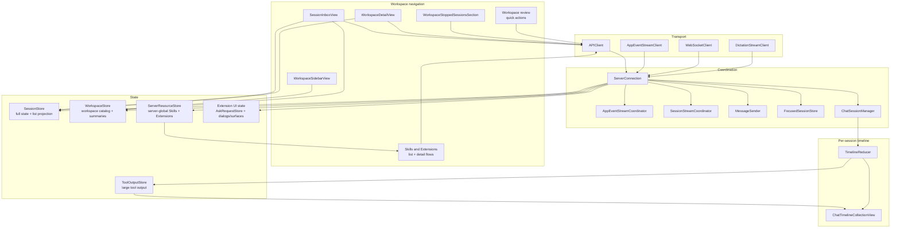
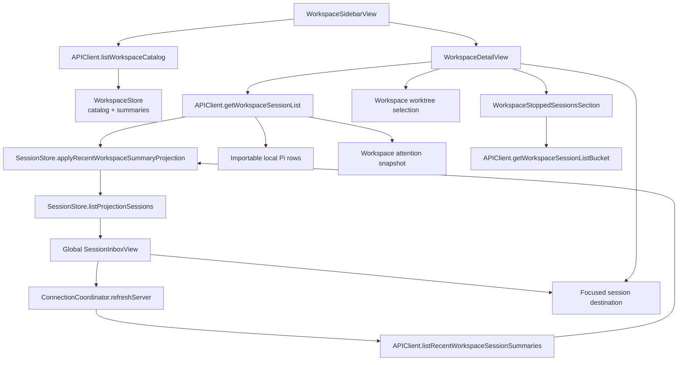
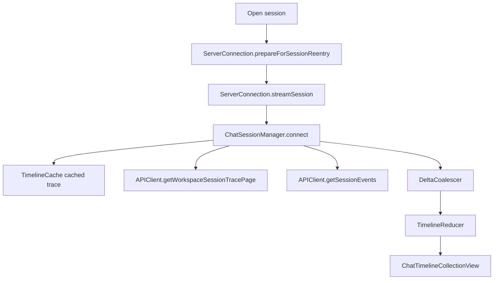

# Oppi client architecture

The Oppi Apple client controls and renders server-owned and terminal-owned Pi sessions. It keeps workspace navigation HTTP-first, reserves WebSockets for live streams, and renders the hot chat timeline through a UIKit-backed pipeline. HTTP/WebSocket clients use authenticated HTTPS/WSS routes.

## Audience and scope

Read this page before changing iOS or macOS client transport code, session and workspace stores, workspace navigation, chat timeline state, extension UI rendering, dictation, or media playback.

This page covers the Apple client structure. Server route, runtime, and storage details live in [Server architecture](architecture-server.md). For end-to-end LAN and paired HTTPS route selection, see [Networking and connection routing](networking.md).

## Client responsibilities

The Apple client owns:

- paired-server credentials and endpoint selection,
- the global sessions inbox, workspace sidebar, server-global Skills and Extensions, workspace detail navigation, and focused-session navigation,
- focused session stream setup and recovery,
- app-event stream consumption and HTTP snapshot repair,
- per-session chat timeline state and rendering,
- extension UI sheets, ask cards, status rows, widgets, and native surfaces,
- voice input, audio playback, file previews, media playback, Quick Session intake, sharing, diagnostics, and settings.

The client does not execute Pi sessions or directly mutate server read models. It sends commands and renders the server projection.

## Client topology

## Client blocks

| Block                                         | Owns                                                                                                                                                     | Does not own                                            |
| --------------------------------------------- | -------------------------------------------------------------------------------------------------------------------------------------------------------- | ------------------------------------------------------- |
| `ServerConnection`                            | HTTPS/WSS connection composition, API/WS client wiring, focused/app-event stream startup, shared store updates                                            | per-session timeline reducer state                      |
| `APIClient`                                   | authenticated HTTP requests and response decoding                                                                                                        | UI decisions or store mutation policy                   |
| `WebSocketClient`                             | focused session WebSocket transport, reconnect policy, inbound metadata                                                                                  | protocol side effects                                   |
| `AppEventStreamClient` + coordinator          | app-event WebSocket consumption                                                                                                                          | focused timeline replay                                 |
| `SessionStreamCoordinator`                    | per-session stream continuations, queue sync, and focused transport lifecycle                                                                            | timeline rendering                                      |
| `SessionStreamCatchUpTracker`                 | platform-neutral durable event sequence tracking for focused stream repair                                                                               | transport opening or telemetry                          |
| `MessageSender`                               | command request IDs, acks, retries, command result waiters                                                                                               | session list rendering                                  |
| `ChatSessionManager`                          | per-session connection loop, cached/paged trace loading, catch-up, reducer/coalescer ownership                                                           | global app-event routing                                |
| `SessionStore`                                | full session cache, cold list projection, per-server partitions, unread completion state                                                                 | workspace catalog                                       |
| `WorkspaceStore`                              | workspace catalog, workspace-effective skill choices used by workspace create/edit flows, workspace summaries, per-server freshness                      | full session lifecycle or server-global extension state |
| `ServerResourceStore`                         | independent per-server global Skill and Extension snapshots, cached-first loading, and normal toggle rollback | workspace overrides, session lifecycle, or UI grouping  |
| `AskRequestStore` and extension UI state      | pending asks, sheet dialogs, status/widget/native-surface state                                                                                          | server-side permission policy                           |
| `TimelineReducer` + `DeltaCoalescer`          | timeline model and live delta coalescing                                                                                                                 | UIKit rendering and network                             |

## Shared Apple client core

`clients/apple/OppiCore/**` is the source-group boundary for Apple client/data code that should compile into both iOS/iPadOS and macOS targets. It holds protocol DTOs, client-environment values, transport identifiers, reducer support state, stream sequence state, ask/message queue state, review-comment state, file-index state, git status state, freshness/health state, media/diff/date/session/error formatting, and other helpers that need no UI or device framework.

Non-adapter files in `OppiCore` must stay platform-neutral. UI/device work belongs in `clients/apple/OppiCore/PlatformAdapters/**`, the iOS app under `clients/apple/Oppi/**`, or the Mac app under `clients/apple/OppiMac/**`. `OppiCore/PlatformAdapters` is excluded from the shared source group until each adapter is added to the correct target explicitly. Mac local server ownership, owner-token loading, certificate trust delegates, notifications, TCC, and process lifecycle are adapters around this shared core, not part of the core itself.

## Transport lanes

**Automatic** constructs verified LAN HTTPS and paired HTTPS candidates. Device credentials use short-lived HTTPS/WSS tokens and P-256 proof. For each HTTPS candidate, the client constructs the final authenticated `APIClient`, probes `GET /server/info` under a total bootstrap deadline, and retains that client if it wins.

A route with current health evidence remains installed across ordinary foreground and network boundaries. Availability failures may retry another supported HTTPS/WSS candidate during the current selection pass. Unknown or revoked credentials fail closed, and TLS identity or protocol failures stop fallback. Pairing probes candidates before one non-replayed `/pair` mutation. Short-lived HTTPS/WSS clients use the device-key refresh flow.

Supported telemetry and logs cover HTTPS/WSS device-auth outcomes without exposing tokens, private keys, or raw credentials.

```mermaid
graph TD
  Client[Apple client]

  Client --> WorkspaceHTTP[Workspace HTTP lane]
  Client --> AppEventWS[Global app event stream<br/>/app/events/stream]
  Client --> SessionWS[Focused session stream<br/>workspace or /control-sessions/:sessionId/stream]
  Client --> SessionCatchup[Focused session catch-up<br/>workspace or /control-sessions/:sessionId/events]
  Client --> AudioWS[Dictation stream<br/>/dictation/stream]

  WorkspaceHTTP --> Home[Workspace catalog and summaries]
  WorkspaceHTTP --> Recent[Recent session summaries across workspaces]
  WorkspaceHTTP --> WorkspaceRecent[Workspace recent session list]
  WorkspaceHTTP --> Archive[Stopped archive buckets]
  WorkspaceHTTP --> Attention[Workspace attention snapshot]
  WorkspaceHTTP --> Files[Files, media, uploads, attachments]
  WorkspaceHTTP --> Review[Quick actions and review comments]

  AppEventWS --> Stores[Shared store updates]
  SessionWS --> Chat[Focused session timeline and commands]
  SessionCatchup --> Replay[Durable session event repair]
  AudioWS --> Dictation[Dictation and audio input]
```

The global app event stream and focused session stream stay separate. App events update lists and attention across workspaces. Focused session streams carry timeline events, commands, queue state, and session-specific UI messages. `SessionRouteScope` selects workspace-owned or declared control-session paths; both scopes feed the same `ChatSessionManager`, reducer, and UIKit timeline.

## Workspace navigation flow

The Workspaces tab opens the global `SessionInboxView` for the active server. The sidebar orders its direct destinations as **Agents**, **Schedules**, **Skills**, **Extensions**, then **Workspaces**. Skills and Extensions are separate server-global utilities; there is no combined Resources destination. Paired Server Detail → Configuration owns the server-scoped Mobile Output Guide toggle. The root shows active sessions under **Your Turn** and **Working**, plus stopped sessions from the three most recent calendar days. Today's stopped group is expanded; earlier day groups are collapsed. Stopped incognito sessions are omitted because they have no resumable history. Workspace rows include workspace context; declared control-session rows use `Pi Control`. Selecting a workspace from the sidebar opens `WorkspaceDetailView` over the global inbox, where older stopped history remains available. Selecting any session opens the same focused chat without reading a Pi JSONL file.

`WorkspaceStore` owns the workspace catalog and sidebar summaries, including the optional compact Git summary requested by the Apple catalog client. A main-checkout `workspace_git_changed` invalidation repairs that compact summary through authenticated HTTP while preserving the last trustworthy value on failure. `SessionStore` owns session rows and exposes `listProjectionSessions` for the global inbox, workspace detail, and quick-session lists. The global inbox reads the server selected in its toolbar, groups that server's active rows by attention and execution state, and groups the already-fetched recent stopped projection by calendar day without another request. View-driven refreshes target the selected server so an unavailable inactive host cannot delay the inbox; app launch and foreground recovery may still refresh the broader connection pool. `WorkspaceDetailView` applies a workspace and worktree scope, refreshes the hot stopped range, exposes importable local sessions, and keeps older archive buckets in view state until loaded. The shared sidebar places saved Agents, schedules, Skills, and Extensions above a persisted Workspaces disclosure, retains the New Workspace row, and pins App Settings below it. Compact selection dismisses the drawer and pushes the management view; split selection keeps the sidebar visible, clears any workspace selection, and opens the management view in the detail column. Resource detail targets carry `serverId`, resource kind, and opaque resource ID. Skill-file targets also carry the server ID and opaque skill ID. `AppNavigation` records utility → detail → file route metadata so stack/split transitions preserve every level without issuing a request to the newly active but wrong server. The Agents list pins a client-presented Pi row before saved Agents and uses the official static Pi avatar. Pi detail shows the live `~/.pi/agent/SYSTEM.md` or Pi's built-in default prompt, plus a built-in Tools picker that writes only `defaultTools`; it has no saved `agentId`. Existing Agent, schedule, and workspace create/edit sheets expose a capability-gated `Use Oppi Session` row. It launches a declared server-scoped session and then opens the ordinary chat destination. Schedule prompts and saved Agent definitions can also open in the full-screen Markdown reader. Server Skill files whose catalog summary carries `editable: true` reuse the same full-screen selected-text review flow and pass the selected existing absolute host path to a Control prompt that uses stock `read` and `edit`; package and other server-authored read-only Skills keep the ordinary file reader. Selected-text comments remain in a server-and-target-scoped local draft until the user chooses **Edit in Oppi Session**. In the guided revision composer, opening and typing create nothing; **Send** posts one idempotent control-session creation request whose initial prompt contains the starter instructions, typed request, and staged comments. The client freezes the complete request and comment snapshots for that idempotency key; retries resend those exact fields, and success clears only comments that remain byte-for-byte unchanged from the sent snapshots. Revised draft text and edited or newly staged comments remain local; the composer stays open with a fresh idempotency key so the user can send that remaining work separately. A prompt-preflight failure keeps the text and comments in place and does not navigate. Skill drafts are keyed by opaque Skill ID so comments from several files can stack into one revision session while retaining each absolute source path. Reading alone never creates a session. On iPad that chat is pushed on the selected management utility's detail stack, so the utility remains selected. Stack navigation pushes workspace detail and chat over the inbox; split navigation keeps the workspace sidebar beside the selected detail and preserves the equivalent route when the layout changes. `WorkspaceAdaptiveRootView` consumes guided first-workspace requests and `oppi://workspace` payloads so both presentations open the same workspace creation sheet. List views must not read the full `SessionStore.sessions` array because hot timeline updates can change full session state without changing row-level summary data.

## Focused session flow

`ChatView` creates or receives a `ChatSessionManager` for a session. The manager owns the per-session reducer, coalescer, and tool-call correlator.

The manager loads cached trace first for immediate display, then fetches the latest trace page in the background. On first WebSocket connect it seeds sequence tracking from the server. On reconnect it uses focused-session catch-up; if the server ring cannot serve the gap, it repairs from paged trace history instead of loading the entire trace at once.

Stopped sessions load history without opening the focused WebSocket. Opening the WebSocket can resume server-owned execution, so explicit resume stays a user action.

## Shared store updates

Live messages can arrive through focused session streams, app-event streams, and HTTP refreshes. The client keeps mutation policy centralized:

- `ServerConnection+StoreUpdates.swift` applies shared session store, workspace summary, screen-awake, unread-completion, and Live Activity state changes.
- `ServerConnection+MessageRouter.swift` applies active-session UI effects, inactive-session UI effects, queue effects, extension UI notifications, and command result side effects.
- `ChatSessionManager` routes timeline events to its own coalescer and reducer after shared store updates.

A live session event should mutate shared stores once. If a non-focused session has its own live consumer, cross-session handling defers shared updates for message types that the live consumer owns.

## Extension UI on Apple

Extension UI is extension-agnostic. Generic client code renders semantic protocol metadata instead of branching on tool names, extension names, status keys, widget keys, or display names.

Main client owners:

- `clients/apple/OppiCore/Stores/AskRequestStore.swift` stores question/confirmation/input requests that render as ask cards.
- `pendingExtensionDialogQueues` stores sheet-backed generic extension dialogs per session.
- `extensionSurfaceBySession` stores status rows, widgets, working messages, hidden-thinking labels, and native surfaces.
- `ServerConnection+Ask.swift` sends responses over the focused stream or the HTTP session command route for non-focused sessions.
- `ExtensionSurfacePanel.swift` and native-surface views render extension-provided content.

Cross-session extension UI responses use HTTP when the focused WebSocket is not bound to the target session.

## Media, files, and sharing

File previews and media playback use authenticated HTTP routes. The focused session WebSocket does not carry raw media bytes.

- `APIClient` fetches workspace files, session files, session attachments, tool output, and exact-path host files through authenticated `GET/HEAD /files/raw`. Host-file HEAD/GET responses carry percent-encoded `X-Oppi-Resolved-Path`; `HostRawFileHeaders` decodes it so tap disclosure and the viewer title can show the canonical realpath.
- `AuthenticatedMediaSource` and media playback views translate local media asset requests into bearer-authenticated HTTP range requests. Markdown `![[video-file]]` reuses this path for native inline playback; `[[video-file]]` keeps the normal file-navigation path.
- `ToolOutputStore` holds large tool output outside hot timeline row state.
- File browser views use workspace path/list/raw endpoints and client-side cached file indexes for search. Host wiki-link taps skip those workspace listings and open `/files/raw` on the source server. Relative links inside host Markdown resolve against the source directory before classification. Pushed host text files keep the SwiftUI navigation bar as the only chrome owner. Host HTML/SVG stay on fetch → `loadHTMLString` + CSP; WKWebView must not URL-load `/files/raw`.
- Sharing and export code uses redaction and file-rendering services outside the transport layer.

Saved-Agent launchers consume server-authored launch constraints from Agent summaries. They show only allowed workspaces whose host or sandbox runtime matches, while the server remains authoritative. A rejected Agent configuration launch stays on the launch surface, shows the server's actionable explanation, and offers workspace or Agent-edit recovery instead of navigating into an unusable session. Terminal configuration stream closures are non-retryable and do not become repeated timeline rows.

Quick Session intake has two paths:

- `StartQuickSessionIntent` runs in the main app and can preload optional text plus one image from Shortcuts. The image must have an image representation and fit the composer's upload limit.
- The iOS share extension collects text, URLs, images, and files into an app-group staging directory, presents `ShareQuickSessionComposerViewController`, loads paired-server workspaces through `ShareQuickSessionSender`, and starts the selected session directly from the extension. Uploads are file-backed, and staged files are deleted on success or cancellation.

`QuickSessionTrigger` owns the latest accepted main-app payload from Shortcuts and the Control widget presentation signal. A request received while the sheet is already open is ignored. Share-extension drafts do not enter the main app or merge with these requests.

## Client boundary rules current code

These rules are enforced by `server/scripts/check-architecture-boundaries.ts` during server checks and the Apple build phase:

- `clients/apple/OppiCore/Runtime/TimelineReducer.swift` and `DeltaCoalescer.swift` must stay platform-neutral under the shared-core import rule.
- `clients/apple/OppiCore/**` non-adapter files must not import UIKit, AppKit, SwiftUI, ActivityKit, UserNotifications, Speech, AVFoundation, WebKit, or MetricKit. Put platform-specific code under `OppiCore/PlatformAdapters/**` or an app-specific adapter.
- `clients/apple/Oppi/Core/Views/**` and `clients/apple/Oppi/Features/Chat/Timeline/**` must not reference `APIClient` or `WebSocketClient` directly.
- Workspace and quick-session list views must read `SessionStore.listProjectionSessions` or `listProjectionSessions(workspaceId:)`, not full `SessionStore.sessions`.
- `SessionStore`, `WorkspaceStore`, `ServerResourceStore`, and shared stores under `clients/apple/OppiCore/Stores/**` must not depend on each other. Cross-store workflows belong in `ServerConnection` or a small service.
- Generic extension UI rendering and routing must not branch on concrete tool names, extension names, status keys, widget keys, or display names. Add semantic protocol metadata at the producer boundary instead.
- SwiftUI foreground, fill, and stroke styling must use the environment-resolved `.theme*` `ShapeStyle` shorthand. `Color.theme*` is a runtime snapshot for APIs that require a concrete `Color` or a UIKit/AppKit bridge. Persistent list and panel modifiers must read `theme` or `themeID` from the environment so mounted content repaints after a theme switch. `scripts/theme-surface-guard.ts` enforces the shorthand boundary during the iOS architecture check.

## Client cleanup targets

Keep these high-churn client modules small and explicit:

- `APIClient.swift` — split by route domain while keeping the same actor and request helpers.
- `ServerConnection.swift` and extensions — keep as composition root; move capability/reconnect policy and extension UI state transitions into smaller coordinators when behavior grows.
- `SessionInboxView.swift` — keep global grouping, sidebar selection, and session actions explicit; move them into a `@MainActor @Observable` controller if the view's state continues to grow.
- `WorkspaceDetailView.swift` — extract refresh, worktree, archive bucket, and local-import state into a `@MainActor @Observable` controller as the view grows.
- `ChatView.swift` — keep rendering and composition in the view; push lifecycle and timeline policy into `ChatSessionManager` and timeline helpers.
- `FullScreenCodeBodies.swift` and timeline tool rows — continue moving heavy rendering and measurement code behind focused view models/builders.

## Where to look in code

| Concern                       | Files                                                                                                                                                                                                                                   |
| ----------------------------- | --------------------------------------------------------------------------------------------------------------------------------------------------------------------------------------------------------------------------------------- |
| Connection composition        | `clients/apple/Oppi/Core/Networking/ServerConnection.swift`, `ServerConnection+*.swift`, and `ConnectionCoordinator.swift`                                                        |
| HTTP API                      | `clients/apple/Oppi/Core/Networking/APIClient.swift`                                                                                                                                                                                    |
| Focused WebSocket transport   | `clients/apple/Oppi/Core/Networking/WebSocketClient.swift`, `SessionStreamCoordinator.swift`, `MessageSender.swift`; shared state in `clients/apple/OppiCore/Runtime/FocusedSessionStore.swift` and `SessionStreamCatchUpTracker.swift` |
| App event stream              | `clients/apple/Oppi/Core/Networking/AppEventStreamClient.swift`, `AppEventStreamCoordinator.swift`, `ServerConnection+AppEvents.swift`                                                                                                  |
| Workspace catalog and sidebar | `clients/apple/Oppi/Core/Services/WorkspaceStore.swift`, shared file index and freshness/health state in `clients/apple/OppiCore/Stores/**`, `SessionInboxView.swift`                                                                   |
| Server Skills and Extensions  | `clients/apple/Oppi/Core/Services/ServerResourceStore.swift`, `APIClient+ServerResources.swift`, `clients/apple/Oppi/Features/Skills/**`, `clients/apple/Oppi/Features/Extensions/**`                                                   |
| Global sessions inbox         | `clients/apple/Oppi/Features/Workspaces/SessionInboxView.swift`, `SessionRow.swift`, `SessionRowPresentation.swift`                                                                                                                     |
| Workspace detail list         | `clients/apple/Oppi/Features/Workspaces/WorkspaceDetailView.swift`, `WorkspaceStoppedSessionsSection.swift`                                                                                                                             |
| Session store                 | `clients/apple/Oppi/Core/Services/SessionStore.swift`; shared ask/queue/review state in `clients/apple/OppiCore/Stores/**`                                                                                                              |
| Chat session lifecycle        | `clients/apple/Oppi/Features/Chat/Session/ChatSessionManager.swift`, `ChatActionHandler.swift`                                                                                                                                          |
| Timeline model                | `clients/apple/OppiCore/Runtime/TimelineReducer.swift`, `DeltaCoalescer.swift`, and shared support under `OppiCore/Runtime/**`                                                                                                          |
| Timeline rendering            | `clients/apple/Oppi/Features/Chat/Timeline/**`, `ChatTimelineCollectionView.swift`                                                                                                                                                      |
| Extension UI                  | `ServerConnection+Ask.swift`, `ServerConnection+MessageRouter.swift`, `clients/apple/OppiCore/Stores/AskRequestStore.swift`, `ExtensionSurfacePanel.swift`, `ExtensionUINativeSurface.swift`                                            |
| File browser and media        | `APIClient.swift`, `AuthenticatedMediaSource.swift`, `AuthenticatedMediaPlayback.swift`, `InlineMediaPlayback.swift`, `FileBrowserView.swift`                                                                                           |
| Quick Session intake          | Main app: `QuickSessionTrigger.swift`, `StartQuickSessionIntent.swift`, `QuickSessionSheet.swift`; share extension: `ShareViewController.swift`, `ShareQuickSessionComposerViewController.swift`, `ShareQuickSessionSender.swift`       |
| Protocol mirrors              | `clients/apple/OppiCore/Models/ClientMessage.swift`, `ServerMessage.swift`, `AppEventMessage.swift`                                                                                                                                     |
