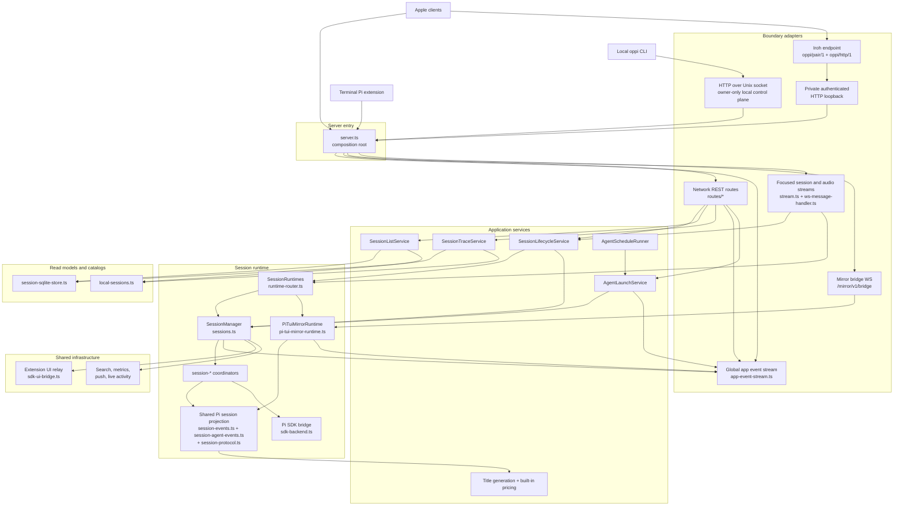
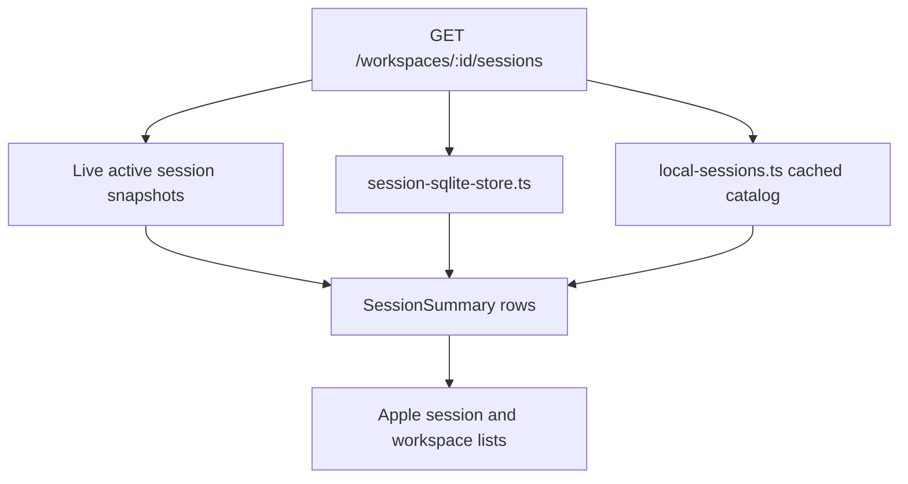

# Oppi server architecture

The Oppi server owns sessions, workspace access, runtime configuration, and the mobile-facing projection of Pi session state. It exposes authenticated HTTP over an owner-only Unix socket to the local CLI. Apple clients, dictation, app events, and the terminal mirror bridge use the same remote HTTP and WebSocket handlers through an independently available network listener or Iroh encrypted tunnel.

## Audience and scope

Read this page when changing server routes, WebSocket transports, session lifecycle code, runtime ownership, the Pi SDK adapter, terminal mirror behavior, storage projections, or protocol contracts.

This page covers production server structure. For Apple UI composition, see [Client architecture](architecture-client.md). For route selection, Iroh fallback, and cross-system connection recovery, see [Networking and connection routing](networking.md).

## Server responsibilities

The server owns:

- authenticated HTTP and WebSocket boundaries,
- workspace CRUD, workspace file access, review comments, quick actions, and provider auth,
- managed Pi SDK session lifecycle,
- saved Agent definitions and schedule-runner state,
- terminal Pi TUI mirror registration and command proxying,
- session event projection into durable sequence numbers, summaries, media, search, and SQLite read models,
- extension UI relay and attention state,
- telemetry, push, Live Activity updates, runtime version status, and diagnostics.

The server does not render the chat timeline. It sends protocol messages and HTTP snapshots for the Apple client to render.

## Server topology

## Main server blocks

| Block                                              | Owns                                                                                                                 | Does not own                               |
| -------------------------------------------------- | -------------------------------------------------------------------------------------------------------------------- | ------------------------------------------ |
| `server.ts`                                        | startup, dependency wiring, HTTP, WebSocket, and Iroh entry, auth shell, service lifecycle                           | session semantics                          |
| `iroh-pairing-server.ts` + `iroh-http-loopback.ts` | persistent Iroh endpoint, peer-bound pairing, bounded tunnel streams, and private HTTP/WebSocket adaptation          | route, runtime, or projection semantics    |
| `routes/*`                                         | HTTP parsing, auth-checked route boundaries, response shapes, app-event emission                                     | lifecycle, list, trace, or runtime policy  |
| `session-lifecycle-service.ts`                     | create/import, resume/open, stop, fork, delete, and mirror promotion policy                                          | HTTP response mapping                      |
| `session-list-service.ts`                          | recent/workspace/archive session row shaping, active runtime overlays, local-session catalog joins                   | route query parsing                        |
| `session-trace-service.ts`                         | trace source precedence, tool output lookup, overall diffs, changed-file summaries, and raw changed-file read policy | streaming bytes to HTTP responses          |
| `session-title-generator.ts` + `token-usage.ts`    | Provider-owned Pi model requests and static built-in pricing lookup                                                  | session lifecycle or route behavior        |
| `agent-launch-service.ts`                          | idempotent saved-Agent and schedule launches into managed sessions                                                   | HTTP response mapping                      |
| `agent-schedules.ts` + `agent-schedule-runner.ts`  | durable schedule definitions, due-run materialization, lease claiming, dispatch, and run history                     | Apple UI routing                           |
| `app-event-stream.ts`                              | global app-event WebSocket, app-event allowlist, row and extension UI mapping, workspace invalidation mapping        | focused timeline replay or command routing |
| `stream.ts` + `ws-message-handler.ts`              | focused session and audio WebSocket framing, fan-out, client-message routing                                         | workspace list data flow                   |
| `runtime-router.ts`                                | runtime ownership dispatch through `SessionRuntimes`                                                                 | shared Pi event projection semantics       |
| `sessions.ts` + `session-*`                        | managed session lifecycle, queue, stop, event translation, SDK calls                                                 | HTTP response shaping                      |
| `pi-tui-mirror-runtime.ts`                         | terminal mirror bridge registration, takeover, queue, and command proxying                                           | Apple focused-session transport            |
| `session-sqlite-store.ts` + `local-sessions.ts`    | persisted read models and local JSONL catalog                                                                        | runtime command delivery                   |

## HTTP and WebSocket boundaries

`server.ts` creates a mandatory local listener and, when configured, a network listener. Both share the same HTTP route and bearer-authentication shell:

- The mandatory local listener serves HTTP over an owner-only Unix socket. Its normal path is `$OPPI_DATA_DIR/run/oppi.sock`; deep custom data-directory paths use a deterministic socket under the user's temporary runtime directory. The runtime directory is `0700`, the socket and startup lock are `0600`, stale paths are ownership-checked, and startup refuses concurrent owners.
- The network listener serves configured HTTP(S) and scoped WebSockets to remote clients. TLS preparation runs off the main thread after the local socket begins listening, so certificate commands and renewal-lock waits do not block local requests. Expected Tailscale availability failures disable the remote listener; unexpected preparation errors remain fatal. Network TLS failure must never create a plaintext fallback.

The local socket intentionally has no WebSocket upgrade handler. Oppi Mirror continues to use the network WebSocket listener. `server.ts` validates network startup security, handles CORS and `/health`, authenticates requests, and delegates authenticated HTTP from either listener to `RouteHandler`.

When Iroh is enabled, `iroh-pairing-server.ts` owns one persistent endpoint with `oppi/pair/1` and `oppi/http/1` ALPNs. Pairing issues an explicit HTTP/Iroh credential grant. Iroh-ALPN pairing obtains the Apple endpoint ID from the live QUIC peer; HTTPS pairing can submit that stable node ID when the signed invite authorizes Iroh. Token consumption and binding are atomic, and an unbound HTTP-issued token is never granted Iroh. Tunnel authentication rejections return stable machine-readable codes so the client can distinguish a route-scoped binding problem from an unknown credential. Each authenticated HTTP tunnel stream is pumped into `iroh-http-loopback.ts`, which invokes the same request and WebSocket upgrade handlers as the network listener. Limits on connections, streams, preface size and timeout, bearer size, and pump chunks bound resource use. Iroh-only startup and authentication fail closed.

The private loopback is an adapter, not a second API. Iroh transport code must not branch on route names, session types, or feature payloads.

`RouteHandler` owns route dispatch across domain files:

- `routes/identity.ts` — user, server info, pairing, stats, runtime status, provider-auth helpers.
- `routes/workspaces.ts` — workspace catalog, CRUD, Git status, worktrees, quick actions, review comments.
- `routes/sessions.ts` — session HTTP boundary for workspace and declared control scopes: create/import, resume, stop, fork, delete, traces, catch-up, tool output, session files, and diffs. Lifecycle, list, and trace/file policy is delegated to application services.
- `routes/agents.ts` — saved Agent definitions and saved-Agent session launches.
- `routes/schedules.ts` — schedule CRUD, manual runs, run history, and pause/resume/archive/restore.
- `routes/server-resources.ts` — server-global Skill/extension catalogs, server-authored capabilities, contained Skill file reads/replacements, and Oppi extension configuration.
- `routes/uploads.ts` — chat attachment upload records and content.
- `routes/workspace-files.ts` — workspace path, directory, and raw-file routes.
- `routes/themes.ts`, `routes/skills.ts`, `routes/provider-auth.ts`, `routes/telemetry.ts`, and E2E harness routes.

WebSocket upgrade paths are explicit:

| Path                                                  | Owner                   | Purpose                                                  |
| ----------------------------------------------------- | ----------------------- | -------------------------------------------------------- |
| `/workspaces/:workspaceId/sessions/:sessionId/stream` | `BoundSessionStreamMux` | workspace-focused timeline, commands, queue sync, state  |
| `/control-sessions/:sessionId/stream`                  | `BoundSessionStreamMux` | control-focused timeline through the same runtime path   |
| `/app/events/stream`                                  | `AppEventStreamMux`     | app-wide session row and extension UI attention events   |
| `/dictation/stream`                                   | `DictationStreamMux`    | dictation control and binary audio                       |
| `/mirror/v1/bridge`                                   | `PiTuiMirrorRuntime`    | terminal Pi TUI mirror registration and command proxying |

## Session runtime ownership

`SessionRuntimes` is the server facade for runtime-owned operations. It dispatches by persisted `Session.runtime`:

- `"oppi"` routes to managed `SessionManager` and the in-process Pi SDK backend.
- `"pi-tui"` routes to `PiTuiMirrorRuntime` and the terminal bridge.

The facade handles common calls such as prompt, steer, follow-up, abort, stop, queue state, pending UI, event catch-up, snapshots, and full tool-output paths. Route and stream code should prefer `SessionRuntimes` when the command applies to either runtime owner.

A stopped, disconnected mirror session with a canonical session file can be promoted to `"oppi"` on resume or focused-stream open. A connected or stale terminal-owned session stays terminal-owned. A terminal bridge can take over an existing `"oppi"` session only after explicit terminal confirmation; if that session is active, the server stops the managed runtime before switching ownership.

## Managed SDK runtime

`SessionManager` is the managed runtime facade. It keeps active sessions in memory and delegates most behavior to coordinators from `session-coordinators.ts`:

- `SessionStartCoordinator` creates SDK-backed active sessions.
- `SessionActivationCoordinator` handles start/resume idempotence.
- `SessionInputCoordinator` handles prompt, steer, follow-up, attachment validation, and first-message capture.
- `SessionMessageQueueCoordinator` owns steering/follow-up queue state.
- `SessionCommandCoordinator` forwards SDK commands and applies SDK snapshots.
- `SessionAgentEventCoordinator` translates Pi events into server messages.
- `SessionBroadcaster` assigns per-session sequence numbers and supports focused-session catch-up.
- `SessionStopFlowCoordinator` and `SessionStopCoordinator` own abort/stop behavior.
- `SessionLifecycleCoordinator` handles idle timers and session end cleanup.

`sdk-backend.ts` wraps Pi's `AgentSession`. It resolves workspace cwd, configures sandbox tools when requested, binds extensions through `SdkUiBridge`, injects session attachment helpers, forwards SDK commands, and emits Pi events back into the session projection pipeline. Declared control sessions use an owner-only, non-symlink `$OPPI_DATA_DIR/control-sessions/cwd` as the real Pi SessionManager cwd and the Oppi agent safety definition; undeclared workspace-less sessions do not gain control-session privileges. `Oppi Control` remains display metadata only and must not be persisted as SessionManager cwd, or Pi JSONLs land under the server process working directory and leak into workspace importable-local discovery. Sandboxes still keep their guest/display cwd split with a host existence override.

## Saved Agents and schedules

Saved Agent routes persist reusable definitions. Launch-time inputs such as workspace, worktree, prompt, model override, and session name flow through `AgentLaunchService`, which owns idempotency, launch recovery, target-constraint enforcement, and prompt dispatch into managed sessions. Definitions may restrict launches to allowed workspace IDs and a required host or sandbox runtime. Incompatible targets and unavailable selected tools, Skills, or Extensions fail closed as typed configuration failures. Pre-start checks may discard a never-announced empty shell and return an actionable non-retryable `422` without a session ID; failures after runtime start preserve one `error` session for audit. Focused streams close with policy violation rather than reconnecting and duplicating timeline errors.

A server-scoped Oppi Control session persists explicit `domain`, `intent`, and optional target metadata with no `workspaceId`. Creation may set model and thinking overrides for the Oppi agent, while a user-selected workspace remains prompt context rather than runtime ownership. `/control-sessions` routes enforce that declaration before reusing the ordinary lifecycle, trace, attachment, command, approval, broadcaster, and focused-stream services. Control sessions remain in the global recent projection but never enter workspace catalogs or counts. Agent, Schedule, Workspace, and Skill revisions use explicit control domains rather than inferring authority from a missing workspace. The Oppi agent can use only the server-managed `oppi`, structured `ask`, and `read` tools. Read-only `oppi session wait` is allowed for bounded status waiting; the built-in tool canonicalizes one-session `oppi session watch` calls to the same bounded operation without exposing the CLI's streaming watch mode. Its Oppi tool uses the saved approval policy: destructive operations and `session respond` always require approval, while other mutations follow that policy.

The CLI accepts bounded in-memory `--definition-json` objects for Agent create/update and schedule update, avoiding temporary files without adding filesystem tools. Canonical Agent and schedule validators reject unexpected fields and empty updates at the server boundary. Skill revisions use the separately allowlisted `oppi skill list|get|file|update-file` commands. The resource catalog marks only top-level, non-package Skills editable; package Skills remain read-only. File replacement accepts a complete JSON-string body for approval plus the SHA-256 revision returned by the latest read, resolves an opaque Skill ID, rejects traversal and symlinks, rejects stale revisions instead of overwriting intervening edits, replaces only existing contained files, serializes mutations, verifies opened file identities, and writes through an fsynced same-directory temporary file plus atomic rename and directory fsync. This is a Skill-specific boundary, not a generic remote filesystem API.

Schedules persist a trigger plus an action. `AgentScheduleRunner` scans active schedules, materializes due slots, claims due runs with a lease, and dispatches automatic runs through the same launch hooks used by manual schedule runs. Pause or archive a schedule to stop future automatic runs. Archived schedules remain listable and can be restored directly to active.

## Terminal mirror runtime

`PiTuiMirrorRuntime` owns `/mirror/v1/bridge` and implements the same `AgentRuntimeTransport` interface as the managed runtime. It registers terminal bridges, resolves the workspace, coalesces sessions by Pi identity, handles takeover confirmation, forwards remote commands, proxies extension UI, mirrors queue state, and projects terminal Pi events through the shared session event pipeline.

Mirror sessions are terminal-owned. If the bridge disconnects, the stored session remains `runtime == "pi-tui"` unless the app explicitly resumes a stopped disconnected session as an Oppi-managed runtime.

## Session list and history read models

Workspace navigation uses `SessionListService` over SQLite-backed snapshots and the local-session catalog instead of reading full JSONL traces on the hot path. The workspace catalog can opt into compact Git summaries (`changedCount`, `ahead`, and `behind`); this uses a lightweight status probe rather than the full review-oriented Git status payload.

The recent lane is time-bounded with `sinceMs` and `untilMs`. Older stopped sessions and importable local sessions are summarized into archive buckets and loaded lazily.

`SessionTraceService` owns trace paging, outline snapshots, recovery, tool output lookup, overall diffs, changed-file summaries, and raw changed-file previews.

Session detail uses bounded trace pages and lightweight outline data where possible. Full trace reads remain behind recovery and compatibility paths:

- `readSessionTrace(...)` for server-owned persisted traces,
- `readSessionTraceFromFile(...)` and `readSessionTraceFromFiles(...)` for Pi JSONL files,
- `readSessionTraceByUuid(...)` for UUID lookup fallback.

## App event stream

`AppEventStreamMux` converts session broadcast events into app-level messages. It sends only allowed `AppEventMessage` types:

- session created/imported/discovered/deleted/ended,
- session summaries,
- stop requested/confirmed/failed,
- session errors,
- extension UI request/settled/notification,
- workspace git changed,
- app-event stream connected.

It does not send focused timeline deltas, full session state, queue state, command results, dictation frames, or raw `GitStatus` payloads. On connect it sends `app_events_connected` with `snapshotRequired: true`; clients repair state through HTTP snapshots.

## Protocol boundary

Server protocol types live in `server/src/types/protocol.ts` and are re-exported from `server/src/types.ts`. `types.ts` is a stable barrel for the historical `./types.js` import path; it should only re-export type modules.

When changing protocol messages:

1. Update server protocol types.
2. Update Apple models: `ClientMessage.swift`, `ServerMessage.swift`, `AppEventMessage.swift`, and stream wrappers.
3. Update protocol snapshots in `protocol/*.json` when the wire shape changes.
4. Run server protocol tests and Apple Codable tests.

## Server boundary rules current code

These rules are enforced by `server/scripts/check-architecture-boundaries.ts` and ESLint local rules:

- Server tests live under `server/tests/**`, not `server/src/**`.
- `server/src/server.ts` is the single composition root. Lower layers must not import it.
- Core modules must not import `server/src/routes/**`; shared logic belongs in non-route modules.
- Concrete route modules must not import each other. Compose route dispatch in `server/src/routes/index.ts`, and keep shared route helpers limited to the approved route helper modules.
- `server/src/types.ts` may only re-export modules under `server/src/types/`.
- `session-*` modules must not import the `sessions.ts` facade.
- `server/src/storage/**` modules are infrastructure leaves. They must not import routes, stream code, or session runtime modules.
- `@earendil-works/pi-ai/compat` imports are forbidden. Configured model/auth requests use `ModelRuntime`; static built-in pricing reads use `@earendil-works/pi-ai/providers/all`.
- Direct `mirror-session-resume.ts` imports live only in `server/src/session-lifecycle-service.ts`; routes and streams call lifecycle service methods for mirror open/resume behavior.
- `runtime == "pi-tui"` ownership checks live only in runtime, lifecycle, mirror-resume, and current input-command boundary modules. Other modules consume typed service results or semantic capabilities instead of branching on runtime ownership.
- Generic extension UI relay/rendering code must not branch on concrete tool names, extension names, status keys, widget keys, or display names. Add semantic protocol metadata at the producer boundary instead.

## Server cleanup targets

Keep these high-churn modules small and explicit:

- `server/src/routes/sessions.ts` — keep as a transport adapter. Put lifecycle, list, trace, diff, and file-read policy in the session application services.
- `server/src/stream.ts` and `server/src/ws-message-handler.ts` — keep WebSocket framing and client-message mapping separate from runtime ownership decisions.
- `server/src/session-lifecycle-service.ts`, `server/src/session-list-service.ts`, and `server/src/session-trace-service.ts` — keep the services separate; do not merge lifecycle, list, and trace behavior into one controller.
- `server/src/server.ts` — keep as composition root; move local policy helpers out when they grow beyond startup/transport wiring.
- `server/src/sessions.ts` and `session-*` — continue pushing managed-runtime behavior into coordinators rather than adding new facade logic.
- `server/src/sdk-backend.ts` — keep SDK and sandbox setup isolated from HTTP and route concerns.
- `server/src/pi-tui-mirror-runtime.ts` — preserve shared projection with managed sessions; avoid creating a second projection path.

## Where to look in code

| Concern                                     | Files                                                                                                                                                                                  |
| ------------------------------------------- | -------------------------------------------------------------------------------------------------------------------------------------------------------------------------------------- |
| Server composition and listeners            | `server/src/server.ts`, `server/src/local-api-socket.ts`, `server/src/cli.ts`                                                                                                          |
| Route dispatch                              | `server/src/routes/index.ts`, `server/src/routes/*`                                                                                                                                    |
| Workspace catalog summaries                 | `server/src/routes/workspaces.ts`, `server/src/storage/session-sqlite-store.ts`                                                                                                        |
| Workspace detail recent list                | `server/src/routes/sessions.ts`, `server/src/session-list-service.ts`, `server/src/local-sessions.ts`                                                                                  |
| Session lifecycle HTTP actions              | `server/src/routes/sessions.ts`, `server/src/session-lifecycle-service.ts`                                                                                                             |
| Saved Agent definitions and launches        | `server/src/routes/agents.ts`, `server/src/agent-definitions.ts`, `server/src/agent-launch-service.ts`                                                                                 |
| Schedule definitions and automatic runs     | `server/src/routes/schedules.ts`, `server/src/agent-schedules.ts`, `server/src/agent-schedule-runner.ts`, `server/src/agent-schedule-dispatch.ts`, `server/src/agent-schedule-cron.ts` |
| Session trace, diff, and changed-file reads | `server/src/routes/sessions.ts`, `server/src/routes/session-files.ts`, `server/src/session-trace-service.ts`                                                                           |
| Focused session stream                      | `server/src/stream.ts`, `server/src/ws-message-handler.ts`                                                                                                                             |
| Global app event stream                     | `server/src/app-event-stream.ts`, `server/src/session-broadcast.ts`                                                                                                                    |
| Managed runtime                             | `server/src/sessions.ts`, `server/src/session-*.ts`, `server/src/sdk-backend.ts`                                                                                                       |
| Terminal mirror runtime                     | `server/src/runtime-router.ts`, `server/src/pi-tui-mirror-runtime.ts`, `server/src/pi-tui-mirror-contract.ts`, `pi-extensions/oppi-mirror/extensions/oppi-mirror.ts`                   |
| Extension UI relay                          | `server/src/sdk-ui-bridge.ts`, `server/src/extension-ui-contract.ts`, `server/src/extension-ui-state.ts`, `server/src/session-agent-events.ts`                                         |
| Workspace files and media                   | `server/src/routes/workspace-files.ts`, `server/src/file-serving-policy.ts`, `server/src/routes/uploads.ts`, `server/src/session-attachments.ts`, `server/src/http-range.ts`           |
| Protocol contract                           | `server/src/types/protocol.ts`, `server/src/types.ts`, `protocol/*.json`                                                                                                               |
| Pi model/auth and pricing                   | `server/src/session-title-generator.ts`, `server/src/token-usage.ts`, `server/src/model-catalog.ts`                                                                                    |
| Provider usage quotas                       | `server/src/provider-quota/` (`adapters/registry.ts` to add a provider; shared DTO + Apple compact/detail presentation)                                                               |
| Pi event projection                         | `server/src/session-events.ts`, `server/src/session-agent-events.ts`, `server/src/session-protocol.ts`, `server/src/session-agent-event-media.ts`                                      |
