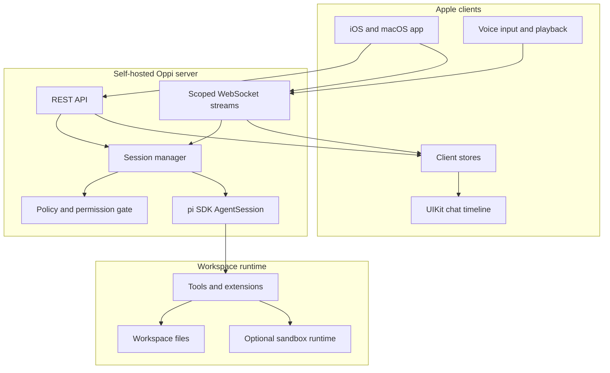
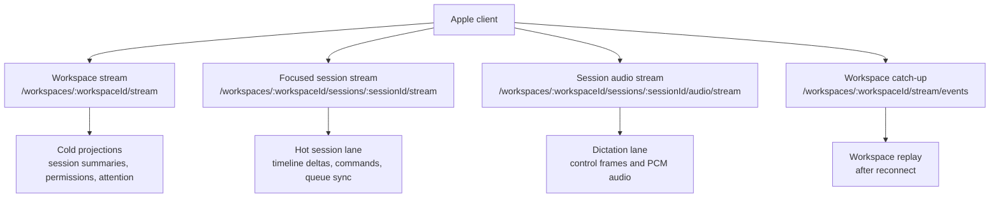
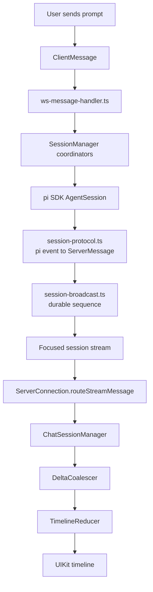
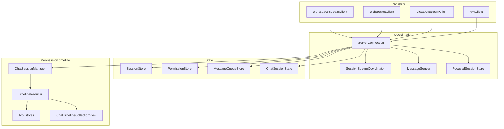
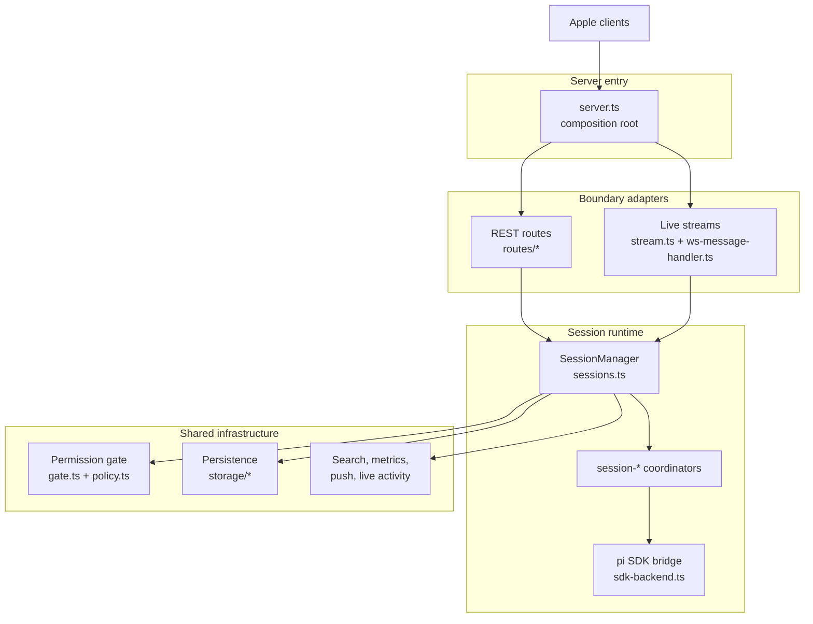

# Oppi architecture

Oppi is an Apple client plus a self-hosted server for supervising pi coding-agent sessions from mobile and desktop surfaces. The server embeds the pi SDK, owns session runtime and protocol translation, and exposes HTTP + scoped WebSocket transports to the Apple clients.

## Scope

This document explains the current production architecture at a conceptual level: runtime topology, live stream lanes, event flow, ownership boundaries, and the rules that keep the chat timeline fast. It does not document every source file or operational runbook.

## Runtime topology

The Apple app is a remote control and renderer. The server is the authority for sessions, workspace access, policy decisions, and pi SDK interaction.

## Live transport lanes

Oppi separates live traffic by purpose. This keeps high-frequency chat deltas from invalidating workspace lists and keeps microphone audio away from timeline frames.

| Lane | Direction | Main server owner | Main Apple owner | Carries |
|------|-----------|-------------------|------------------|---------|
| Workspace stream | Server to client | `WorkspaceStreamMux` | `WorkspaceStreamClient` | Workspace attention, session summaries, permission state, projections |
| Focused session stream | Bidirectional JSON | `BoundSessionStreamMux` | `WebSocketClient` + `SessionStreamCoordinator` | Timeline events, prompts, commands, queue sync |
| Session audio stream | Bidirectional JSON + binary | `SessionAudioStreamMux` | `DictationStreamClient` | Dictation control messages, transcript events, PCM audio |
| Workspace catch-up | HTTP GET | `WorkspaceStreamMux` | `APIClient` | Missed workspace-stream events after reconnect |

The focused session stream is bound by URL. Client commands sent over that socket already have the target workspace and session in the path.

## Event flow: prompt to pixel

Most user-visible chat work follows this path.

Durable session events get per-session sequence numbers and can be replayed through session catch-up. High-frequency deltas such as token text, thinking deltas, and tool output are treated as hot live traffic; if a reconnect misses them, the client recovers by resuming live stream or reloading the full trace.

## Client architecture

The Apple client keeps transport, shared stores, and timeline rendering separate.

Key boundaries:

- `ServerConnection` owns per-server coordination: stream lifecycle, shared store updates, focused-session UI effects, and forwarding send operations.
- `ChatSessionManager` owns one session's timeline pipeline: reducer, coalescer, correlator, and reconnect scheduling.
- Timeline row rendering is UIKit-backed for the hot path. SwiftUI owns navigation shells, forms, and high-level composition.
- Stores are split by reason to re-render. Hot timeline deltas must not rebuild workspace/session list projections unless they also carry cold summary state.

## Server architecture

The server has one composition root and two request boundaries. The diagram shows ownership layers, not every call edge.

Read the server as four blocks:

| Block | Owns | Does not own |
|-------|------|--------------|
| `server.ts` | startup, dependency wiring, HTTP/WS entry | session semantics |
| `routes/*` | HTTP parsing, auth boundary, REST response shape | runtime orchestration |
| `stream.ts` + `ws-message-handler.ts` | WebSocket framing, scoped stream fan-out, client-message routing | pi SDK lifecycle |
| `sessions.ts` + `session-*` | session lifecycle, queue, stop, event translation, SDK calls | HTTP/WS transport details |

Core rules:

- `server.ts` is the composition root; subsystems do not import it.
- Route modules are boundary-only and depend on explicit route context services.
- `stream.ts` owns transport framing and fan-out, not session command semantics.
- `ws-message-handler.ts` routes client messages into `SessionManager` and `GateServer`.
- `types.ts` is the protocol contract leaf shared by tests and client mirrors.

## Protocol boundary

The protocol is mirrored manually on both sides:

- Server source of truth: `server/src/types.ts`
- Apple mirrors: `ClientMessage.swift`, `ServerMessage.swift`, and `StreamMessage`
- Snapshot and codable tests guard drift.

When a message contract changes, update server types, Apple models, and protocol tests together. Partial protocol updates are invalid because a mismatched app/server pair can fail at the transport boundary.

## Design invariants

- Keep hot timeline traffic separate from cold workspace/session projections.
- Use the focused session stream for one session's timeline and command plane.
- Use the workspace stream for attention and list projection state.
- Use the audio stream for server dictation so microphone frames do not compete with chat deltas.
- Apply shared store updates exactly once per inbound live event on the client.
- Keep reducers and coalescers UI-framework-free; keep UIKit-specific rendering under the timeline package.
- Prefer narrow dependencies in views: REST-only views use `APIClient`, UI state uses `ChatSessionState`, and transport actions go through `ServerConnection`.

## Where to look in code

| Concern | Server | Apple |
|---------|--------|-------|
| Capability advertisement | `server/src/routes/identity.ts` | `ServerInfo.swift`, `ServerConnection.refreshStreamCapabilities()` |
| WebSocket upgrade routing | `server/src/server.ts` | `WorkspaceStreamClient.swift`, `WebSocketClient.swift`, `DictationStreamClient.swift` |
| Stream muxes | `server/src/stream.ts` | `ServerConnection.swift`, `SessionStreamCoordinator.swift` |
| Session runtime | `server/src/sessions.ts`, `server/src/session-*.ts` | `ChatSessionManager.swift`, `ChatActionHandler.swift` |
| Protocol contract | `server/src/types.ts` | `ClientMessage.swift`, `ServerMessage.swift` |
| Timeline rendering | `session-protocol.ts`, `session-broadcast.ts` | `TimelineReducer.swift`, `ChatTimelineCollectionView.swift` |
| Dictation | `dictation-manager.ts`, `stt-provider.ts` | `OppiDictationProvider.swift`, `OppiDictationSession.swift` |
