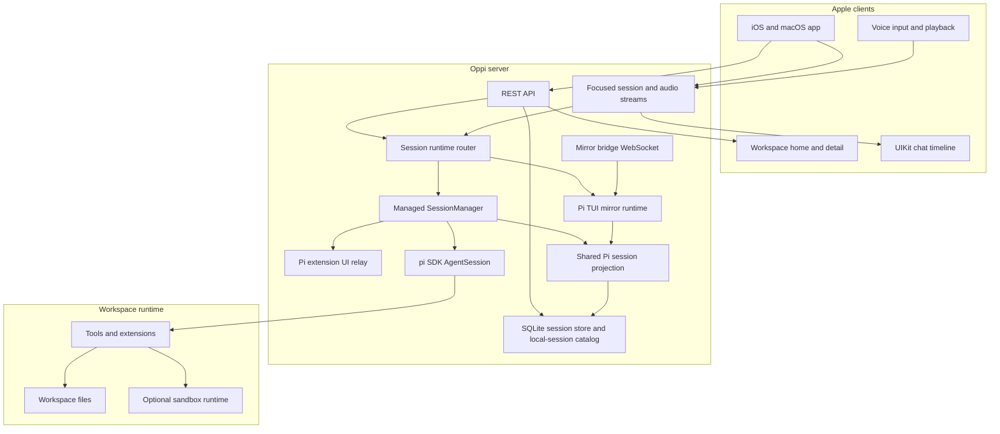
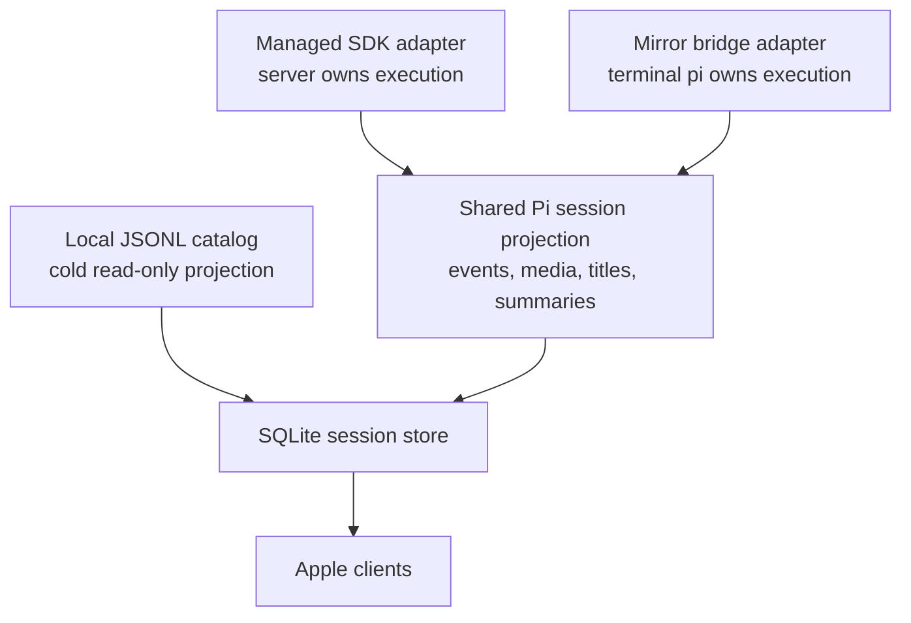
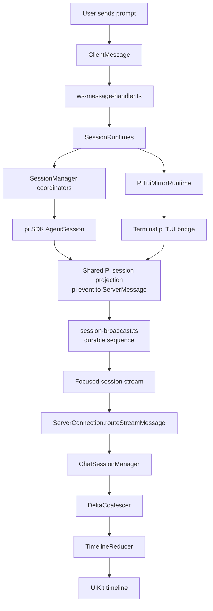
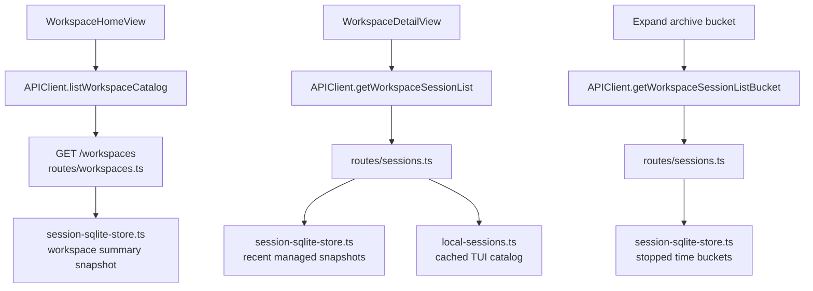
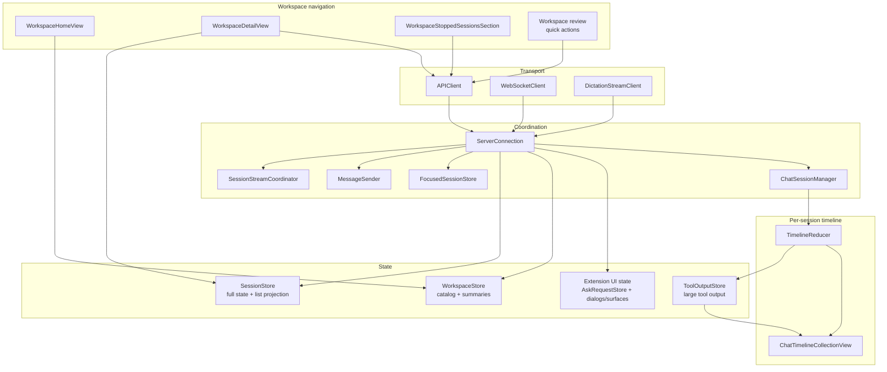
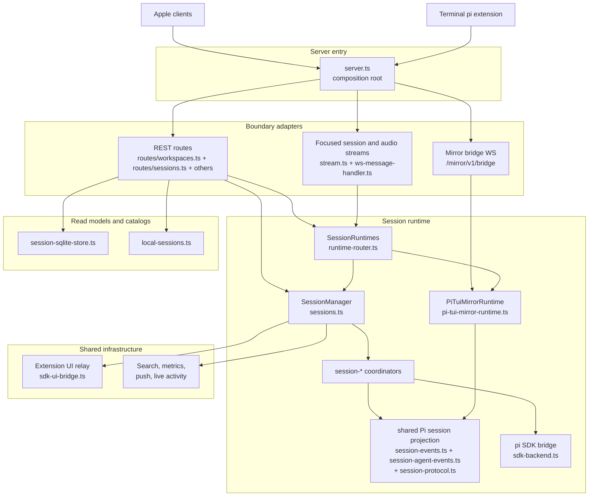

# Oppi architecture

Oppi is an Apple client plus an Oppi server for viewing, prompting, and steering pi coding-agent sessions from iPhone, iPad, and Mac clients. The server embeds the pi SDK for managed sessions, can mirror a live terminal-owned pi TUI session through the Oppi Mirror extension, and exposes HTTP plus scoped WebSocket transports to Apple clients and the mirror bridge.

## Scope

This document explains the current production architecture at a conceptual level: runtime topology, transport lanes, workspace navigation data flow, ownership boundaries, and the rules that keep the chat timeline fast. It does not document every source file or operational runbook.

## Runtime topology

The Apple app is a remote control and renderer. The server is the authority for sessions, workspace access, runtime configuration, and the mobile-facing session projection. Execution can be owned either by the server's pi SDK runtime or by a terminal pi TUI process connected through the mirror extension.

## Runtime ownership and projection

Oppi treats managed SDK sessions, mirrored terminal sessions, and local JSONL imports as different adapters into one canonical pi-backed session lane.

The adapters differ only where ownership semantics differ: start/stop, abort, remote commands, queue control, and extension UI response plumbing. Shared projection code owns pi event translation, session state mutation, tool-media materialization, first-message/title policy, summaries, and the SQLite read model. Live mirror and local JSONL import coalesce by `piSessionId` and canonical `piSessionFile`, so a terminal session should not appear as two unrelated rows. See [Oppi Mirror mode](oppi-mirror.md) for the detailed mirror contract and test map.

Persisted runtime ownership uses `Session.runtime == "oppi"` for server-owned SDK sessions and `Session.runtime == "pi-tui"` for terminal-owned mirror sessions. `SessionRuntimes` is the server facade that dispatches command, catch-up, pending UI, and snapshot calls by that field. Connected and stale `pi-tui` sessions stay terminal-owned. A stopped, disconnected mirror session with a canonical session file can be promoted to `oppi` when the app resumes it or opens its focused stream. A terminal bridge can also take over an existing `oppi` session after explicit terminal confirmation; if that session is active, the server stops the managed runtime before switching ownership to `pi-tui`.

## Live transport and navigation lanes

Oppi keeps Apple workspace navigation HTTP-first. The Apple app uses WebSockets for the focused session and audio dictation paths; the terminal mirror extension uses its own `/mirror/v1/bridge` WebSocket.

```mermaid
graph TD
  Client[Apple client]
  Terminal[Terminal pi extension]

  Client --> WorkspaceHTTP[Workspace HTTP lane]
  Client --> SessionWS[Focused session stream<br/>/workspaces/:workspaceId/sessions/:sessionId/stream]
  Client --> SessionCatchup[Focused session catch-up<br/>/workspaces/:workspaceId/sessions/:sessionId/events]
  Client --> AudioWS[Dictation stream<br/>/dictation/stream]
  Terminal --> MirrorBridge[Mirror bridge<br/>/mirror/v1/bridge]

  WorkspaceHTTP --> Summaries[GET /workspaces]
  WorkspaceHTTP --> RecentList[GET /workspaces/:id/sessions?status&sinceMs&untilMs]
  WorkspaceHTTP --> ArchiveBucket[GET /workspaces/:id/session-buckets?status&beforeMs]
  WorkspaceHTTP --> Attention[GET /workspaces/:id/attention]
  WorkspaceHTTP --> Files[GET /workspaces/:id/paths<br/>GET /workspaces/:id/contents<br/>GET /workspaces/:id/raw/:path]
  WorkspaceHTTP --> Media[GET /workspaces/:id/sessions/:sessionId/attachments/:attachmentId<br/>GET /workspaces/:id/sessions/:sessionId/tool-output/:toolCallId]
  WorkspaceHTTP --> QuickActions[GET /workspaces/:id/quick-actions<br/>POST /workspaces/:id/quick-actions/selection<br/>POST /workspaces/:id/quick-actions/session]
  WorkspaceHTTP --> ReviewComments[GET/POST /workspaces/:id/review/comments]

  SessionWS --> Hot[Hot session lane<br/>timeline deltas, commands, queue sync, session summaries]
  AudioWS --> Dictation[Dictation lane<br/>control frames and PCM audio]
  SessionCatchup --> Replay[Durable focused-session replay]
  MirrorBridge --> MirrorRuntime[Terminal-owned session control<br/>commands, queue sync, extension UI]
```

| Lane                                        | Transport                   | Main server owner                                                                               | Main client owner                                                                  | Carries                                                                                                            |
| ------------------------------------------- | --------------------------- | ----------------------------------------------------------------------------------------------- | ---------------------------------------------------------------------------------- | ------------------------------------------------------------------------------------------------------------------ |
| Workspace home summaries                    | HTTP                        | `routes/workspaces.ts` + `session-sqlite-store.ts`                                              | `WorkspaceStore` / `WorkspaceHomeView`                                             | Per-workspace active/stopped counts, latest activity, attention/error flags                                        |
| Workspace detail recent lane                | HTTP                        | `routes/sessions.ts` + `session-sqlite-store.ts` + `local-sessions.ts`                          | `WorkspaceDetailView` + `SessionStore.applyWorkspaceRecentSnapshot(...)`           | Recent managed session summaries, attention snapshot, recent importable TUI sessions, archive bucket summaries     |
| Workspace archive bucket                    | HTTP                        | `routes/sessions.ts`                                                                            | `WorkspaceStoppedSessionsSection`                                                  | Lazy-loaded stopped/importable rows for one older bucket                                                           |
| Workspace files and media previews          | HTTP GET/HEAD               | `routes/workspace-files.ts` + `routes/uploads.ts` + `session-attachments.ts` + `http-range.ts`  | `APIClient` + `AuthenticatedMediaSource` + media/file preview views                | Path lists, directory contents, raw file bytes, uploaded/session attachments, full tool output, and byte-range media |
| Workspace quick actions and review comments | HTTP                        | `routes/workspaces.ts` + `workspace-quick-action-session.ts` + `review-comment-sqlite-store.ts` | `WorkspaceContextBar`, `WorkspaceReviewFileDetailView`, `ChatView` review comments | Prompt templates exposed as selected-file quick actions, quick-action sessions, and session-scoped review comments |
| Focused session stream                      | Bidirectional JSON          | `BoundSessionStreamMux` + `SessionRuntimes`                                                     | `WebSocketClient` + `SessionStreamCoordinator`                                     | Timeline events, prompts, commands, queue sync, low-frequency `session_summary` updates                            |
| Focused session catch-up                    | HTTP GET                    | `SessionRuntimes.getCatchUp()`                                                                  | `APIClient` + `SessionStreamCoordinator`                                           | Missed durable focused-session events after reconnect                                                              |
| Mirror bridge                               | Bidirectional JSON          | `PiTuiMirrorRuntime` + `pi-tui-mirror-contract.ts`                                              | Oppi Mirror pi extension                                                           | Terminal-owned session registration, takeover confirmation, commands, queue sync, and extension UI proxying         |
| Dictation stream                            | Bidirectional JSON + binary | `DictationStreamMux`                                                                            | `DictationStreamClient`                                                            | Dictation control messages, transcript events, PCM audio                                                           |

## Event flow: prompt to pixel

Most user-visible chat work follows this path. The managed and mirror runtimes differ in the owner of execution, but converge before projection and broadcast.

Durable session events get per-session sequence numbers and can be replayed through focused-session catch-up. High-frequency deltas such as token text, thinking deltas, and tool output are hot live traffic; if a reconnect misses them, the client recovers by resuming the live stream or reloading the full trace.

## Workspace navigation flow

Workspace navigation avoids rereading JSONL traces on the hot path.

The recent lane is explicitly time-bounded (`sinceMs` / `untilMs`). Older stopped sessions and older importable TUI sessions are summarized into archive buckets and loaded lazily.

## Client architecture

The Apple client keeps transport, shared stores, workspace HTTP refresh, and timeline rendering separate.

Key boundaries:

- `ServerConnection` owns focused-session transport, app-wide refresh coordination, and shared store updates for live session messages; `ChatView` owns the per-session `ChatSessionManager` pipeline that consumes those stream events.
- `WorkspaceStore` owns workspace catalog freshness plus SQLite-backed workspace-home summaries.
- `WorkspaceDetailView` owns view-scoped workspace refresh/polling using `getWorkspaceSessionList(...)` and lazy archive bucket fetches.
- Workspace prompt templates are exposed to Apple as quick-action options; quick actions and review comments stay on the HTTP lane, and review-comment loading is keyed by workspace plus session so comments do not leak across sessions in the same workspace.
- Workspace file previews and media playback use authenticated HTTP sources with byte ranges; they do not ride on the focused session stream.
- Standard Pi extension UI is the current approval and input lane: ask requests use `AskRequestStore`; select, confirm, input, editor, notification, status, widget, editor-text, and native surfaces live on `ServerConnection` state. Oppi has no separate built-in server/client approval transport.
- `SessionStore` keeps the hot list projection separate from full session state so timeline-frequency updates do not rebuild workspace lists.
- Timeline row rendering is UIKit-backed for the hot path. Large tool output is capped in rows; full text lives in `ToolOutputStore` or is fetched through the full tool-output HTTP route. SwiftUI owns navigation shells, forms, and high-level composition.

## Server architecture

The server has one composition root and three main boundaries: HTTP routes, Apple session/audio streams, and the terminal mirror bridge.

Read the server as these blocks:

| Block                                            | Owns                                                                           | Does not own                         |
| ------------------------------------------------ | ------------------------------------------------------------------------------ | ------------------------------------ |
| `server.ts`                                      | startup, dependency wiring, HTTP and WS entry                                  | session semantics                    |
| `routes/*`                                       | HTTP parsing, auth boundary, workspace summary and session-list response shape | runtime orchestration                |
| `stream.ts` + `ws-message-handler.ts`            | focused session and audio WS framing, fan-out, client-message routing          | workspace navigation data flow       |
| `pi-tui-mirror-runtime.ts`                       | terminal mirror bridge registration, takeover, queue, and command proxying     | Apple focused-session transport      |
| `sessions.ts` + `session-*`                      | managed session lifecycle, queue, stop, event translation, SDK calls           | HTTP response shaping                |
| `runtime-router.ts`                              | runtime ownership dispatch through `SessionRuntimes`                           | shared pi event projection semantics |

## Protocol boundary

The protocol is mirrored manually on both sides:

- Server source of truth: `server/src/types/protocol.ts`, re-exported by `server/src/types.ts`
- Apple mirrors: `ClientMessage.swift`, `ServerMessage.swift`, and `StreamMessage`
- Snapshot and codable tests guard drift.

When a message contract changes, update server types, Apple models, and protocol tests together. Partial protocol updates are invalid because a mismatched app/server pair can fail at the transport boundary.

## Design invariants

- Workspace navigation is HTTP-first. There is no workspace-scoped WebSocket for normal list navigation.
- The hot workspace recent lane must be explicitly time-bounded. Older stopped/importable history belongs in archive buckets.
- Workspace session-list endpoints return **session summaries**, not full `Session` payloads.
- Hot workspace endpoints must not reread `~/.pi/agent/sessions/*.jsonl`; importable TUI metadata comes from the cached local-session catalog and SQLite-backed read models.
- Runtime adapters must not duplicate pi event projection logic. Managed SDK sessions and terminal mirror sessions should share translation, session mutation, media materialization, title/first-message derivation, summaries, and storage projection.
- Mirror sessions are terminal-owned. The server must not auto-start a pi SDK runtime for a connected or stale `runtime == "pi-tui"` session. A stopped, disconnected mirror with a canonical session file can be promoted to `runtime == "oppi"` on resume or focused-stream open. A terminal bridge can take over an `oppi` session only after explicit terminal confirmation.
- Keep hot timeline traffic separate from cold workspace/session projections.
- Keep file previews, attachments, and media playback on authenticated HTTP routes with byte-range support; do not send raw media over the focused session WebSocket.
- Keep workspace quick-action discovery, selected-file prompt-template preparation, and review comments on HTTP routes; only the created/focused session uses the session stream.
- Apply shared store updates exactly once per inbound live session event on the client.
- Keep reducers and coalescers UI-framework-free; keep UIKit-specific rendering under the timeline package.
- Preserve the ability to resume imported TUI sessions without mutating the original JSONL traces.

## Where to look in code

| Concern                                    | Server                                                                                                                                         | Apple                                                                                       |
| ------------------------------------------ | ---------------------------------------------------------------------------------------------------------------------------------------------- | ------------------------------------------------------------------------------------------- |
| Workspace home summaries                   | `server/src/routes/workspaces.ts`, `server/src/storage/session-sqlite-store.ts`                                                                | `WorkspaceStore.swift`, `WorkspaceHomeView.swift`                                           |
| Workspace detail recent lane               | `server/src/routes/sessions.ts`, `server/src/local-sessions.ts`                                                                                | `WorkspaceDetailView.swift`, `SessionStore.swift`                                           |
| Lazy stopped archive buckets               | `server/src/routes/sessions.ts`, `server/src/storage/session-sqlite-store.ts`                                                                  | `WorkspaceStoppedSessionsSection.swift`, `WorkspaceDetailView.swift`                        |
| Workspace quick actions                    | `server/src/routes/workspaces.ts`, `server/src/workspace-quick-action-session.ts`                                                              | `WorkspaceContextBar.swift`, `WorkspaceReviewFileDetailView.swift`, `WorkspaceReview.swift` |
| Review comments                            | `server/src/routes/workspaces.ts`, `server/src/storage/review-comment-sqlite-store.ts`                                                         | `ChatView.swift`, `ReviewComments/`, `ReviewCommentStore.swift`                             |
| Focused session WebSocket                  | `server/src/stream.ts`, `server/src/ws-message-handler.ts`                                                                                     | `WebSocketClient.swift`, `SessionStreamCoordinator.swift`, `ServerConnection.swift`         |
| Managed session runtime                    | `server/src/sessions.ts`, `server/src/session-*.ts`                                                                                            | `ChatSessionManager.swift`, `ChatActionHandler.swift`                                       |
| Terminal mirror runtime                    | `server/src/runtime-router.ts`, `server/src/pi-tui-mirror-runtime.ts`, `server/src/pi-tui-mirror-contract.ts`, `pi-extensions/oppi-mirror/extensions/oppi-mirror.ts` | `SessionRow.swift`, `ChatActionHandler.swift`                                               |
| Extension UI and approvals                 | `server/src/sdk-ui-bridge.ts`, `server/src/extension-ui-contract.ts`, `server/src/extension-ui-state.ts`, `server/src/session-agent-events.ts`, `server/src/pi-tui-mirror-runtime.ts` | `ServerConnection+Ask.swift`, `ServerConnection+MessageRouter.swift`, `AskRequestStore.swift`, `ExtensionUINativeSurface.swift`, `ExtensionSurfacePanel.swift`, `ChatView.swift` |
| Workspace files and authenticated media    | `server/src/routes/workspace-files.ts`, `server/src/routes/uploads.ts`, `server/src/session-attachments.ts`, `server/src/http-range.ts`, `server/src/routes/sessions.ts` | `APIClient.swift`, `AuthenticatedMediaSource.swift`, `AuthenticatedMediaPlayback.swift`, `InlineMediaPlayback.swift`, `RemoteFileView.swift` |
| Workspace file-link navigation             | `server/src/routes/workspace-files.ts`                                                                                                         | `WorkspaceAdaptiveRootView.swift`, `WorkspaceHomeView.swift`, `MarkdownWikiLink.swift`, `FileBrowserView.swift` |
| Protocol contract                          | `server/src/types/protocol.ts`, `server/src/types.ts`                                                                                         | `ClientMessage.swift`, `ServerMessage.swift`                                                |
| Pi event projection and timeline rendering | `server/src/session-events.ts`, `server/src/session-agent-events.ts`, `server/src/session-protocol.ts`, `server/src/session-agent-event-media.ts`, `server/src/session-broadcast.ts` | `TimelineReducer.swift`, `ChatTimelineCollectionView.swift`, `AssistantMarkdownSegmentSource.swift`, `ToolOutputStore.swift`, `FullScreenCodeBodies.swift` |
