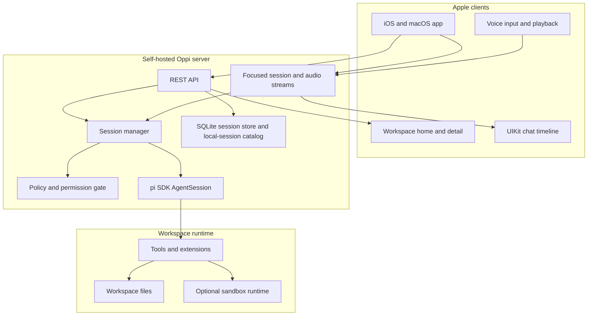
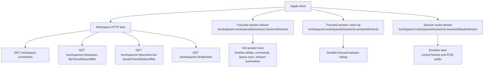
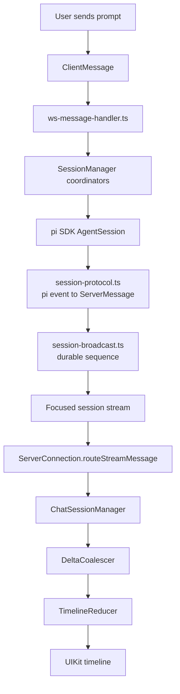
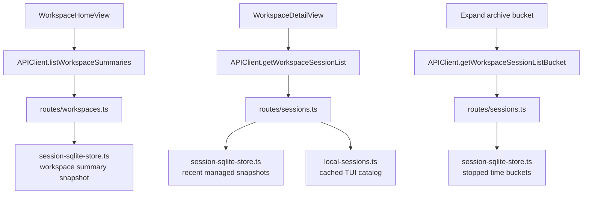
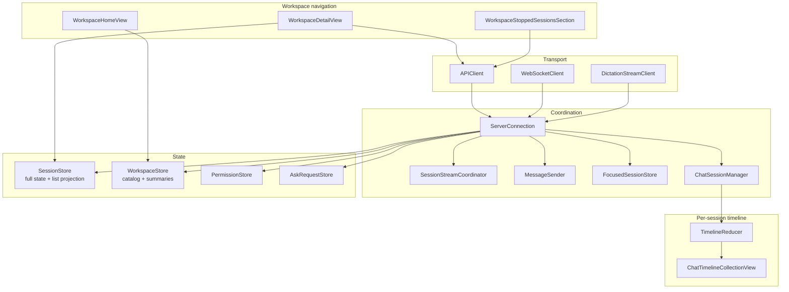
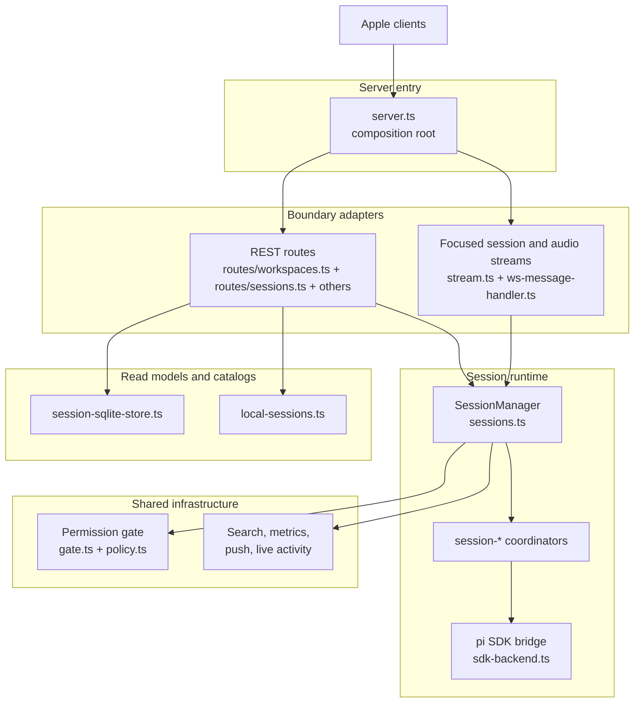

# Oppi architecture

Oppi is an Apple client plus a self-hosted server for supervising pi coding-agent sessions from mobile and desktop surfaces. The server embeds the pi SDK, owns session runtime and protocol translation, and exposes HTTP plus scoped WebSocket transports to the Apple clients.

## Scope

This document explains the current production architecture at a conceptual level: runtime topology, transport lanes, workspace navigation data flow, ownership boundaries, and the rules that keep the chat timeline fast. It does not document every source file or operational runbook.

## Runtime topology

The Apple app is a remote control and renderer. The server is the authority for sessions, workspace access, policy decisions, and pi SDK interaction.

## Live transport and navigation lanes

Oppi now keeps **workspace navigation HTTP-first** and uses WebSockets only for the focused session and audio dictation paths.

| Lane | Transport | Main server owner | Main Apple owner | Carries |
|------|-----------|-------------------|------------------|---------|
| Workspace home summaries | HTTP | `routes/workspaces.ts` + `session-sqlite-store.ts` | `WorkspaceStore` / `WorkspaceHomeView` | Per-workspace active/stopped counts, latest activity, attention summary |
| Workspace detail recent lane | HTTP | `routes/sessions.ts` + `session-sqlite-store.ts` + `local-sessions.ts` | `WorkspaceDetailView` + `SessionStore.applyWorkspaceSnapshot(...)` | Recent managed session summaries, attention snapshot, recent importable TUI sessions, archive bucket summaries |
| Workspace archive bucket | HTTP | `routes/sessions.ts` | `WorkspaceStoppedSessionsSection` | Lazy-loaded stopped/importable rows for one older bucket |
| Focused session stream | Bidirectional JSON | `BoundSessionStreamMux` | `WebSocketClient` + `SessionStreamCoordinator` | Timeline events, prompts, commands, queue sync, low-frequency `session_summary` updates |
| Focused session catch-up | HTTP GET | `SessionManager.getCatchUp()` | `APIClient` + `SessionStreamCoordinator` | Missed durable focused-session events after reconnect |
| Session audio stream | Bidirectional JSON + binary | `SessionAudioStreamMux` | `DictationStreamClient` | Dictation control messages, transcript events, PCM audio |

## Event flow: prompt to pixel

Most user-visible chat work follows this path.

Durable session events get per-session sequence numbers and can be replayed through focused-session catch-up. High-frequency deltas such as token text, thinking deltas, and tool output are hot live traffic; if a reconnect misses them, the client recovers by resuming the live stream or reloading the full trace.

## Workspace navigation flow

Workspace navigation avoids rereading JSONL traces on the hot path.

The recent lane is explicitly time-bounded (`sinceMs` / `untilMs`). Older stopped sessions and older importable TUI sessions are summarized into archive buckets and loaded lazily.

## Client architecture

The Apple client keeps transport, shared stores, workspace HTTP refresh, and timeline rendering separate.

Key boundaries:

- `ServerConnection` owns focused-session transport, app-wide refresh coordination, and shared store updates for live session messages.
- `WorkspaceStore` owns workspace catalog freshness plus SQLite-backed workspace-home summaries.
- `WorkspaceDetailView` owns view-scoped workspace refresh/polling using `getWorkspaceSessionList(...)` and lazy archive bucket fetches.
- `SessionStore` keeps the hot list projection separate from full session state so timeline-frequency updates do not rebuild workspace lists.
- Timeline row rendering is UIKit-backed for the hot path. SwiftUI owns navigation shells, forms, and high-level composition.

## Server architecture

The server has one composition root and two main boundaries: HTTP routes and split session/audio streams.

Read the server as four blocks:

| Block | Owns | Does not own |
|-------|------|--------------|
| `server.ts` | startup, dependency wiring, HTTP and WS entry | session semantics |
| `routes/*` | HTTP parsing, auth boundary, workspace summary and session-list response shape | runtime orchestration |
| `stream.ts` + `ws-message-handler.ts` | focused session and audio WS framing, fan-out, client-message routing | workspace navigation data flow |
| `sessions.ts` + `session-*` | session lifecycle, queue, stop, event translation, SDK calls | HTTP response shaping |

## Protocol boundary

The protocol is mirrored manually on both sides:

- Server source of truth: `server/src/types.ts`
- Apple mirrors: `ClientMessage.swift`, `ServerMessage.swift`, and `StreamMessage`
- Snapshot and codable tests guard drift.

When a message contract changes, update server types, Apple models, and protocol tests together. Partial protocol updates are invalid because a mismatched app/server pair can fail at the transport boundary.

## Design invariants

- Workspace navigation is HTTP-first. There is no workspace-scoped WebSocket for normal list navigation.
- The hot workspace recent lane must be explicitly time-bounded. Older stopped/importable history belongs in archive buckets.
- Workspace session-list endpoints return **session summaries**, not full `Session` payloads.
- Hot workspace endpoints must not reread `~/.pi/agent/sessions/*.jsonl`; importable TUI metadata comes from the cached local-session catalog and SQLite-backed read models.
- Keep hot timeline traffic separate from cold workspace/session projections.
- Apply shared store updates exactly once per inbound live session event on the client.
- Keep reducers and coalescers UI-framework-free; keep UIKit-specific rendering under the timeline package.
- Preserve the ability to resume imported TUI sessions without mutating the original JSONL traces.

## Where to look in code

| Concern | Server | Apple |
|---------|--------|-------|
| Workspace home summaries | `server/src/routes/workspaces.ts`, `server/src/storage/session-sqlite-store.ts` | `WorkspaceStore.swift`, `WorkspaceHomeView.swift` |
| Workspace detail recent lane | `server/src/routes/sessions.ts`, `server/src/local-sessions.ts` | `WorkspaceDetailView.swift`, `SessionStore.swift` |
| Lazy stopped archive buckets | `server/src/routes/sessions.ts`, `server/src/storage/session-sqlite-store.ts` | `WorkspaceStoppedSessionsSection.swift`, `WorkspaceDetailView.swift` |
| Focused session WebSocket | `server/src/stream.ts`, `server/src/ws-message-handler.ts` | `WebSocketClient.swift`, `SessionStreamCoordinator.swift`, `ServerConnection.swift` |
| Session runtime | `server/src/sessions.ts`, `server/src/session-*.ts` | `ChatSessionManager.swift`, `ChatActionHandler.swift` |
| Protocol contract | `server/src/types.ts` | `ClientMessage.swift`, `ServerMessage.swift` |
| Timeline rendering | `server/src/session-protocol.ts`, `server/src/session-broadcast.ts` | `TimelineReducer.swift`, `ChatTimelineCollectionView.swift` |
