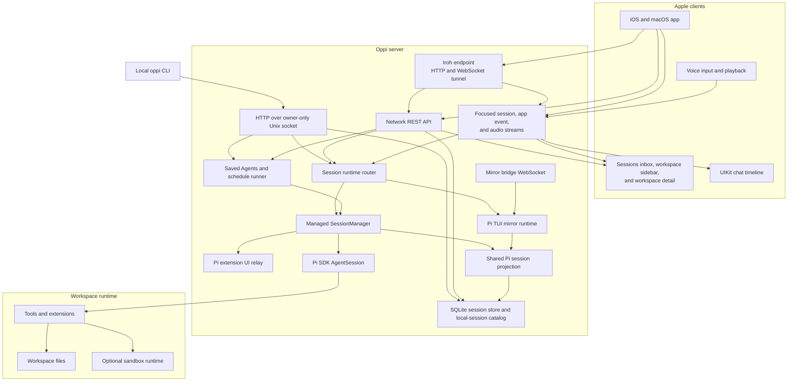
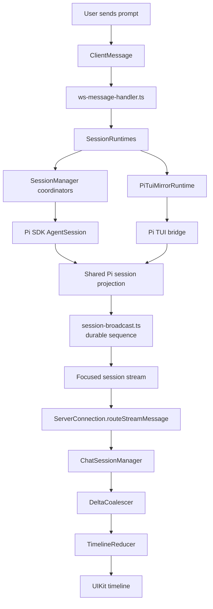

# Oppi architecture

Oppi is an Apple client plus an Oppi server for viewing, prompting, and steering Pi coding-agent sessions from iPhone, iPad, and Mac clients. The server embeds the Pi SDK for managed sessions, can mirror a live terminal-owned Pi TUI session through the Oppi Mirror extension, and stores saved Agent and schedule state. It exposes HTTP over an owner-only Unix socket for the local CLI, plus remote HTTP and scoped WebSocket handlers that Apple clients can reach through an optional network listener or an Iroh encrypted tunnel without an Oppi host, port, DNS name, TLS certificate, LAN, or Tailscale.

## Audience and scope

This page is the cross-system map. Use it when you need to understand how the Apple app, server, Pi SDK runtime, and terminal mirror runtime fit together.

For implementation details, read the split pages:

- [Server architecture](architecture-server.md) — HTTP routes, stream muxes, runtime ownership, session coordinators, storage, mirror bridge, and server boundary rules.
- [Client architecture](architecture-client.md) — Apple stores, transport coordinators, workspace navigation, chat timeline pipeline, extension UI rendering, and client boundary rules.

This page does not document every source file or operational runbook.

## Runtime topology

The Apple app is a remote control and renderer. The server is the authority for sessions, workspace access, runtime configuration, saved Agent and schedule state, and the mobile-facing session projection. Execution can be owned either by the server's Pi SDK runtime or by a terminal Pi TUI process connected through the mirror extension.

## Runtime ownership and projection

Oppi treats managed SDK sessions, mirrored terminal sessions, and local JSONL imports as adapters into one Pi-backed session model.

The adapters differ where ownership semantics differ: start, stop, abort, remote commands, queue control, and extension UI response delivery. Shared projection code owns Pi event translation, session mutation, media materialization, title and first-message policy, summaries, and the SQLite read model. Live mirror and local JSONL import coalesce by `piSessionId` and canonical `piSessionFile`, so one terminal session appears as one Oppi row.

Persisted runtime ownership uses `Session.runtime == "oppi"` for server-owned SDK sessions and `Session.runtime == "pi-tui"` for terminal-owned mirror sessions. `SessionRuntimes` dispatches command, catch-up, pending UI, and snapshot calls by that field.

## Transport map

Oppi keeps workspace navigation HTTP-first. WebSockets carry live state where streaming is required.

| Lane                                        | Transport                   | Carries                                                                                                  |
| ------------------------------------------- | --------------------------- | -------------------------------------------------------------------------------------------------------- |
| Local CLI control plane                     | HTTP over Unix socket       | Authenticated CLI routes without host, port, TLS, DNS, or Tailscale dependencies                         |
| Host-free Apple transport                   | HTTP/WebSocket over Iroh    | The same remote routes and streams through an authenticated encrypted tunnel                             |
| Global sessions inbox                       | HTTP                        | Recent session summaries across workspaces; the root groups active rows by attention and execution state |
| Workspace catalog summaries                 | HTTP                        | Workspace rows, active/stopped counts, attention/error flags, and optional compact Git summaries         |
| Workspace detail recent list                | HTTP                        | Recent active/stopped session summaries, attention snapshot, importable local sessions                   |
| Workspace archive bucket                    | HTTP                        | Older stopped/importable rows for one lazy-loaded time bucket                                            |
| Workspace files and media                   | HTTP GET/HEAD               | Directory listings, raw bytes, uploads, attachments, byte-range media                                    |
| Workspace quick actions and review comments | HTTP                        | Prompt-template options, selected-file preparation, review comments                                      |
| Saved Agents and schedules                  | HTTP                        | Agent definitions, Agent launches, schedule definitions, manual runs, run history                        |
| Global app event stream                     | Server-to-client WebSocket  | Session row updates, extension UI attention, workspace invalidation                                      |
| Focused session stream                      | Bidirectional WebSocket     | Timeline events, prompts, commands, queue sync, focused session summaries                                |
| Focused session catch-up                    | HTTP GET                    | Missed durable focused-session events after reconnect                                                    |
| Mirror bridge                               | Bidirectional WebSocket     | Terminal-owned session registration, takeover, commands, queue, extension UI proxying                    |
| Dictation stream                            | Bidirectional JSON + binary | Dictation control frames, PCM audio, transcript events                                                   |

## Prompt to pixel

Most chat work follows this path. Managed and mirror runtimes differ in the owner of execution, then converge before projection and broadcast.

Durable session events get per-session sequence numbers and can be replayed through focused-session catch-up. High-frequency deltas such as token text, thinking deltas, and tool output are hot live traffic. If a reconnect misses them, the client resumes the live stream or repairs from paged trace history instead of loading the entire trace at once.

## Cross-system invariants

- The local CLI uses bearer-authenticated HTTP over the owner-only Unix socket. It does not discover or fall back to a host, port, DNS name, TLS identity, or plaintext network listener.
- Network HTTP(S)/WebSocket and Iroh availability are independent from the local CLI socket. Remote transport failures fail closed without disabling local CLI routes.
- Iroh reuses the existing HTTP route and WebSocket upgrade handlers through a private loopback adapter. It must not implement a second feature-specific API or session projection.
- Iroh device tokens are bound to the paired Apple endpoint ID. Iroh-only credentials fail closed without HTTP fallback, and Iroh-bound tokens follow their invite transport policy.
- Host-free means Oppi does not require a server hostname, port, TLS certificate, LAN, or Tailscale. Iroh can use direct paths, signed endpoint address lookup, and relay infrastructure to reach the signed server endpoint ID.
- Workspace navigation is HTTP-first. `/app/events/stream` keeps visible rows and attention state fresh between snapshots; compact sidebar Git state comes from the workspace catalog snapshot, never raw Git payloads on the app-event stream.
- The Workspaces root is a server-scoped active-session inbox. Workspace selection opens the workspace-scoped recent list, files, and configuration.
- The hot workspace recent list is time-bounded. Older stopped/importable history belongs in archive buckets.
- Workspace session-list endpoints return session summaries, not full `Session` payloads.
- Hot workspace endpoints do not reread `~/.pi/agent/sessions/*.jsonl`; importable TUI metadata comes from the cached local-session catalog and SQLite read models.
- Runtime adapters share Pi event projection. Managed SDK sessions and terminal mirror sessions use the same translation, session mutation, media materialization, title/first-message derivation, summary, and storage projection code where ownership semantics allow it.
- Mirror sessions are terminal-owned. The server does not auto-start a Pi SDK runtime for a connected or stale `runtime == "pi-tui"` session.
- Hot timeline traffic stays separate from cold workspace/session projections.
- The global app event stream is store-level only. It must not carry timeline deltas, full state, queue state, command results, dictation/audio, or raw `GitStatus` payloads.
- Reconnect repair for the global app event stream comes from HTTP snapshots, not app-event replay.
- File previews, attachments, and media playback stay on authenticated HTTP routes with byte-range support.
- Workspace quick-action discovery, selected-file prompt-template preparation, review comments, saved Agents, and schedules stay on HTTP routes. Only the created or focused session uses the session stream.
- Automatic schedule runs use the server schedule runner and managed-session launch path; they do not create a separate runtime adapter.
- Shared store updates apply exactly once per inbound live session event on the client.
- Reducers and coalescers stay UI-framework-free. UIKit-specific rendering lives under the timeline package.
- Imported TUI sessions remain resumable without mutating original JSONL traces.

## Protocol boundary

The protocol is mirrored manually on both sides:

- Server source of truth: `server/src/types/protocol.ts`, re-exported by `server/src/types.ts`
- Apple mirrors under `clients/apple/OppiCore/Models/` (`ClientMessage.swift`, `ServerMessage.swift`, `AppEventMessage.swift`) plus the stream wrappers
- Snapshot and Codable tests guard focused-stream and app-event drift.

When a message contract changes, update server types, Apple models, and protocol tests together. Partial protocol updates are invalid because a mismatched app/server pair can fail at the transport boundary. See [Server architecture](architecture-server.md#protocol-boundary) for the step-by-step checklist.
