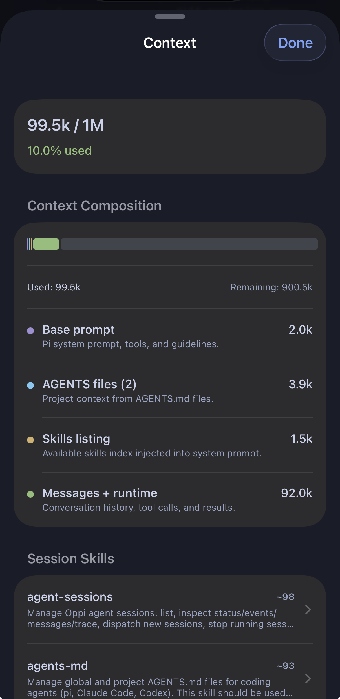
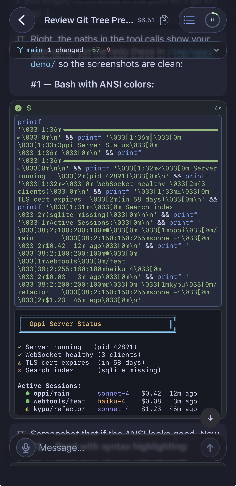
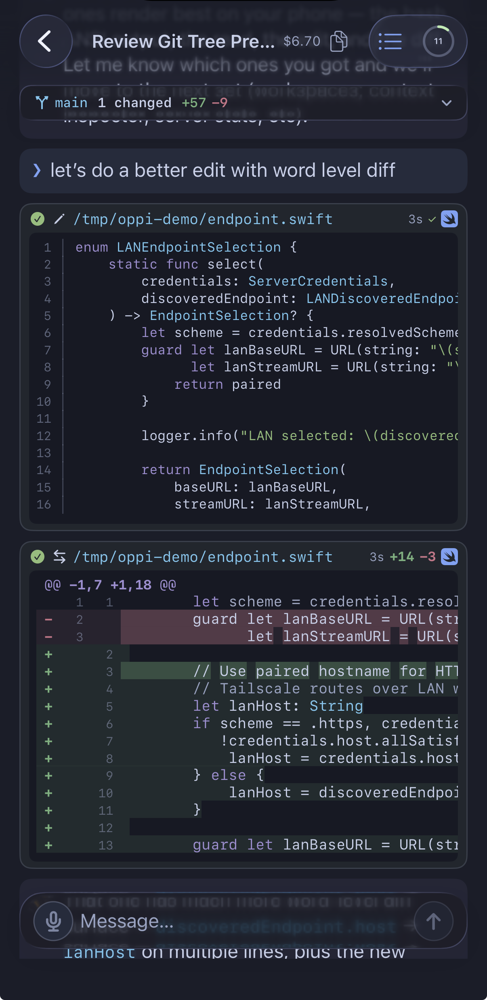
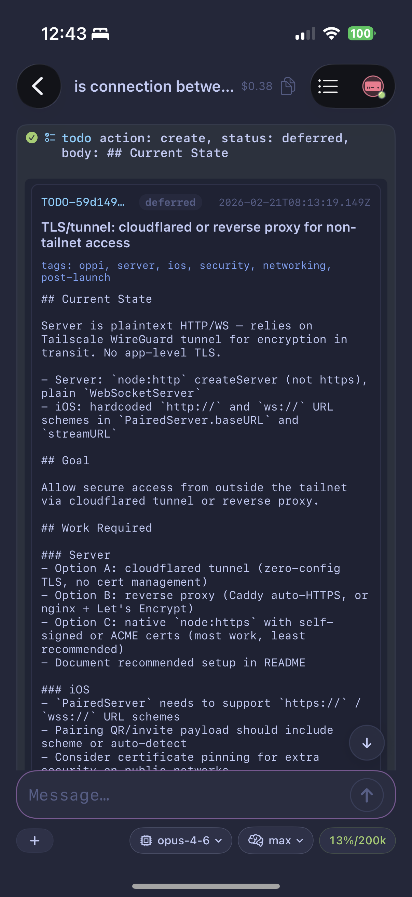

# Screenshots

## Context inspector

Token usage, context composition breakdown (base prompt, AGENTS.md, skills, messages), and loaded skills.

## Bash with ANSI rendering

Terminal output with true-color ANSI escape sequences rendered natively.

## Write + Edit with diff

File write with syntax highlighting, followed by a surgical edit showing added/removed lines.

## Extension rendering

Custom pi extension output rendered inline.

## Demo video

https://github.com/user-attachments/assets/<uuid>
