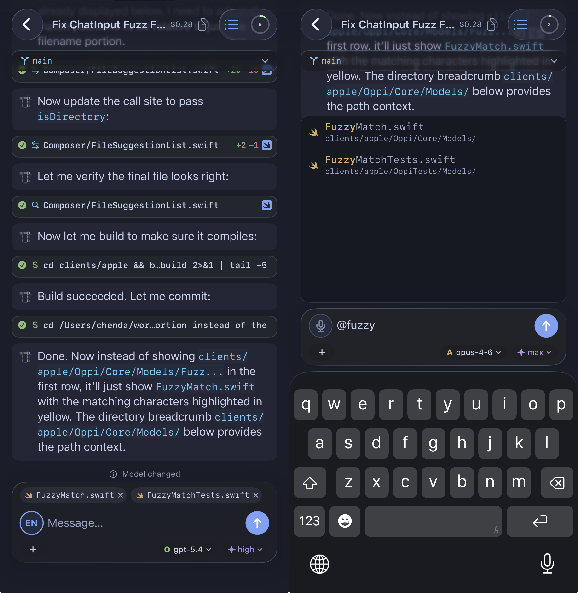
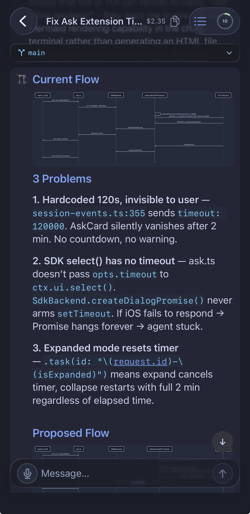
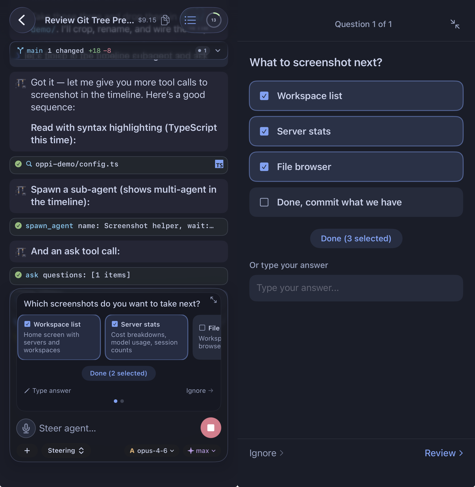
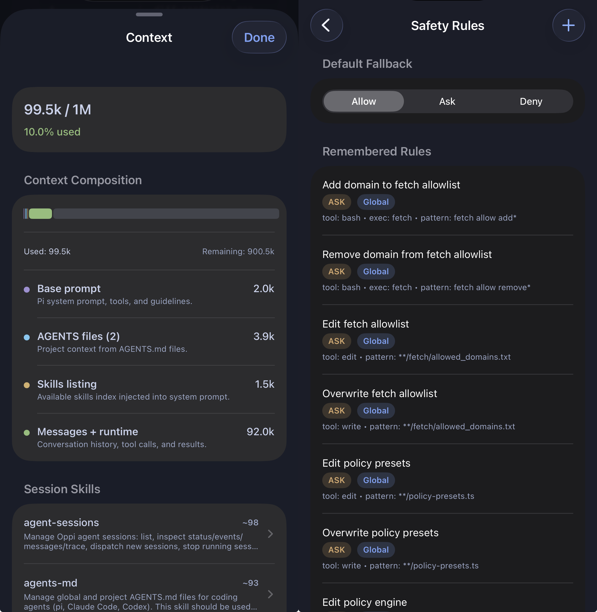
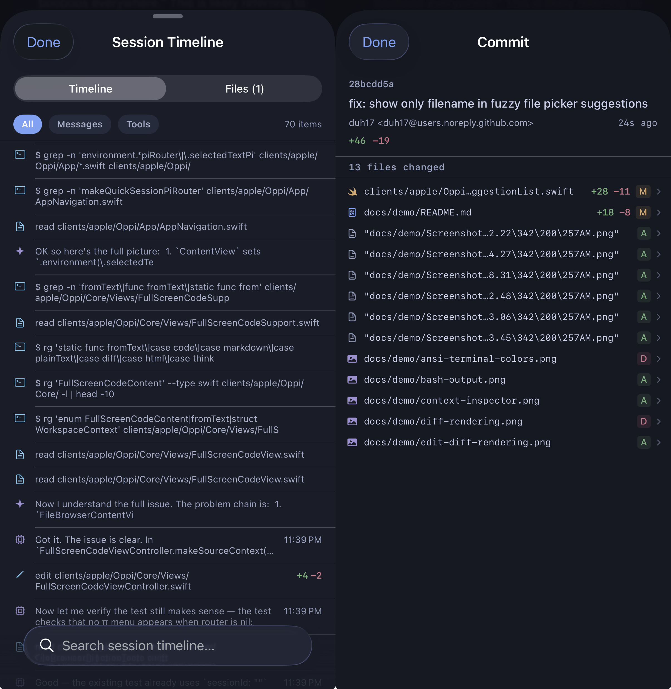
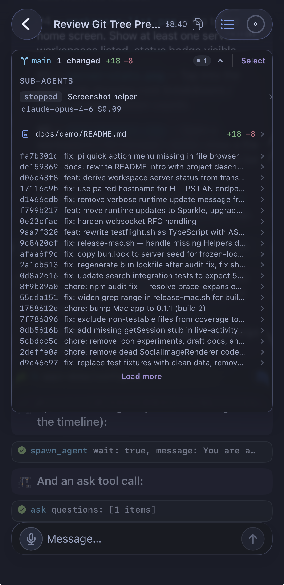
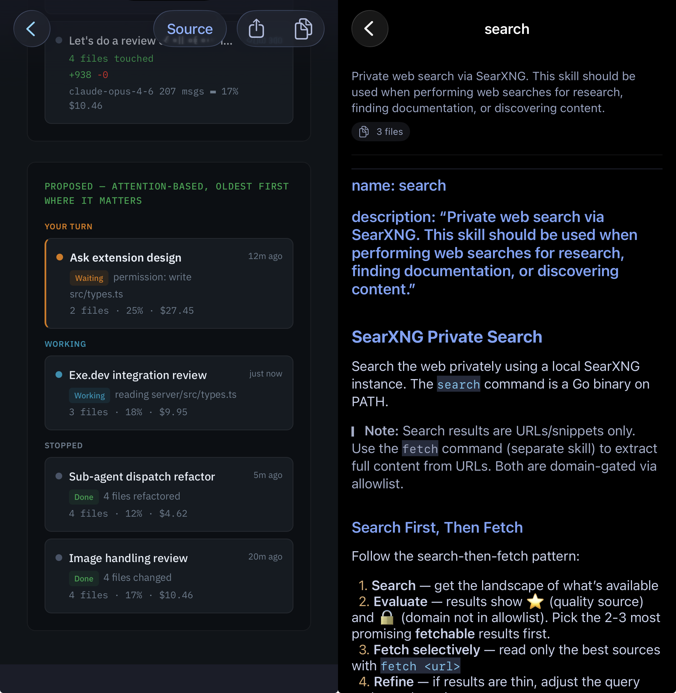

# Screenshots

## Session with file context and fuzzy search

## Mermaid diagrams

## ANSI terminal output

## Edit diff

## Ask tool

## Context inspector and safety rules

## Session timeline and commit detail

## Multi-agent

## HTML and markdown rendering

