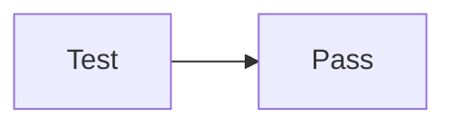

# Image Loading Test

## Relative Image (same directory)

## Another Relative Image

## Mermaid (should render as diagram)

## Done

If you see the two images above and a mermaid diagram, workspace image loading works.
