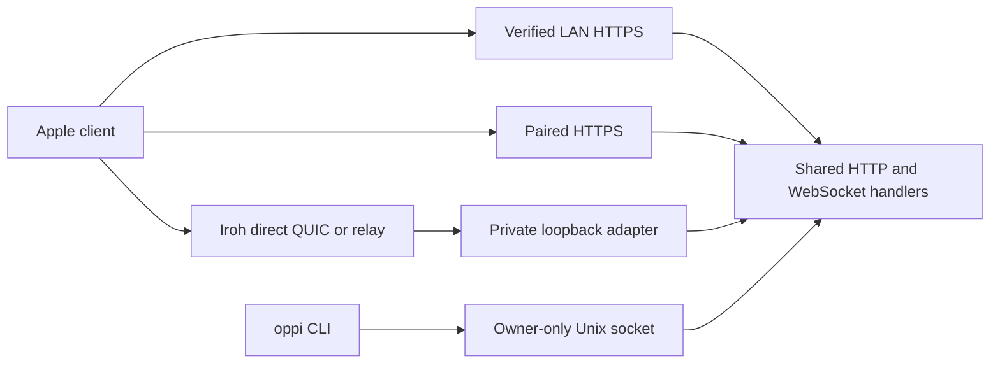

# Networking and connection routing

Oppi carries the same authenticated HTTP and WebSocket API over verified LAN HTTPS, paired HTTPS, or an Iroh tunnel. The local CLI uses an owner-only Unix socket and never selects a remote route.

## Transport authorization and route mode

A signed invite authorizes HTTPS, Iroh, or both. Its historical wire value `irohPreferred` means **both transports are authorized**; it does not label a product route order.

Each paired server has an Apple route mode:

| Mode           | Candidate order                          |
| -------------- | ---------------------------------------- |
| **Automatic**  | verified LAN HTTPS → paired HTTPS → Iroh |
| **HTTPS Only** | verified LAN HTTPS → paired HTTPS        |
| **Iroh Only**  | Iroh                                     |

Automatic is the default. The selected mode can narrow the invite's signed transport set, never expand it. The server-issued device credential also carries an explicit transport grant. Effective candidates are the signed authorization intersected with that credential grant and the selected mode. A verified LAN candidate must match the paired server identity and use HTTPS. Plaintext LAN HTTP is never selected.



## Selection, fallback, and recovery

A working installed route stays in use when it has current health evidence. That evidence is a recent authenticated HTTP success, a focused or app-event stream that has reconnected and passed its heartbeat policy, or successful in-place Iroh foreground recovery with selected-path evidence.

When a route has no current health evidence, the client evaluates its effective candidates in mode order under a bounded bootstrap deadline. An availability failure excludes that route only for the current selection pass. The next recovery or retry starts a new pass, so the route becomes eligible again. Route selection does not use readiness leases, readiness IDs, or server-readiness routing.

Failure scope is explicit. A tunnel `binding_missing`, `binding_mismatch`, or `forbidden_transport` result removes Iroh from that credential's grant and requires re-pairing to restore it; LAN and paired HTTPS recovery remain active. An unknown or revoked credential fails closed for every route. TLS identity, signed-peer, ALPN, framing, and protocol failures stop automatic fallback.

The operation that reported a failure is not replayed after a route change. Transport generations fence in-flight mutations so they cannot retry on another lane.

For HTTPS candidates, the client builds the final authenticated API client, probes authenticated `GET /server/info`, and retains that client if it wins. For Iroh, it validates signed metadata, starts the local proxy, obtains selected-path evidence, then completes the same authenticated bootstrap before committing the composition.

A healthy paired HTTPS route stays installed across ordinary network and foreground boundaries. A route failure, missing composition, verified LAN change, explicit **Retry Connection**, or explicit reconfiguration starts a new pass where previously excluded routes are eligible again. Iroh recovery is server-scoped and uses the shared automatic retry budget; another server's healthy transport stays untouched.

### Foreground recovery

On foreground, an active Iroh route first recycles its endpoint **in place**, verifies selected-path evidence, rebuilds loopback-bound clients if needed, and reconnects streams. It stays on Iroh when that succeeds. Automatic walks other allowed candidates only if the in-place recovery fails. There is no unconditional Iroh → HTTPS → Iroh handoff.

## Pairing

Before the one non-replayed `POST /pair` mutation, onboarding probes authorized candidates:

- HTTPS uses bounded read-only `GET /health` probes.
- Iroh validates its signed metadata and obtains selected-path evidence.

The client sends `/pair` once on the selected route. For HTTPS pairing that also authorizes Iroh, the request includes the stable Apple Iroh node ID without binding or dialing an endpoint. The server verifies that Iroh is authorized, atomically consumes the pairing token, binds the issued credential to that node ID, and returns the credential's transport grant. An HTTP-issued credential without a node binding is HTTP-only.

If the pairing response is lost after dispatch, pairing might have completed; obtain a fresh invite rather than replaying the one-time mutation. After pairing, authenticated bootstrap is retained to test and install normal candidates.

## Iroh relay configuration

By default, Iroh uses its public relay map. An owner can replace the server map with up to eight relay entries:

```json
{
  "iroh": {
    "enabled": true,
    "relays": [
      { "url": "https://relay-us.example" },
      { "url": "https://relay-eu.example", "quicPort": 7842 }
    ]
  }
}
```

`url` must be an HTTPS root URL with a host. Entries cannot contain credentials, queries, fragments, paths, loopback/private/link-local/unspecified IP literals, or duplicate normalized URLs. `quicPort` must be an integer from 1 through 65535. An omitted port is normalized to `7842`; this preserves QUIC address discovery. A non-empty custom list replaces the server's public defaults.

Change configuration with the implemented CLI:

```bash
oppi config set iroh.enabled true
oppi config set iroh.relays '[{"url":"https://relay-us.example"},{"url":"https://relay-eu.example","quicPort":7842}]'
oppi config validate
oppi doctor
```

Relay changes require a server restart and a fresh pairing invite. For a LaunchAgent installation, `oppi server restart` restarts it; when running `oppi serve` directly, stop and start that process instead. Then run `oppi pair` to create a new invite. `oppi doctor` reports public/default versus custom mode and configured/live drift without printing relay URLs.

The running endpoint writes the live relay set used in new invites. Editing config does not change a running endpoint or an already paired client. Re-pair devices after a relay change.

### Apple relay-map compatibility

The relay membership experiment found that a default-map client cannot reach a server homed on an out-of-map relay when direct UDP is unavailable, even with a full ticket or relay-bearing address. Therefore Iroh metadata v2 can carry optional `relayUrls`.

Apple maintains one process-global Iroh map: public defaults plus relays from every paired server and the in-flight invite. It adds these URLs before pairing or dialing; one server's custom relays do not replace public defaults or another server's relays. Missing `relayUrls` retains public-default behavior.

Older clients can ignore this additive field and might fail against a private-only relay deployment. There is no in-app relay editor or per-phone override. Running a custom relay is separate from Oppi.

## Privacy and security

Relays carry encrypted Iroh traffic but can observe client IP addresses, timing, and volume and can deny availability. They do not replace signed-peer validation, TLS identity checks, or tunnel bearer authentication.

Uploaded telemetry and ordinary client logs must not contain relay URLs or hosts, IP addresses, tokens, tickets, node IDs, endpoint IDs, or raw transport errors. Diagnostics use bounded transport and path categories only. See [Telemetry](telemetry.md).

## Diagnose a server

```bash
oppi status
oppi doctor
```

Useful server events include `iroh_transport.started`, `iroh_transport.start_failed`, `iroh_transport.connection_failed`, `iroh_tunnel.pump_failed`, and `iroh_transport.stopped`. The absence of `iroh_transport.started` after restart means Iroh is unavailable even if an invite contains Iroh metadata.

## Related docs

- [Onboarding and pairing](onboarding.md)
- [Client architecture](architecture-client.md)
- [Server architecture](architecture-server.md)
- [Config schema](../server/docs/config-schema.md)
