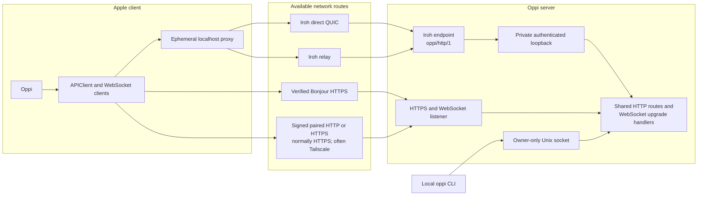
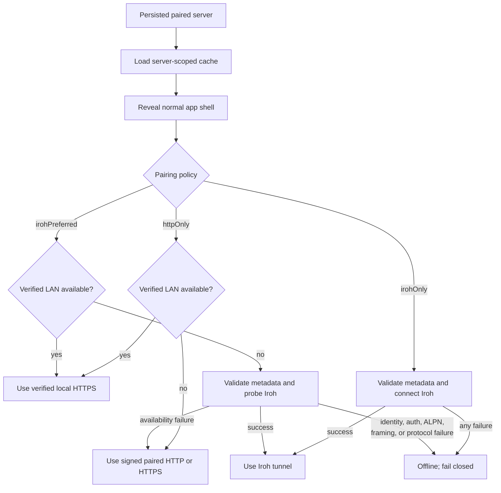
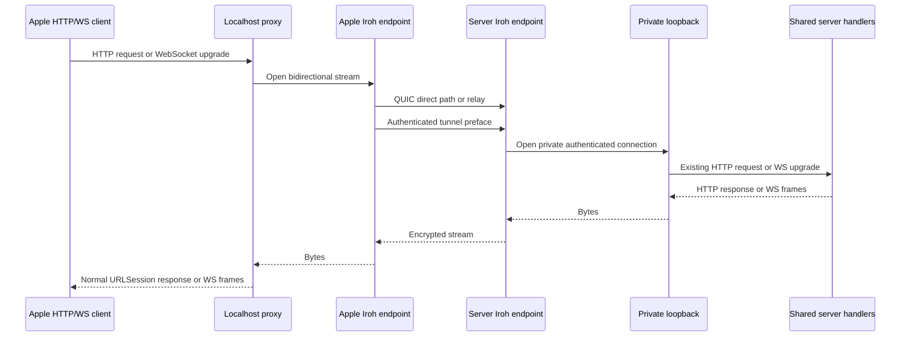
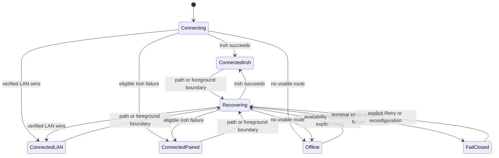

# Networking and connection routing

Oppi carries the same authenticated HTTP and WebSocket APIs over three remote routes: verified local HTTPS, a signed paired HTTP(S) endpoint, or an Iroh tunnel. The local CLI uses a fourth route, an owner-only Unix socket, and never falls back to a remote endpoint. Plain network HTTP requires the server's explicit insecure-network escape hatch and is never eligible for Bonjour LAN selection.

## Audience and scope

Use this page to understand pairing transport policy, runtime route selection, fallback, recovery, and the Apple/server networking boundary.

This page does not define HTTP routes or stream payloads. See [Server architecture](architecture-server.md) and [Client architecture](architecture-client.md) for those contracts. See [Onboarding and pairing](onboarding.md) for setup steps.

## Connection routes



All Apple routes end at the same server handlers. Iroh is a transport adapter, not a second API. REST requests, focused streams, app events, dictation, uploads, files, and media retain their HTTP or WebSocket semantics inside the tunnel.

### Route names

| Route                 | Client transport path | Identity and trust                                                                                                                                                           |
| --------------------- | --------------------- | ---------------------------------------------------------------------------------------------------------------------------------------------------------------------------- |
| Verified local HTTPS  | `lan`                 | Bonjour server identity must match the paired server. TLS uses the paired certificate pin or the exact signed Tailscale hostname and port.                                   |
| Signed paired HTTP(S) | `paired`              | Uses the host, port, scheme, and TLS identity from signed pairing credentials. This is commonly Tailscale HTTPS. Plain HTTP requires explicit insecure server configuration. |
| Iroh                  | `iroh`                | Uses the signed server node ID, ticket/address metadata, `oppi/http/1` ALPN, and a device token bound to the Apple endpoint ID.                                              |
| Local CLI             | Unix socket           | Uses bearer-authenticated HTTP over an owner-only local socket. It does not participate in Apple route selection.                                                            |

## Pairing policy and runtime selection

Pairing credentials declare one policy:

- `httpOnly`: use verified local HTTPS when available; otherwise use the signed paired HTTP(S) endpoint.
- `irohOnly`: use Iroh and fail closed. HTTP fallback is forbidden.
- `irohPreferred`: use verified local HTTPS when available, otherwise probe Iroh, then use the signed paired HTTP(S) endpoint only for an eligible Iroh availability failure.



A verified LAN endpoint discovered while Iroh setup is in flight can still win before application traffic starts. Once an operation starts on a route, Oppi does not replay that mutation on another route.

## Iroh tunnel shape



The localhost URL exists only inside the running Apple process. It never replaces the paired server identity.

## Fallback and recovery

Only an Iroh reachability or availability failure can downgrade `irohPreferred` to the signed paired HTTP(S) route. These failures do not permit fallback:

- malformed or unsupported signed metadata
- ticket or connected-peer mismatch
- authentication failure
- ALPN negotiation failure
- framing failure
- protocol violation

The HTTPS fallback remains sticky between recovery boundaries. Oppi reevaluates transport when:

- the network path changes
- the app returns to the foreground
- the user selects **Retry Connection**
- the connection is explicitly reconfigured

Focused-session and app-event WebSockets report persistent ping or reconnect failure through the same server-scoped recovery coordinator. Concurrent reports are coalesced, with one pending follow-up retained when it still belongs to the current stream generation. An unhealthy established Iroh route triggers a full rebuild for that server: Oppi closes its persistent streams and Iroh manager, reruns signed route selection, rebuilds the API and WebSocket clients, restores focused-session and app-event subscription intent, and force-refreshes server data. A closed or timed-out QUIC connection is replaced rather than repeatedly redialed through the same cached connection and loopback proxy. If the replacement remains unhealthy, automatic rebuilds use a five-attempt budget. The first rebuild is immediate, subsequent attempts use exponential 1-, 2-, 4-, and 8-second spacing, and the fifth attempt reserves the final 16-second cooldown without permitting a sixth automatic rebuild. A proven focused or app-event stream reconnect restores the budget. Another paired server's healthy manager remains untouched.

An availability failure during the rebuild can still select the signed HTTP fallback for `irohPreferred`. Authentication, identity, ALPN, framing, and protocol failures remain fail-closed and do not enter automatic retry. **Retry Connection** invokes the same full rebuild immediately, bypassing automatic-recovery cooldown. If an ordinary preparation is already running, the forced rebuild runs immediately after it instead of being dropped. Retry never rebuilds another server's connection.



Cached UI remains visible during these transitions. A connectivity failure does not send an already paired user back to onboarding.

## Server configuration

Enable Iroh durably:

```bash
oppi config set iroh.enabled true
```

Restart the server after changing the setting. On successful startup, the server log contains:

```text
iroh_transport.started
```

`OPPI_IROH_TRANSPORT=1` and `OPPI_IROH_PAIRING=1` remain temporary compatibility overrides. Persistent installations, including the Oppi Mac app and launchd, should use `iroh.enabled`.

Iroh startup and the network HTTPS listener are independent. A failed optional Iroh startup leaves an allowed HTTPS route usable. `irohOnly` mode requires Iroh readiness and fails server startup closed when that readiness cannot be established.

## Diagnose the active route

The server badge reports connection health and the active or attempted route. Uploaded telemetry uses bounded route names and coarse error categories.

Check server startup and recent transport failures:

```bash
oppi status
oppi doctor
```

For repository development, use the incident and client-log lanes described in [Telemetry](telemetry.md). Relevant server events include:

| Event                              | Meaning                                                                              |
| ---------------------------------- | ------------------------------------------------------------------------------------ |
| `iroh_transport.started`           | The server Iroh endpoint is accepting connections.                                   |
| `iroh_transport.start_failed`      | Endpoint startup failed. HTTPS can remain available in preferred mode.               |
| `iroh_transport.connection_failed` | A client reached the server endpoint, but connection establishment did not complete. |
| `iroh_tunnel.pump_failed`          | An established tunnel failed while copying traffic.                                  |
| `iroh_transport.stopped`           | The server endpoint shut down.                                                       |

The absence of `iroh_transport.started` after a server restart means clients cannot connect through Iroh, even when their signed pairing metadata is valid.

## Security and correctness invariants

- Iroh-only credentials never fall back to HTTP.
- Only availability failures can downgrade Iroh-preferred credentials.
- LAN selection requires matching paired server identity and authenticated HTTPS.
- Tailscale public-CA fallback uses the exact signed hostname and port.
- Sender generations advance across persistent route replacement so in-flight mutations cannot replay on another route.
- Iroh device tokens remain bound to the paired Apple endpoint ID.
- Uploaded telemetry never includes node IDs, tickets, relay URLs, IP addresses, hostnames, or tokens.
- The local CLI socket never discovers or falls back to LAN, Tailscale, or Iroh.

## Code ownership

| Concern                                          | Owners                                                                  |
| ------------------------------------------------ | ----------------------------------------------------------------------- |
| Durable activation and server composition        | `server/src/storage/config-store.ts`, `server/src/server.ts`            |
| Server Iroh endpoint and tunnel limits           | `server/src/iroh-pairing-server.ts`, `server/src/iroh-http-loopback.ts` |
| Pairing invite transport metadata                | `server/src/cli.ts`, `server/src/iroh-invite-state.ts`                  |
| Client route policy                              | `IrohTransportPolicy.swift`, `LANEndpointSelection.swift`               |
| Client endpoint, connection, and localhost proxy | `IrohConnectionManager.swift`, `IrohLoopbackProxy.swift`                |
| Connection composition and recovery              | `ServerConnection.swift`, `ConnectionCoordinator.swift`                 |
| Transport telemetry                              | `IrohTransportTelemetry.swift`, [Telemetry](telemetry.md)               |
