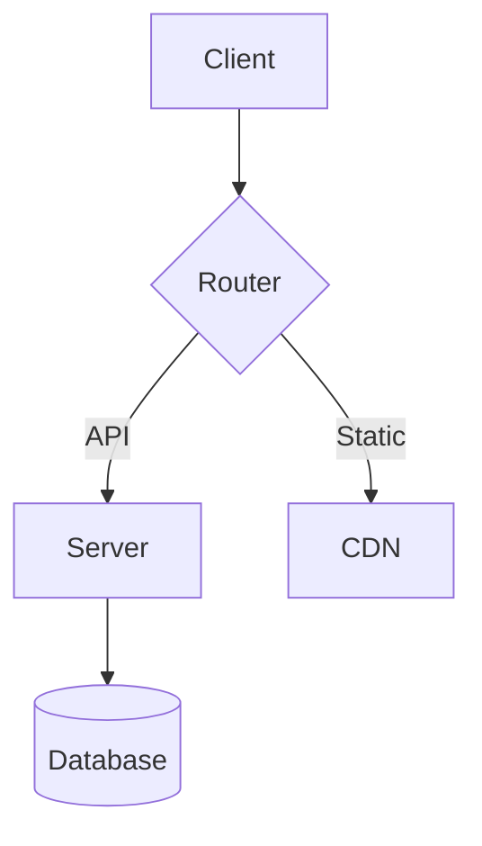

# Render Test

This document tests inline rendering of all supported block types.

## Mermaid Diagram



## Code Block

```swift
struct Point {
    var x: Double
    var y: Double
    
    func distance(to other: Point) -> Double {
        let dx = x - other.x
        let dy = y - other.y
        return sqrt(dx * dx + dy * dy)
    }
}
```

## Table

| Feature | Status | Notes |
|---------|--------|-------|
| Mermaid | Done | Inline diagrams |
| Images | Done | URL + workspace |
| Tables | Done | Horizontal scroll |
| Code | Done | Syntax highlighted |
| LaTeX | Done | Math rendering |

## Simple Text

This is just regular text with **bold**, *italic*, and `inline code`.

> A blockquote for good measure.
