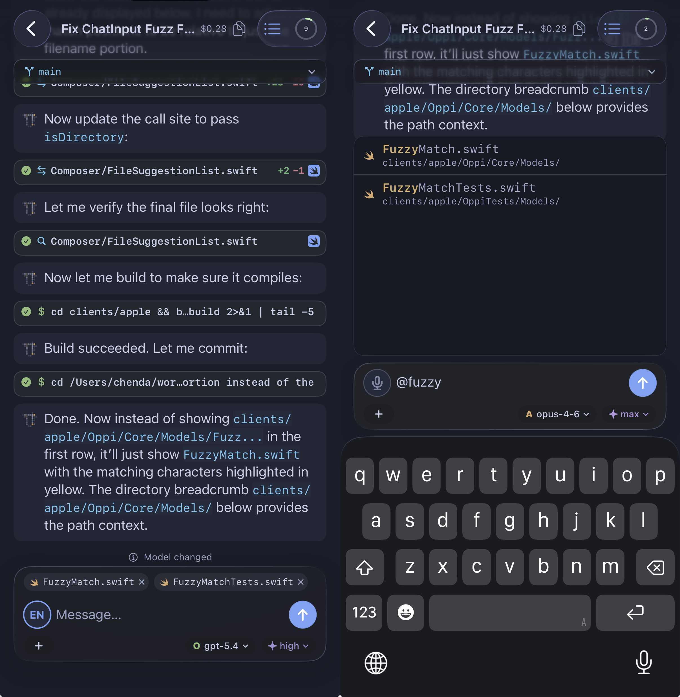
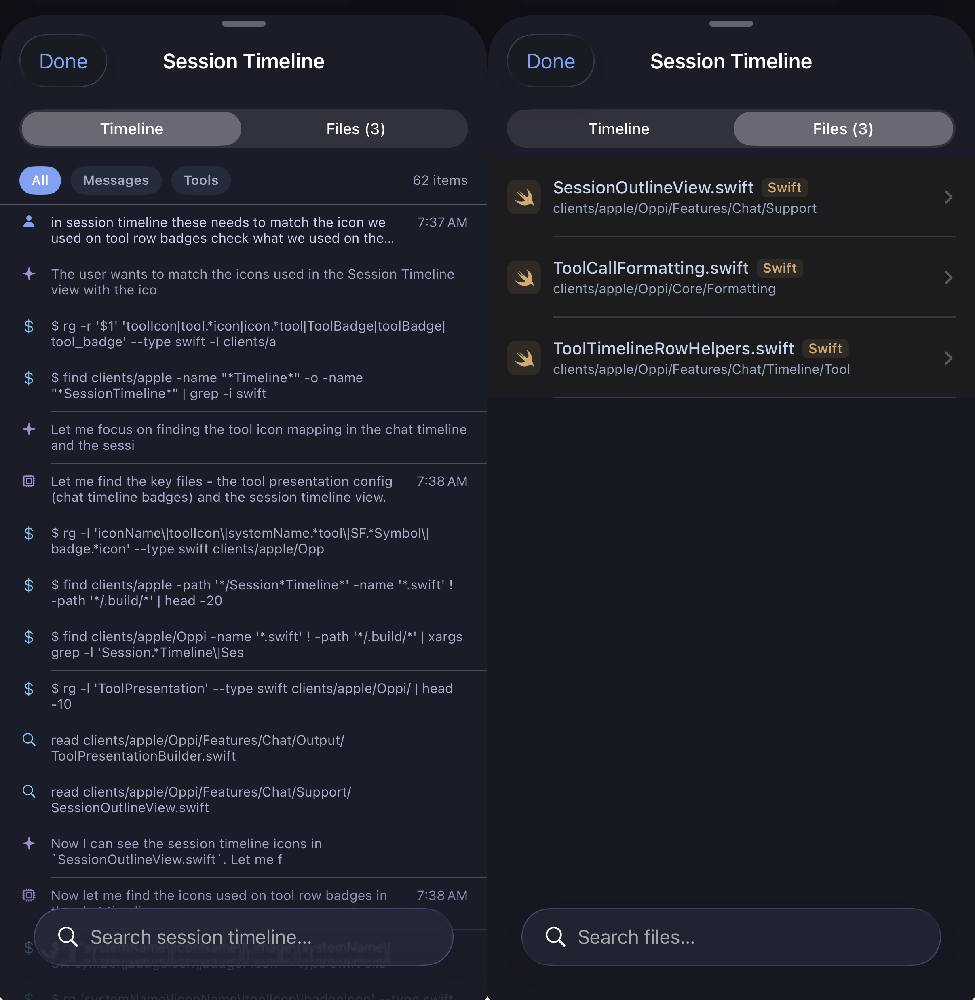

# Using Oppi

Daily phone and tablet use after you have paired a server. Pairing is in [Onboarding](onboarding.md).

Pi slash commands, skills, compaction, and the TUI stay in [Pi's usage guide](https://github.com/badlogic/pi-mono/blob/main/packages/coding-agent/docs/usage.md).

## Screen map

The Workspaces tab opens **All Sessions** for the active server.

- **Your Turn** — sessions waiting on you: a question, confirmation, or other prompt.
- **Working** — sessions that are busy.
- Stopped sessions sit below, grouped by day. Each row shows the workspace name.

The sidebar or drawer manages saved Agents and schedules, collapses the workspace list, opens App Settings, or browses a workspace's sessions, files, and settings.

Open a session to see the chat timeline. Tap a tool row to inspect command, output, diff, or file content. The changed-files bar lists files this session touched. If an extension shows a card or sheet, answer it in the app; you do not need to go back to a Mac.

## Prompt, steer, follow-up, and stop

When the session is idle, the composer says **Message…**. Send starts a new turn.

While the agent is working, choose how to send:

| Mode | Composer | What it does |
| --- | --- | --- |
| **Steering** | Steer agent… | Guides the current turn. |
| **Follow-up** | Queue follow-up… | Queues the next instruction after this turn. |

Toggle **Steering** / **Follow-up** on the composer. If an Ask card is visible, the composer answers that prompt instead of creating a steer or follow-up.

When the composer is empty during a busy turn, the primary action is **Stop**.

## Quick Session and the share sheet

**Quick Session** starts a session without opening a workspace first. Launch it from Oppi, Control Center, the Action Button, Spotlight, Siri, or Shortcuts. The Shortcuts **New Session** action can add optional text and one image to the composer.

The iOS share extension accepts text, URLs, images, and files. Choose a paired-server workspace in its Quick Session composer, then start the session from the share sheet.

## Files and photos

Attach files from the Files picker, photos from the library, or a camera capture. A selected photo or file uploads with the session turn; canceling before send does not upload. The Share extension stages shared files until the Quick Session handoff succeeds or is cancelled.

Assistant output can open markdown, code, diffs, and other documents in full-screen viewers. See [Document viewers](document-viewers.md).

## Voice

**Settings → Voice → Dictation Engine** is **On-device** or **Server**.

- **On-device** uses Apple's speech APIs on the phone. Audio stays on the device. Submitting the transcript still sends the prompt to the paired server.
- **Server** streams audio to the paired server, which forwards it to the configured speech-to-text backend.

Voice replies are produced by the paired server and its configured voice extension. See [Server configuration](server-configuration.md) for ASR and TTS setup.

## Agents and schedules

The sidebar holds saved **Agents** and **Schedules**.

- Agents store reusable definitions and can use one Unicode emoji or SF Symbol as an icon.
- Schedules support `at`, `every`, and `cron` triggers. Each schedule can target a workspace, saved Agent, or existing session. Oppi keeps run history for manual and approved automatic runs.

Create and edit sheets can open a **Pi Control** session (ordinary Pi with global settings, tools, Skills, Extensions, `SYSTEM.md`, and `APPEND_SYSTEM.md`) or use the native forms.

## Sandbox and Mirror

- [Sandbox workspaces](sandbox.md) run agent file tools in a Gondolin VM.
- [Oppi Mirror](oppi-mirror.md) shows a live terminal Pi session in Oppi.

## Models and quota

Pick models from the in-app picker. Remaining provider quota and pace live on **Server** detail → **Model Providers**. The CLI also has `oppi quota` and `oppi models`. See [Provider quotas](provider-quotas.md).

## What stays Pi

Oppi does not replace Pi's coding-agent manual. Use [Pi's usage guide](https://github.com/badlogic/pi-mono/blob/main/packages/coding-agent/docs/usage.md) for slash commands, skills, compaction, the TUI, and the extensions API. Oppi documents only mobile daily use and the [extension overlay](extensions.md).
