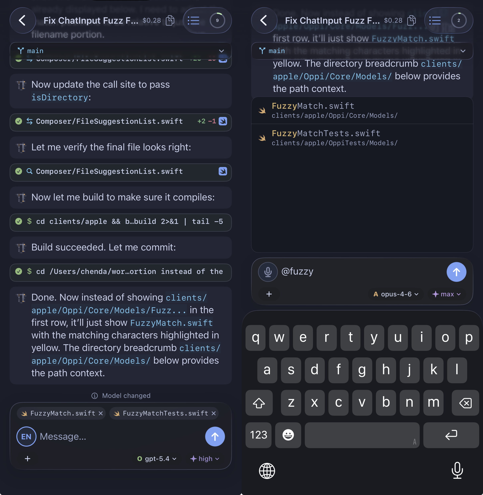
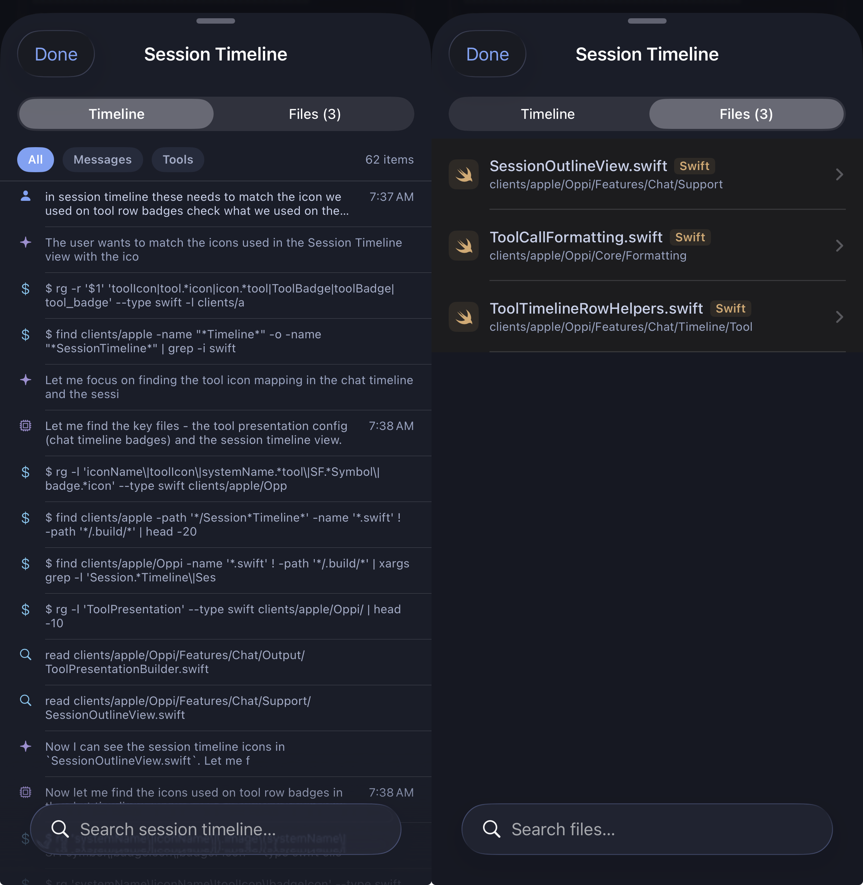

# Using Oppi

Daily phone and tablet use after you have paired a server. Pairing is in [Onboarding](onboarding.md).

Pi slash commands, skills, compaction, and the TUI stay in [Pi's usage guide](https://github.com/badlogic/pi-mono/blob/main/packages/coding-agent/docs/usage.md).

## Screen map

The Workspaces tab opens **All Sessions** for the active server.

- **Your Turn** — sessions waiting on you: a question, confirmation, or other prompt.
- **Working** — sessions that are busy.
- Stopped sessions sit below, grouped by day. Each row shows the workspace name.

All Sessions lists every session as its own row. **Session Threads** is an opt-in experiment: turn it on under Settings → **Experiments** → **Session Threads** (off by default, saved on this device) and sessions that other sessions launched sit under the session that launched them. A thread row is two targets: tap the session row to open that session's chat, or tap the Thread strip beneath it to open the thread. The strip shows which child sessions are working, a small lane graph, the saved Agents in the thread, and totals; the Agents and totals count the root session too. The lane graph has one lane per session from its launch to its last recorded activity, ordered by events rather than clock time. It summarizes the thread; it is not an exact record of when sessions ran. A thread with work in progress stays in **Working** even while its root waits. Turn the experiment off again to return to one row per session. The rest of this section, and Session Rows' Thread options, apply only while it is on.

A workspace's session list works the same way: the same sections, rows, swipe actions, and (with Session Threads on) Thread strips. It adds the worktree picker, host Pi sessions you can import, and older stopped history grouped by month. A thread is listed in the workspace of the session that launched it, and its strip adds **N workspaces** when its sessions run in more than one. A session launched from another workspace or worktree stays a row in its own list, with an **In thread** link to that thread that names the other workspace when there is one. In thread detail, Outline names the workspace of any session outside the root's workspace. Oppi only connects sessions it has loaded, so a session whose launcher is older than the loaded history shows as a plain row.

Open a thread and use its pill for three views. Oppi remembers the view you last used on this device:

- **Outline** — the launch tree. Finished children fold into one row under their parent. Each row shows its model, cache hit rate, and an estimated prompt-cache state: **in use**, **kept warm** (Pi is refreshing it), **warm** with minutes left, or **cold**. Providers can drop a cache early, so treat warm as likely, not certain. Tap a cross-thread row to open that session. Swipe a row left, or long-press it, to stop it or resume it.
- **Waterfall** — one row per session in tree order, labelled with its Agent icon and name, with a bar from launch to last recorded activity on clock time (a summary, not exact execution time). Arrows mark messages between sessions. Pinch to zoom; tap a row or bar to open it.
- **Timeline** — one lane per session, with launches, stops, and messages or control commands sent between sessions with `oppi session`. Filter chips hide or show each kind. Messages to sessions in other threads appear as cross-thread rows.

The **New session in thread** bar at the bottom of a thread opens Quick Session in the root's workspace and checkout. The session you start joins the thread as a child of the root. A pill above the composer names the thread; tap it, or choose a workspace on another server, to start a standalone session instead.

### Session rows

Settings → Sessions → **Session Rows** opens the row editor. Choose **Standard** (the full row) or **Compact** (tighter spacing, with details joined on one line only when they all fit; otherwise the same two lines as Standard, and it never hides or shortens a detail you turned on), then turn optional details on or off: model, time, context usage, cost, files touched, and compactions. With Session Threads on, **Agent Summary** and **Lane Graph** turn off the matching parts of a Thread strip; with it off those options are hidden. Turning off **Cost** also removes the cost total from the strip. The preview above the controls uses sample data, or a snapshot of one of your already-loaded sessions, and never opens or fetches anything. Every change saves for this device as you make it and applies to Oppi session rows in every session list; **Restore Defaults** resets all of them. The title, status, questions, Incognito, workspace context, search matches, and the Thread control always show.

The sidebar or drawer manages saved Agents and schedules, collapses the workspace list, opens App Settings, or browses a workspace's sessions, files, and settings.

Open a session to see the chat timeline. Tap a tool row to inspect command, output, diff, or file content. The changed-files bar lists files this session touched. If an extension shows a card or sheet, answer it in the app; you do not need to go back to a Mac.

## Prompt, steer, follow-up, and stop

When the session is idle, the composer says **Message…**. Send starts a new turn.

While the agent is working, choose how to send:

| Mode | Composer | What it does |
| --- | --- | --- |
| **Steering** | Steer agent… | Guides the current turn. |
| **Follow-up** | Queue follow-up… | Queues the next instruction after this turn. |

Toggle **Steering** / **Follow-up** on the composer. If an Ask card is visible, the composer answers that prompt instead of creating a steer or follow-up.

When the composer is empty during a busy turn, the primary action is **Stop**.

## Siri, Quick Session, and the share sheet

**Siri** starts a session with a prompt and opens that live chat. Say "Start a session in Oppi", "Open a session in Oppi", or "New session in Oppi", and optionally "in <workspace>". If you don't give a prompt, Siri asks "What should Pi do?". Before anything is sent, Siri and Shortcuts ask you to confirm the exact prompt and the workspace (plus the server when you have more than one paired). Invisible formatting characters are removed from the prompt first, so what you confirm is what is sent. Cancel creates no session and sends nothing. The same confirmation applies when the prompt comes from another Shortcut action. Prompts over 280 characters or 12 lines are too long to confirm this way; Siri asks you to open Oppi and send them from the app.

**Quick Session** opens the composer without creating a session yet. Launch it from Oppi, Control Center, the Action Button, or the Shortcuts **New Session** action. That action can add optional text and one image to the composer.

The iOS share extension accepts text, URLs, images, and files. Choose a paired-server workspace in its Quick Session composer, then start the session from the share sheet.

## Files and photos

Attach files from the Files picker, photos and videos from the library, or a camera capture. A selected photo, video, or file uploads with the session turn; canceling before send does not upload. Videos are uploaded as files, not as model image input. The Share extension stages shared files until the Quick Session handoff succeeds or is cancelled.

Assistant output can open markdown, code, diffs, and other documents in full-screen viewers. See [Document viewers](document-viewers.md).

## Voice

**Settings → Voice & Dictation → Dictation Engine** is **On-device** or **Server**.

- **On-device** uses Apple's speech APIs on the phone. Audio stays on the device. Submitting the transcript still sends the prompt to the paired server.
- **Server** streams audio to the paired server, which forwards it to the configured speech-to-text backend.

**Settings → Voice & Dictation → Dictation Animation** chooses the listening control: **Composing** and **Breathing** are voice-reactive Metal orbs, and **Ring** is the older stroke. New installs default to Ring; a saved choice stays. The button size does not change.

**Settings → Chat → Busy Animation** chooses the busy-row animation: **Orbiting**, **Searching**, and **Solving** Metal orbs, plus **Pi** and **GoL**. New installs default to Orbiting; saved Pi or GoL choices stay.

Those indicators adapt Thinking Orbs geometry; they are not original Oppi artwork. Jakub Antalik created the original [thinking-orbs](https://github.com/Jakubantalik/thinking-orbs) designs and engine. Haplo LLC made the Swift [ThinkingOrbs](https://github.com/haplollc/ThinkingOrbs) port. Oppi adds Metal rasterization and voice-reactive motion. The full MIT notice lives with the orb source in `clients/apple/Shared/Renderers/Orbs/LICENSE`.

Voice replies are produced by the paired server and its configured voice extension. See [Server configuration](server-configuration.md) for ASR and TTS setup.

## Agents and schedules

The sidebar holds saved **Agents** and **Schedules**.

- Agents store reusable definitions and can use one Unicode emoji or SF Symbol as an icon.
- Schedules support `at`, `every`, and `cron` triggers. Each schedule can target a workspace, saved Agent, or existing session. Oppi keeps run history for manual and approved automatic runs.

Create and edit sheets can open a **Pi Control** session (ordinary Pi with global settings, tools, Skills, Extensions, `SYSTEM.md`, and `APPEND_SYSTEM.md`) or use the native forms.

## Sandbox and Mirror

- [Sandbox workspaces](sandbox.md) run agent file tools in a Gondolin VM.
- [Oppi Mirror](oppi-mirror.md) shows a live terminal Pi session in Oppi.

## SSH Terminal experiment

Turn on **Settings → Experiments → SSH Terminal** to save SSH hosts on this device, with password or per-device key sign-in. **Settings → SSH Hosts**, and **Terminal** below **MCP Servers**, open that list. Saved passwords and trusted host keys stay in this device’s Keychain; saved-password reads and Secure Enclave signing require user presence. See [SSH Terminal](ssh-terminal.md) for setup, host trust, reconnect behavior, and supported algorithms.

## Durable Sessions experiment

Durable sessions run on the server's durable engine instead of the classic Pi session. A server offers them only after `oppi config set experimental.serverDurable true` and a restart; the setting never turns existing or new classic sessions durable.

Turn on **Settings → Experiments → Durable Sessions** (off by default, saved on this device). When the visible server offers durable sessions, the workspace sidebar shows **Durable** right after **Terminal**. It is All Sessions narrowed to that server's durable sessions, with the same sections, search, swipe actions, and quick session bar; stopped durable sessions stay listed past All Sessions' three-day window. **Start** and **Dictate** in the bar open Quick Session to pick a workspace and write the first prompt; the session it starts is durable. Saved Agents can't start durable sessions yet, so a durable Quick Session runs plain Pi and shows "No Agents on durable yet" in place of the Agent picker. Durable chats open in the normal chat view, with a small **Durable** label next to the title. All Sessions and workspace lists keep showing every session, durable or classic.

From the CLI, `oppi session create --workspace <id> --prompt <text> --engine durable` starts a durable session; it fails while the server flag is off. Adding `--agent` fails too: saved Agents can't start durable sessions yet.

## Models and quota

Pick models from the in-app picker. Remaining provider quota and pace live on **Server Settings** → **Model Providers**. The CLI also has `oppi quota` and `oppi models`. See [Provider quotas](provider-quotas.md).

## Workspace settings

**Workspace Settings** (a workspace's slider button, or Server Settings → Workspaces) opens with the workspace's icon, name, and folder; tap it for **Details**: name, description, icon, and **Workspace Folder**. A new folder is checked on the server first, and Oppi offers to create one missing directory. Details has its own **Save**; going back discards edits.

Below it: **Instructions** (its own editor with **Save**), **Skills** and **Extensions** (each row shows how many are enabled, such as "5 of 8"), **MCP Servers**, and **Dictionary**. A sandbox workspace also has **Network Access** for Allowed Hosts, with its own **Save**; its **MCP Servers** page turns on the global servers that sandbox may load. **Project Trust** is read-only. Every toggle (Skills, Extensions, sandbox MCP servers, **Show Changes in Chat**) applies as soon as you flip it, and flips back with the error if the server refuses it. **Delete Workspace** is last and asks first.

## Server settings

**Server Settings** (host switcher → Server Settings, or Settings → your server) opens with the server's name and connection status, then a list: **Model Providers**, **Workspaces**, **Dictionary**, **Paired Devices**, **About This Server**, and **Badge Icon**. **Mobile Output Guide** and **Remove Server** follow on the same screen. Add another server from Settings.

**About This Server** shows connection, uptime, Pi SDK and Pi TUI versions, and the server version. Its row reads **Update Available** when a newer `oppi-server` is on npm.

When a newer `oppi-server` is on npm and this host is a global npm install, About This Server shows **Update available** and an **Update** button. Confirming names the version and warns that running sessions will be interrupted. Oppi installs that exact version, restarts the server, and reconnects. Interrupted sessions resume after the restart; see [Running sessions across a restart](server-configuration.md#running-sessions-across-a-restart).

Git checkouts, Docker images, and other non-npm installs show a copyable `npm install -g oppi-server@…` command instead of a button. `oppi update` on the host uses the same install check.

If this app build needs a newer server than the one you are connected to, All Sessions shows a single notice that opens Server Settings. That notice goes away after you update and reconnect.

**Paired Devices** lists the devices paired with this server. Your device is marked **This device** and has no Revoke button. Other devices show when they were last used; **Revoke** asks for confirmation, then signs that device out immediately. See [Onboarding](onboarding.md#paired-devices).

## What stays Pi

Oppi does not replace Pi's coding-agent manual. Use [Pi's usage guide](https://github.com/badlogic/pi-mono/blob/main/packages/coding-agent/docs/usage.md) for slash commands, skills, compaction, the TUI, and the extensions API. Oppi documents only mobile daily use and the [extension overlay](extensions.md).
