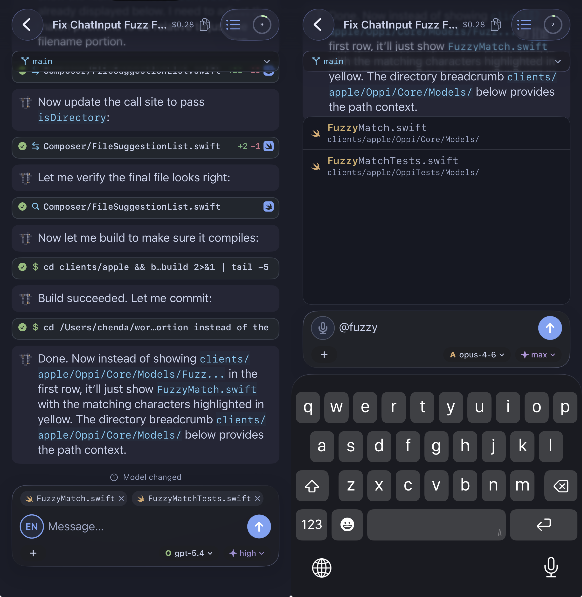
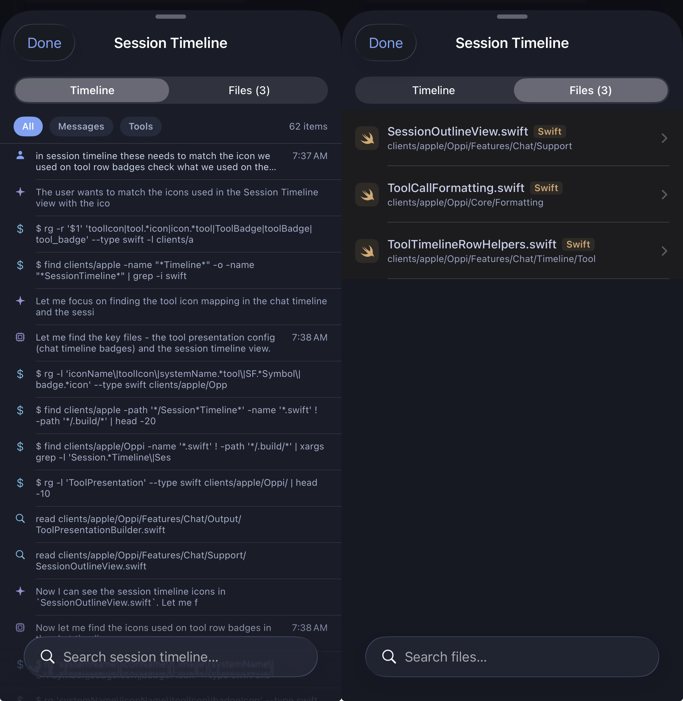

# Using Oppi

Daily phone and tablet use after you have paired a server. Pairing is in [Onboarding](onboarding.md). Pi slash commands, skills, compaction, and the TUI stay in [Pi's usage guide](https://github.com/badlogic/pi-mono/blob/main/packages/coding-agent/docs/usage.md).

## Screen map

The Workspaces tab opens **All Sessions** for the active server.

- **Your Turn**: sessions waiting on you (a question, an approval, a sign-in, or a result you have not seen). Blocked sessions come first.
- **Working**: sessions that are busy.
- Stopped sessions sit below, grouped by day, each with its workspace name.

Every row and thread shows the same status. **Working** is blue. **Needs approval**, **Question**, and **Sign-in** are orange. **Error** is red. **Done** is green until you open the session on this phone, then it reads **Idle** (grey). **Stopped** is a stopped session you have seen or that ended without a result. Seen state is kept per device and resets when the app restarts.

A workspace's session list has the same sections, rows, and swipe actions. It adds the worktree picker, host Pi sessions you can import, and older stopped history grouped by month.

The sidebar or drawer holds saved Agents and schedules, the workspace list, App Settings, and each workspace's sessions, files, and settings.

Open a session to see the chat timeline. Tap a tool row to inspect its command, output, diff, or file content. If an extension shows a card or sheet, answer it in the app.

### Session Threads (experiment)

Turn on **Settings → Experiments → Session Threads** (off by default, saved on this device) to group sessions that other sessions launched under the session that launched them. Tap a session row to open its chat, or the Thread strip under it to open the thread. The strip shows children that need you or are working, a lane graph, the saved Agents in the thread, and totals. A thread with work in progress stays in **Working**, and one with a blocked session sits in **Your Turn**. Turn the experiment off to return to one row per session.

A thread has three views, chosen with its pill (Oppi remembers your last choice):

- **Outline**: the launch tree, with each session's model, cache hit rate, and estimated prompt-cache state (**in use**, **kept warm**, **warm** with minutes left, or **cold**; treat warm as likely, not certain). Swipe a row, or long-press it, to stop or resume it.
- **Waterfall**: one row per session with a bar from launch to last activity on clock time (a summary, not exact execution time). Pinch to zoom; tap a row to open it.
- **Timeline**: one lane per session, with launches, stops, and messages sent between sessions with `oppi session`. Filter chips hide each kind.

The **New session in thread** bar opens Quick Session in the root's workspace; the new session joins the thread as a child of the root.

### Session rows

**Settings → Sessions → Session Rows** sets **Standard** or **Compact** rows and turns optional details on or off: model, time, context usage, cost, files touched, and compactions. With Session Threads on, **Agent Summary** and **Lane Graph** control the Thread strip. Changes save for this device. **Restore Defaults** resets them. The title, status, questions, Incognito, workspace context, search matches, and Thread control always show.

## Prompt, steer, follow-up, and stop

When the session is idle, the composer says **Message…** and Send starts a new turn. While the agent works, toggle how to send:

| Mode | Composer | What it does |
| --- | --- | --- |
| **Steering** | Steer agent… | Guides the current turn. |
| **Follow-up** | Queue follow-up… | Queues the next instruction after this turn. |

If an Ask card is visible, the composer answers that prompt instead. With an empty composer during a busy turn, the primary action is **Stop**.

## Siri, Quick Session, and the share sheet

**Siri** starts a session with a prompt and opens that chat. Say "Start a session in Oppi", "Open a session in Oppi", or "New session in Oppi", optionally followed by "in <workspace>". Without a prompt, Siri asks "What should Pi do?". Siri and Shortcuts show the exact prompt, the workspace, and (with more than one server) the server for you to confirm before anything is sent. Invisible formatting characters are removed from the prompt first, so what you confirm is what is sent. Cancel sends nothing. The same confirmation applies when the prompt comes from another Shortcut action. Prompts over 280 characters or 12 lines are too long to confirm; open Oppi and send them from the app.

**Quick Session** opens the composer without creating a session yet. Launch it from Oppi, Control Center, the Action Button, or the Shortcuts **New Session** action.

**The Shortcuts New Session action** reads "Open *Agent* in *Mode* mode". Every field is optional, and an empty one follows Quick Session's own choice:

| Field | Values | Empty |
|---|---|---|
| Mode | Message, Dictation, Live Voice | Message |
| Agent | Any active saved Agent on a paired server | The Agent Quick Session last used, or Pi |
| Workspace | Any workspace on a paired server | The workspace Quick Session last used on the Agent's server |
| Text, Image | Composer text and one image | None |

In Live Voice mode (needs the Live Voice experiment below), text and an image are the call's first message, and an Agent starts without one: what you say first is its first message. The Agent and workspace must be on the same server. Set the Action Button to **Shortcut** and pick this action to put a voice-assistant Agent, with its own model, tools, and extensions, one press away.

**Live Voice** is an experiment, off by default. Turn it on under **Settings → Experiments → Live Voice** (saved on this device; needs a server with a voice backend). Control Center, the Lock Screen, and the Action Button then offer **Live Voice**, which starts a session straight into a call in the workspace and Agent Quick Session last used. Siri: "Talk to Oppi" or "Call Oppi". The call keeps going with the screen locked, in another app, or when you leave its chat for the session list or another session; open that session's chat to see the call again, and end it there with **End**. On iPhone and iPad the system also shows it as a call with the session's title (status bar, Dynamic Island, Lock Screen, and a paired Apple Watch or CarPlay) with Mute and End, AirPods mute works, and a phone call you answer puts Live Voice on hold until the phone call ends. One call runs at a time: while it is on, other chats offer no Live Voice, and dictation and read-aloud are off everywhere in the app. A draft left in Quick Session is saved, not sent into the call. If the workspace, Agent, or voice backend is unavailable, Quick Session opens, says why, and brings the draft back. With the experiment off, Live Voice entries open Quick Session instead.

**Incognito:** tap the eye-slash pill beside the workspace in Quick Session to start one session Incognito. The Pi session lives in server memory only, with no transcript, search entry, or restart resume. Leaving its chat ends it: the server stops and deletes it. Opening Files, a reader, or a fork, switching tabs, or App Lock locking the app does not end it. The pill is not offered with a saved Agent selected.

The iOS share extension accepts text, URLs, images, and files. Choose a workspace in its Quick Session composer, then start the session from the share sheet.

## Files and photos

Attach files from the Files picker, photos and videos from the library, or a camera capture. An attachment uploads with the session turn; canceling before send uploads nothing. Videos upload as files, not as model image input.

Assistant output opens markdown, code, diffs, and other documents in full-screen viewers. See [Document viewers](document-viewers.md).

### Git panel

In a chat whose workspace is a Git repository, **Git** in the top bar's menu (or its button, if you pin it) shows how many files the session changed and opens a panel with the branch, the changed files, and the commit graph (a sheet on iPhone, a column beside the chat on iPad). The graph shows the session's checkout and every local branch, and a ring marks the session's commit. Tap a file for its review or a commit for its detail. **Select** picks files to start a session or a prompt template with.

- A session in its own worktree lists every change in that worktree, including ones its shell commands made.
- A session in the main checkout lists the files it edited (**This session**). **All changes** lists every change in the checkout. The panel opens on This session.

A workspace's session list has the same **Git** button in its top bar, listing every change in the selected worktree.

## Voice

**Settings → Voice & Dictation → Dictation Engine** is **On-device** (the default) or **Server**.

- **On-device** uses Apple's speech APIs. Audio stays on the phone; submitting the transcript still sends the prompt to the server.
- **Server** streams audio to the paired server, which forwards it to its configured speech-to-text backend. See [Server configuration](server-configuration.md#dictation-asr--stt).

With the server's read aloud configured, a finished assistant reply has a speaker that reads it aloud (tap again to stop). See [Read aloud](server-configuration.md#read-aloud). Selecting text in a message shows a microphone first in the edit menu, then **Comment**; the microphone starts dictating into the comment draft.

**Settings → Voice & Dictation → Dictation Animation** picks the listening control: **Composing** and **Breathing** (voice-reactive Metal orbs) or **Ring** (the default for new installs). **Settings → Chat → Busy Animation** picks the busy-row animation: **Orbiting** (the default for new installs), **Searching**, **Solving**, **Pi**, or **GoL**. The orbs adapt Thinking Orbs geometry: Jakub Antalik created the original [thinking-orbs](https://github.com/Jakubantalik/thinking-orbs), Haplo LLC made the Swift [ThinkingOrbs](https://github.com/haplollc/ThinkingOrbs) port, and Oppi adds Metal rasterization and voice-reactive motion. The MIT notice is in `clients/apple/Shared/Renderers/Orbs/LICENSE`.

## Chat display

**Settings → Chat → Style** sets how every chat looks, unless the chat's Agent sets its own (see [Agents and schedules](#agents-and-schedules)):

- **Full** (default): every tool call and thinking block.
- **Compact**: each turn's tool calls and thinking fold into one strip you tap to expand, showing **Icons** or **Words**.
- **Chat**: a messaging layout with trailing bubbles for your messages, cards for replies, and a **Worked 9s · 2 steps** pill per turn.

**Settings → Chat → Top Bar** chooses which buttons a chat's top bar shows and their order: **Files**, **Git**, **Outline**, **Context** (the usage ring), and **Terminal**. The default shows only Context; the rest sit in the **…** menu, which always stays and has **Customize Top Bar…**. A button the chat cannot use is not shown: no Files, Git, or Terminal without a workspace folder, no Git outside a Git repository (or with Git status off), no Outline for an empty timeline, and no Terminal for a sandbox or relative-folder workspace. **Terminal** opens a login shell in the session's folder ([Open Terminal here](ssh-terminal.md#open-terminal-here)).

## Appearance

**Settings → Appearance** picks a built-in theme (Dark, OLED, Light, Night) or an imported custom theme, by hand or matching Light and Dark to iOS Display & Brightness. Custom themes are JSON files on the server; see [Custom themes](themes.md).

## Agents and schedules

The sidebar holds saved **Agents** and **Schedules**.

- Agents store reusable definitions and can use one Unicode emoji or SF Symbol as an icon.
- **Edit Agent → Chat Style** picks how that Agent's sessions look on this device: **Full**, **Compact**, **Chat**, or **Settings** to follow **Settings → Chat → Style**. The choice is per device and restyles the Agent's open sessions too.
- Schedules support `at`, `every`, and `cron` triggers. A one-time `at` schedule moves to Archived after its run succeeds; a failed run keeps it active. A schedule targets a workspace, a saved Agent, or an existing session. Oppi keeps run history for manual and approved automatic runs.

## Edit with Oppi

Describe a change in a composer: a list's composer to create something, or the **Describe a change…** bar at the bottom of a detail page to change it (the bar shows the model and thinking pills once you tap it). Oppi opens one setup session that inspects the current setup, asks if the outcome is unclear, shows the change, and applies it. Changes made through `oppi` commands change the live server, so the setup prompt tells the session to show each server write and wait for your approval. That is an instruction to the model, not an enforced confirmation. Before it edits a file, the session says what will change. At the end it tells you where to see the change and whether a running session must reload.

The setup session uses Oppi's own short prompt, not your global Pi prompt ([Pi Control sessions](extensions.md#pi-control-sessions)).

| Surface | Create | Change |
| --- | --- | --- |
| Agents | Composer in the Agents list | The bar on an active Agent's page; comments on its definition become the request |
| Schedules | Composer in the Schedules list | The bar on a schedule's page; comments on its prompt become the request |
| Pi's system prompt (`SYSTEM.md`) | | The bar on the Pi entry under Agents; comments on the file |
| Skill files | | **Edit → Edit with Oppi** on an editable Skill's file, with your staged comments |
| Extensions | | **Edit with Oppi** in the chat's context panel, or the bar on an extension's page (single files you own) |
| Custom themes | Composer in **Settings → Appearance → Custom Themes** | Swipe a theme, or touch and hold, then **Edit with Oppi** |
| Workspaces | **Create with Oppi** in the create sheet | The bar in Workspace Settings (hidden while the workspace is locked) |

## Sandbox, Mirror, and SSH Terminal

- [Sandbox workspaces](sandbox.md) run agent file tools and shell commands in a Gondolin VM.
- [Oppi Mirror](oppi-mirror.md) shows a live terminal Pi session in Oppi.
- [SSH Terminal](ssh-terminal.md) opens a shell on a host saved on this device (**Settings → SSH Hosts**, or **Terminal** below **MCP Servers**). A workspace's or chat's **Terminal** button opens that folder on the saved host.

## Durable Sessions experiment

Durable sessions run on the server's durable engine instead of the classic Pi session. A server offers them only after `oppi config set experimental.serverDurable true` and a restart. They are a development playground and do not match terminal coding agents feature for feature.

Turn on **Settings → Experiments → Durable Sessions** (off by default, saved on this device). When the server offers durable sessions, Quick Session shows a **Classic** pill beside the workspace; tap it to start that one session **∞ Durable**. **Start Sessions as Durable** makes durable the default and the pill switches one session to Classic. A saved Agent follows the same default. Incognito sessions are always Classic.

Durable sessions appear in All Sessions with a small **∞** after the title and follow **Settings → Chat → Style**. A durable session has no tree, so Outline lists the timeline and you fork from a message to branch.

A durable session runs only extensions that ship a durable entry ([Durable extensions](extensions.md#durable-extensions)), plus MCP when the Agent selects it. It starts without the rest, including codemode. When a saved Agent selected extensions that have no durable entry (or that `oppi extensions disable` turned off), the session shows a warning that names them. MCP tools load through `tool_search`, the durable stand-in for codemode.

From the CLI, `oppi session create --workspace <id> --prompt <text> --engine durable` starts a durable session (it fails while the server flag is off). Add `--agent <name>` for a saved Agent, or use `oppi schedule create --engine durable`.

A durable session can start helper sessions with its `subagent` tool. Each child opens from the tool row or the **Subagents** pill above the composer and is listed in All Sessions. The pill shows each child as Working, Needs attention, Done, or Error, with its model and context use; expand it to see what each child is doing now. A child reports each answer back to its parent as a card that names the sender and kind (report, task, or message), folded to its first lines; tap the card to read it all, or the sender's name to open the child. A child can start its own children only when its parent allows it, and can work in a git worktree of its own on a branch named after it, so an editing child never touches its parent's checkout.

## Models and quota

Pick models from the in-app picker. Remaining provider quota and pace are under **Server Settings → Model Providers**, in `oppi quota`, and in `oppi models`. See [Provider quotas](provider-quotas.md).

## Workspace settings

**Workspace Settings** (a workspace's slider button, or Server Settings → Workspaces) opens with the workspace's icon, name, and folder. Tap it for **Details**: name, description, icon, and **Workspace Folder**. A new folder is checked on the server first, and Oppi offers to create one missing directory. Details has its own **Save**; going back discards edits.

Below it: **Instructions** (its own editor and **Save**), **Skills** and **Extensions** (each row counts how many are enabled, such as "5 of 8"), **MCP Servers**, and **Dictionary**. A sandbox workspace also has **Network Access** (Allowed Hosts, with its own **Save**). **Project Trust** is read-only. Toggles (Skills, Extensions, sandbox MCP servers, **Show Changes in Chat**) apply as you flip them and flip back with the error if the server refuses. **Delete Workspace** is last and asks first.

## Server settings

**Server Settings** (host switcher → Server Settings, or Settings → your server) opens with the server's name and connection status, then **Model Providers**, **Workspaces**, **Dictionary**, **Paired Devices**, **About This Server**, and **Badge Icon**. On the same screen: **Mobile Output Guide** ([what it does](extensions.md#mobile-output-guide)), **Server Metrics** (off by default; see [Server Metrics](server-configuration.md#server-metrics)), **Notifications** (push and Live Activities, per server), **Lock Server**, and **Remove Server**. Add another server from Settings.

**About This Server** shows connection, uptime, the Pi SDK, Pi TUI, and server versions, and the **Voice** backend states. Its row reads **Update Available** when a newer `oppi-server` is on npm.

- **Global npm install:** an **Update** button names the version and warns that running sessions will be interrupted. Oppi installs that exact version, restarts the server, and reconnects. Interrupted sessions resume ([Running sessions across a restart](server-configuration.md#running-sessions-across-a-restart)). `oppi update` on the host uses the same check.
- **Checkout `npm link`ed as the global `oppi`** (what `setup.sh --install` sets up): the server never installs from npm. When the checkout has changes the running build lacks, **Rebuild & Restart** runs `npm run build:in-place` there and restarts. A failed compile keeps the running build and shows the error.
- **Installer install** (`install.sh`, in `~/.oppi/install`): **Update Available** with the copyable installer command instead of a button. Run it on the host; it upgrades and restarts the service.
- **Other installs** (other git checkouts, Docker images): a copyable `npm install -g oppi-server@…` command instead of a button.
- If the server is older than this app needs and nothing newer is available, the row reads **Server Outdated** and names the needed and available versions. All Sessions also shows a notice that opens Server Settings until you update and reconnect.

**Paired Devices** lists devices paired with this server. Your device is marked **This device** and has no Revoke button. For others, **Revoke** asks first, then signs that device out at once. See [Onboarding](onboarding.md#paired-devices).
