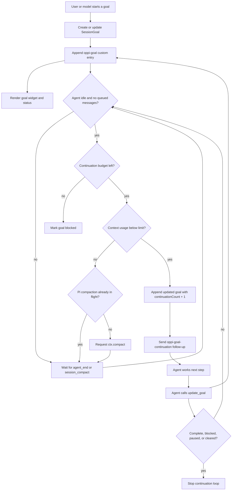

# Oppi goal extension

Pi extension that prototypes Codex-style `/goal` behavior without Oppi server lifecycle hooks.

What it provides:

- `/goal <objective>` starts a durable session goal.
- `get_goal`, `create_goal`, and `update_goal` let the model inspect and update goal state.
- Goal snapshots persist as Pi custom session entries with `customType: "oppi-goal"`.
- An extension-owned outer loop queues a continuation message after the agent becomes idle while the goal is active.
- A persistent widget renders goal status, elapsed goal time, and task elapsed time in Pi and as an Oppi native extension surface when supported.

How it works:



Useful commands:

```text
/goal Build the feature
/goal status
/goal pause [reason]
/goal resume
/goal complete [summary]
/goal block <reason>
/goal budget <continuations>
/goal clear
```

The widget updates periodically while a goal is active, so mobile surfaces can show timer-like elapsed durations. Task timing is inferred from task status transitions: `in_progress` starts a timer, and `completed` records the elapsed duration.

The continuation budget is a safety cap, not a target to spend. Continuation prompts ask the model to audit completion against real evidence and avoid stopping on weak proxy signals. If the model tries to mark a goal complete while listed tasks are still pending or in progress, the extension keeps the goal active and records the unfinished tasks in the summary.

The loop stops when the goal is complete, blocked, paused, cleared, reaches its continuation budget, or reaches the configured context-usage limit.
