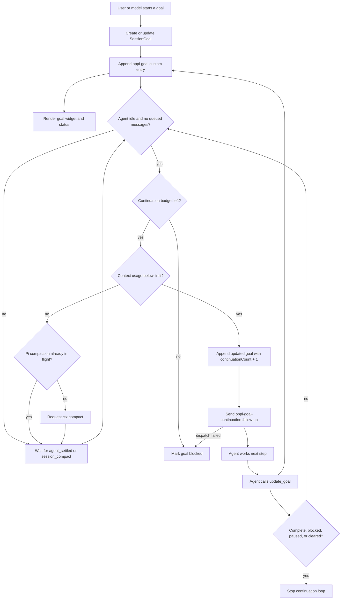

# Oppi goal extension

A Pi extension that prototypes Codex-style `/goal` behavior without Oppi server lifecycle hooks.

What it provides:

- `/goal <objective>` starts a durable session goal.
- `get_goal`, `create_goal`, and `update_goal` let the model inspect and update goal state.
- Goal snapshots persist as Pi custom session entries with `customType: "oppi-goal"`.
- While a goal is active, an extension-owned outer loop queues a continuation message after the agent becomes idle.
- A persistent widget renders goal status, elapsed goal time, and task elapsed time in Pi and, when supported, as an Oppi native extension surface.

How it works:



Useful commands:

```text
/goal Build the feature
/goal status
/goal pause [reason]
/goal resume
/goal complete [summary]
/goal block <reason>
/goal budget <continuations>
/goal clear
```

While a goal is active, the widget updates periodically so mobile surfaces can show timer-like elapsed durations. Task timing comes from task-status transitions: `in_progress` starts a timer, and `completed` records the elapsed duration.

The continuation budget is a safety cap, not a target to spend. Continuation prompts tell the model to audit completion against real evidence and avoid stopping on weak proxy signals. Every completion path—including `/goal complete`, model tool updates, and loaded snapshots—keeps the goal active when listed tasks remain pending or in progress, then records those tasks in the summary.

The loop waits for Pi's `agent_settled` event before queuing the next turn. It stops when the goal is complete, blocked, paused, or cleared. Budget exhaustion and continuation-dispatch failures leave the goal blocked. Context pressure waits for compaction and blocks only if compaction fails.
