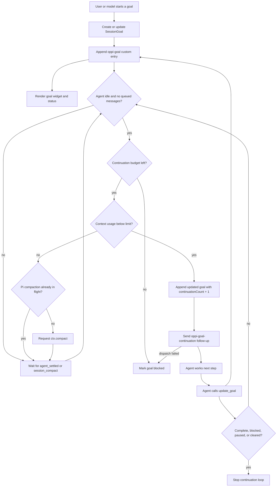

# Oppi goal extension

A Pi extension that prototypes Codex-style `/goal` behavior without Oppi server lifecycle hooks.

What it provides:

- `/goal <objective>` starts a durable session goal.
- `get_goal`, `create_goal`, and `update_goal` let the model inspect and update goal state.
- Goal snapshots persist as Pi custom session entries with `customType: "oppi-goal"`.
- While a goal is active, an extension-owned outer loop queues a continuation message after the agent becomes idle.
- A persistent widget renders goal status, elapsed goal time, and task elapsed time in Pi and, when supported, as an Oppi native extension surface.

How it works:


```mermaid
flowchart TD
  User[User or model starts a goal] --> Create[Create or update SessionGoal]
  Create --> Persist[Append oppi-goal custom entry]
  Persist --> Widget[Render goal widget and status]
  Persist --> IdleCheck{Agent idle and no queued messages?}

  IdleCheck -- no --> Wait[Wait for agent_settled or session_compact]
  Wait --> IdleCheck

  IdleCheck -- yes --> Budget{Continuation budget left?}
  Budget -- no --> Block[Mark goal blocked]
  Budget -- yes --> Context{Context usage below limit?}

  Context -- no --> CompactGuard{Pi compaction already in flight?}
  CompactGuard -- yes --> Wait
  CompactGuard -- no --> Compact[Request ctx.compact]
  Compact --> Wait

  Context -- yes --> Continue[Append updated goal with continuationCount + 1]
  Continue --> Send[Send oppi-goal-continuation follow-up]
  Send -- dispatch failed --> Block
  Send --> Agent[Agent works next step]
  Agent --> Tool[Agent calls update_goal]
  Tool --> Persist

  Tool --> Done{Complete, blocked, paused, or cleared?}
  Done -- yes --> Stop[Stop continuation loop]
  Done -- no --> IdleCheck
```

Useful commands:

```text
/goal Build the feature
/goal status
/goal pause [reason]
/goal resume
/goal complete [summary]
/goal block <reason>
/goal budget <continuations>
/goal clear
```

While a goal is active, the widget updates periodically so mobile surfaces can show timer-like elapsed durations. Task timing comes from task-status transitions: `in_progress` starts a timer, and `completed` records the elapsed duration.

The continuation budget is a safety cap, not a target to spend. Continuation prompts tell the model to audit completion against real evidence and avoid stopping on weak proxy signals. Every completion path—including `/goal complete`, model tool updates, and loaded snapshots—keeps the goal active when listed tasks remain pending or in progress, then records those tasks in the summary.

The loop waits for Pi's `agent_settled` event before queuing the next turn. It stops when the goal is complete, blocked, paused, or cleared. Budget exhaustion and continuation-dispatch failures leave the goal blocked. Context pressure waits for compaction and blocks only if compaction fails.

## Server Durable port

`durable.ts` provides the native goal extension for experimental server-durable sessions. The classic extension above is unchanged. On the phone, send a prompt such as:

```text
Create an autonomous goal to audit the feature against its requirements.
Track implementation, tests, and evidence as tasks. Use a budget of 5 continuations.
```

The model uses `create_goal`, `get_goal`, and `update_goal`. To inspect, pause, resume, block, change the budget, or complete the goal, ask the model to call those tools. Durable has no `/goal` command. There is no clear tool; complete or pause the goal, or replace it with `create_goal(replace=true)`.

The latest goal is a conversation document (`oppi.goal`). Each change also appends a full `oppi-goal` snapshot. `oppi-goal-continuation` entries record updates, continuation decisions, wait/resume decisions, blockers, and cancellation reasons. Decision entries carry display-only `data.card` metadata, with the action, full reason, continuation count/budget, and timestamp. Trace reload restores them as system/custom cards; live append emits one ephemeral notice per entry. Decisions have no `model`, do not appear in `get_messages`, and do not enter model context or start a run. Snapshots and tool results retain the full summary/checklist; UI transport limits still apply to widgets.

A conversation-owned Durable task waits until `pi.live.run` is absent, the inbox is empty, and compaction has settled. It then submits an ordinary follow-up input to start a **new run**. An `onYield` continuation would keep the original run busy, bypassing Oppi's settled/auto-stop boundary. The runner is not a background task: Abort/Stop cancels it. Goal state remains available; only `create_goal` or `update_goal(status="active")` arms a runner. Summary-only and checklist-only updates do not restart a cancelled runner. After Stop, the prompt section retains the goal summary but tells the model not to call `update_goal(status="active")` unless the user explicitly asks to resume. An explicit active update creates a runner and restores normal goal instructions. The widget shows `Runner stopped` with an inactive row while an active goal has no live runner. Forks start with no goal (`fork: "initial"`) so an inherited transcript cannot launch a second autonomous loop.

The budget reservation, snapshot, continuation reason, and submission checkpoint are one commit. Before admission, the runner checks goal identity/status, run state, and inbox again. An intervening user run, queued input, or stopped/replaced goal releases the reservation and records a skip reason. In that case, any still-queued owned continuation is withdrawn. An exact-content queued continuation that is the only pending input may instead be placed with its existing request ID. Admission atomically places the continuation as the sole input of a new run through the public Durable transaction surface; it never queues behind user work.

The request ID is `oppi-goal:<goal-id>:<continuation-count>:<attempt>`. The persisted attempt increases even when a budget reservation is rolled back, so a fresh plan cannot reuse an aborted request. Replay accepts an existing submission only when its stored content matches the plan. The backend reserves `oppi-goal:` and rejects client turn IDs with that prefix. Tool receipts and mutations share a commit, so a replayed create/update does not repeat its mutation.

The runner watches run presence, compaction IDs, inbox emptiness, and goal changes. Streaming partial frames do not cause runner commits.

| Classic behavior                                              | Native Durable behavior                                                                                                                                                                           |
| ------------------------------------------------------------- | ------------------------------------------------------------------------------------------------------------------------------------------------------------------------------------------------- |
| Tool parameters, stale-ID rejection, active replacement guard | Same tools and parameters; tools run sequentially and replay safely                                                                                                                               |
| Completion audit and unfinished-task invariant                | Same guidance; unfinished tasks keep the goal active                                                                                                                                              |
| Task start/completion timestamps and elapsed time             | Persisted; returned by tools and text widget snapshots                                                                                                                                            |
| Append goal snapshots                                         | Full typed entries plus latest conversation document                                                                                                                                              |
| `before_agent_start` goal injection                           | `section("goal")` reads the document before each request. The prompt omits the live clock so the provider KV prefix stays valid; widgets and `get_goal` still show elapsed time.                  |
| Settled run followed by automatic follow-up                   | New submission after `pi.live.run` clears; stable request ID across restart                                                                                                                       |
| Budget exhaustion and launch failure                          | Blocked goal with inspectable reason                                                                                                                                                              |
| Before/after compaction handling                              | `CompactionTask.beforeCompact` records the goal in a task memo while compaction runs; the runner waits for compaction and records completion/failure; the document survives transcript compaction |
| Proactive compaction at 95% context usage                     | Uses Durable's configured token-reserve/overflow compaction instead; no separate 95% trigger or goal-specific summarizer instructions                                                             |
| Widget/status and periodic elapsed refresh                    | Generic durable-ui replacement slots with native activity list, full summary/blocker, and explicit clears on completion; refreshed on state changes, no periodic timer                            |
| `/goal`, TUI styling, custom message display                  | Tools only; continuations are ordinary user inputs, without classic custom-message metadata                                                                                                       |
| Restart/session start                                         | Pending runner resumes from its checkpoint; Abort/Stop retains state but requires an active update to restart the runner                                                                          |

Validation from `server/`:

```bash
npx vitest run tests/durable-goal.test.ts
npm run check:server
npm test
npm run build && npm run check:pack-contents
```

The credential-approved live smoke uses a private temporary Pi credential copy and an owned throwaway server. It creates a goal, waits for one continuation to open `ask`, kills that server with SIGKILL, restores the same goal/dialog, and completes it with no duplicate continuation:

```bash
node --import tsx scripts/durable-goal-smoke.ts
```

Build first. Run the smoke through the credential-approved tool, not an ordinary shell lane. It retains receipts, WebSocket events, and server logs; it never targets the owner's runtime.
